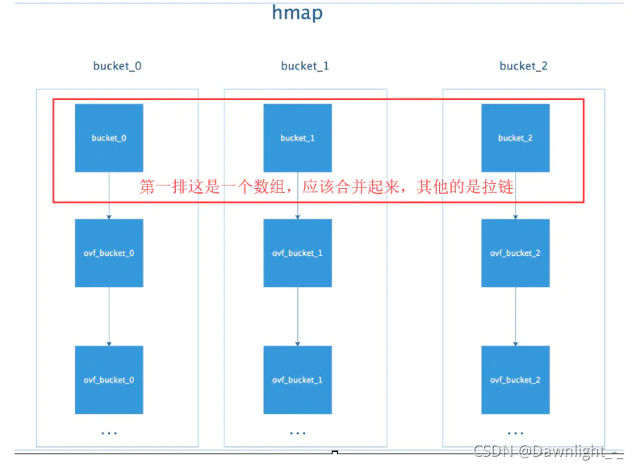
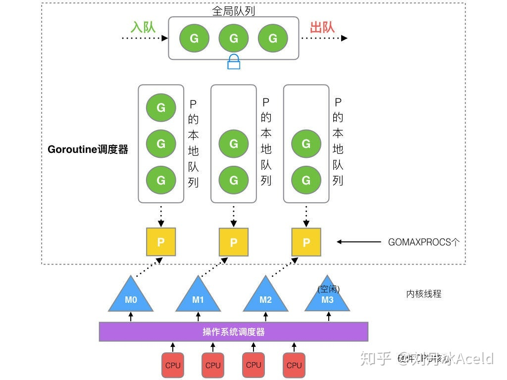
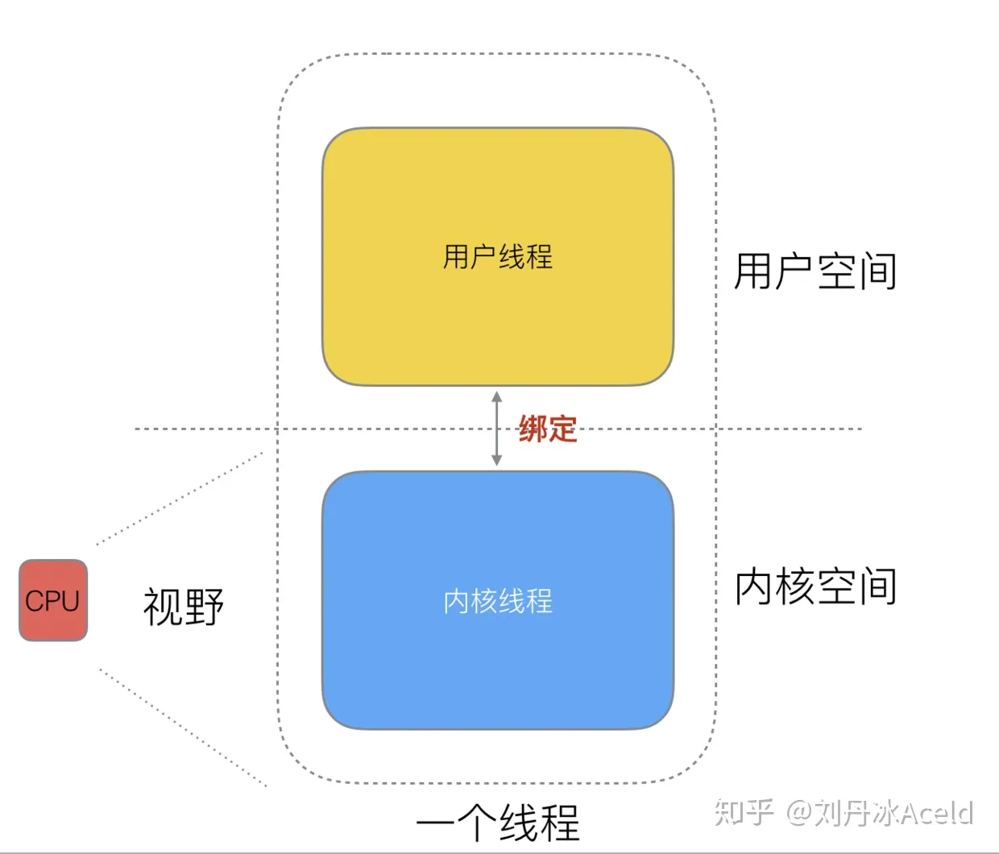
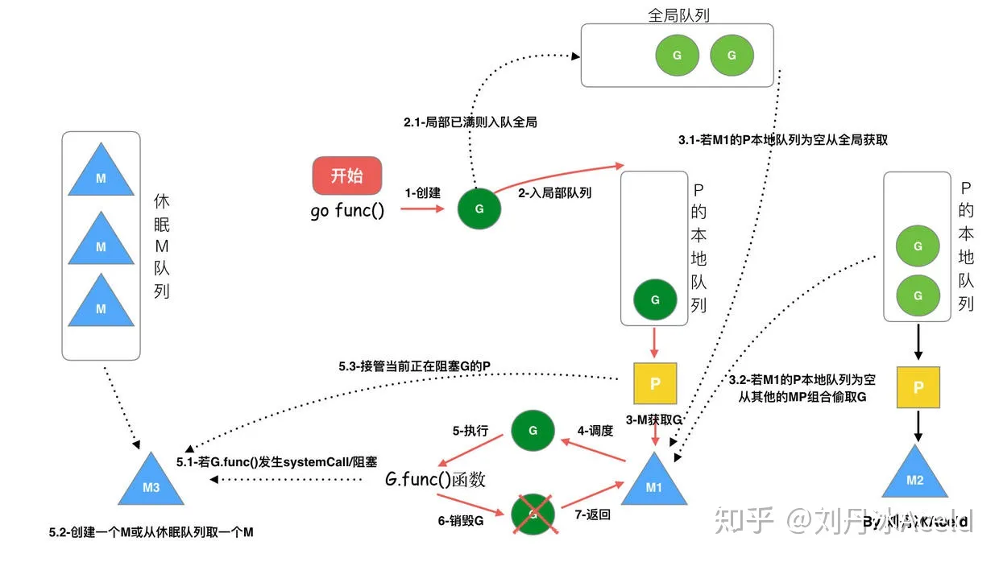
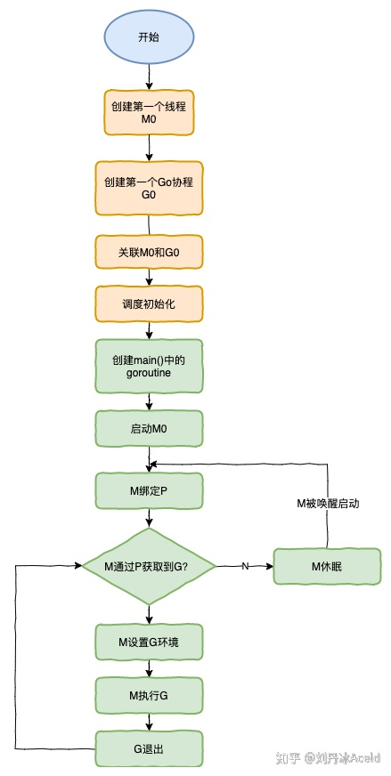

# Golang语言设计及实现

## 第一章 基础数据结构

### 1.1map

mp:=map[int]bool{}

```go
type hmap struct {
    count     int // 元素个数，调用 len(map) 时，直接返回此值
    flags     uint8 //代表当前 map 的状态（是否处于正在写入的状态等）,如果并发,直接painc
    B         uint8  // buckets 的对数 log_2
    noverflow uint16 // 为 map 中溢出桶的数量。当溢出的桶太多时，map 会进行 same-size map growth，其实质是避免桶过大导致内存泄露
    hash0     uint32 // 代表生成 hash 的随机数种子
    buckets    unsafe.Pointer // 指向 buckets 数组，大小为 2^B，如果元素个数为0，就为 nil
    oldbuckets unsafe.Pointer // 是在map扩容时存储旧桶的，当所有旧桶数据都已经转移到了新桶中时，则清空
    nevacuate  uintptr        //在扩容时使用，用于标记当前旧桶中小于nevacuate 的数据都已经转移到了新桶中
    extra *mapextra // 存储 map 中的溢出桶
}
```

Map效率的关键点:

1.hash函数的选择  --- 哈希函数的结果能够尽可能的均匀分布

2.哈希冲突的解决  ----

  1.使用开放寻址法（当前地址被占用.移动到下一个不为空的地址）  

  2.拉链法(当前地址被占用,使用链表在该地址上串联)

#### **bmap（bucket桶）**：

源码中只定义了tophash,此字段顺序存储 key 的哈希值的前 8 位。

```go
type bmap struct {
    tophash [bucketCnt]uint8
}
```

根据编译期间的 [`cmd/compile/internal/gc.bmap`](https://draveness.me/golang/tree/cmd/compile/internal/gc.bmap) 函数重建它的结构：

```go
type bmap struct {
    topbits  [8]uint8
    keys     [8]keytype  //存储key
    values   [8]valuetype //存储value
    pad      uintptr
    overflow uintptr // 溢出bucket的地址
}
```

由此看出hmap和bucket的关系是这样的：



#### **哈希冲突:**

哈希函数返回的哈希会帮助我们选择一个桶，选择桶的方式是直接对哈希返回的结果取模

```go
index := hash("Key6") % array.len
```

一个bucket 最多可容纳8个键值对,当超过8个时,就会将多余的元素放在溢出桶内

#### **负载因子:**

 负载因子 = 键数量/bucket数量

哈希表需要将负载因子控制在合适的大小，超过其阀值需要进行rehash，也即键值对重新组织：

- 哈希因子过小，导致空间利用率低
- 哈希因子过大，导致冲突严重，存取效率低

每个哈希表的实现对负载因子容忍程度不同

- Golang 因为每个桶能存储8个元素,所以负载因子为6.5
- redis 负载因子为1
- java 负载因子为0.75

**Golang为6.5是开发团队做了实验,在空间利用率和存取效率之间取了一个中间值, 选择6.5**


#### **渐进式扩容**

触发扩容的情况:

根据触发扩容的原因,实行扩容的方案也不相同

**1.负载因子超过6.5**

 **翻倍扩容方案**: 将B+1 即 bucket数量翻倍,旧bucket数据搬迁到新的bucket。 考虑到如果map存储了数以亿计的key-value，一次性搬迁将会造成比较大的延时，Go采用逐步搬迁策略，即每次访问map时都会触发一次搬迁，每次搬迁2个键值对。

**overflow bucket 数量太多，导致 key 会很分散，查找插入效率低得吓人，因此出台第 2 点规定**:

**2.溢出桶数量过多**

频繁增删map，导致未被使用的overflow 的 bucket 数量过多：当 B 小于 15，也就是 bucket 总数 2^B 小于 2^15 时，如果 overflow 的 bucket 数量超过 2^B（**未用于存储的bucket数量过多**），就会触发扩容；当 B >= 15，也就是 bucket 总数 2^B 大于等于 2^15，如果 overflow 的 bucket 数量超过 2^15，就会触发扩容。

**等量扩容方案:**

因为频繁增删改,导致空余的溢出桶数量较多,键值对正好集中在一小部分的bucket，这样会造成overflow的bucket数量增多，但负载因子又不高

所谓等量扩容，实际上并不是扩大容量，buckets数量不变，重新做一遍类似增量扩容的搬迁动作，把松散的键值对重新排列一次，以使bucket的使用率更高，进而保证更快的存取。

**扩容过程:**

由于 map 扩容需要将原有的 key/value 重新搬迁到新的内存地址，如果有大量的 key/value 需要搬迁，会非常影响性能。因此 Go map 的扩容采取了一种称为“渐进式”地方式，原有的 key 并不会一次性搬迁完毕，每次最多只会搬迁 2 个 bucket。

hmap数据结构中oldbuckets成员指身原bucket，而buckets指向了新申请的bucket。新的键值对被插入新的bucket中。 后续对map的访问操作会触发迁移，将oldbuckets中的键值对逐步的搬迁过来。当oldbuckets中的键值对全部搬迁完毕后，删除oldbuckets。

#### **go中map的常见问题**

**1、Key为什么是无序的？**
 map 在扩容后，会发生 key 的搬迁，原来落在同一个 bucket 中的 key，搬迁后，有些 key 就要远走高飞了（bucket 序号加上了 2^B）。而遍历的过程，就是按顺序遍历 bucket，同时按顺序遍历 bucket 中的 key。搬迁后，key 的位置发生了重大的变化，有些 key 飞上高枝，有些 key 则原地不动。这样，遍历 map 的结果就不可能按原来的顺序了。

当我们在遍历 go 中的 map 时，并不是固定地从 0 号 bucket 开始遍历，每次都是从一个随机值序号的 bucket 开始遍历，并且是从这个 bucket 的一个随机序号的 cell 开始遍历。这样，即使你是一个写死的 map，仅仅只是遍历它，也不太可能会返回一个固定序列的 key/value 对了。

**2、float类型是否可以作为map的key？**
 从语法上看，是可以的。Go 语言中只要是可比较的类型都可以作为 key。除开 slice，map，functions 这几种类型，其他类型都是 OK 的。具体包括：布尔值、数字、字符串、指针、通道、接口类型、结构体、只包含上述类型的数组。这些类型的共同特征是支持 == 和 != 操作符，k1 == k2 时，可认为 k1 和 k2 是同一个 key。如果是结构体，只有 hash 后的值相等以及字面值相等，才被认为是相同的 key。很多字面值相等的，hash出来的值不一定相等，比如引用。

float 型可以作为 key，但是由于精度的问题，会导致一些诡异的问题，慎用之。

**3、map可以遍历的同时删除吗？**
 map 并不是一个线程安全的数据结构。同时读写一个 map 是未定义的行为，如果被检测到，会直接 panic。

上面说的是发生在多个协程同时读写同一个 map 的情况下。 如果在同一个协程内边遍历边删除，并不会检测到同时读写，理论上是可以这样做的。但是，遍历的结果就可能不会是相同的了，有可能结果遍历结果集中包含了删除的 key，也有可能不包含，这取决于删除 key 的时间：是在遍历到 key 所在的 bucket 时刻前或者后。

一般而言，这可以通过读写锁来解决：sync.RWMutex。

读之前调用 RLock() 函数，读完之后调用 RUnlock() 函数解锁；写之前调用 Lock() 函数，写完之后，调用 Unlock() 解锁。

另外，sync.Map 是线程安全的 map，也可以使用。

**4、可以对map元素取地址吗？**
 无法对 map 的 key 或 value 进行取址，将无法通过编译

如果通过其他 hack 的方式，例如 unsafe.Pointer 等获取到了 key 或 value 的地址，也不能长期持有，因为一旦发生扩容，key 和 value 的位置就会改变，之前保存的地址也就失效了。

**5、如何比较两个map是否相等？**
 map 深度相等的条件：

> 1. 都为 nil
> 2. 非空、长度相等，指向同一个 map 实体对象
> 3. 相应的 key 指向的 value “深度”相等
>     直接将使用 map1 == map2 是错误的。这种写法只能比较 map 是否为 nil。
>     因此只能是遍历map 的每个元素，比较元素是否都是深度相等。

**6、map是线程安全的吗？**
 map 不是线程安全的。

在查找、赋值、遍历、删除的过程中都会检测写标志，一旦发现写标志置位（等于1），则直接 panic。赋值和删除函数在检测完写标志是复位之后，先将写标志位置位，才会进行之后的操作。

检测写标志：

```go
if h.flags&hashWriting == 0 {
        throw("concurrent map writes") //这里的flags就是hmap里的flags
    }
```

## 第二章 Golang调度器 GMP模型

#### **1.GMP模型**

M(thread) 线程

G(goroutine) Go协程

P(Processor) Goroutine调度器

全局图:



1. **全局队列**（Global Queue）：存放等待运行的G。
2. **P的本地队列**：同全局队列类似，存放的也是等待运行的G，存的数量有限，不超过256个。新建G'时，G'优先加入到P的本地队列，如果队列满了，则会把本地队列中一半的G移动到全局队列。
3. **P列表**：所有的P都在程序启动时创建，并保存在数组中，最多有`GOMAXPROCS`(可配置)个。
4. **M**：线程想运行任务就得获取P，从P的本地队列获取G，P队列为空时，M也会尝试从全局队列**拿**一批G放到P的本地队列，或从其他P的本地队列**偷**一半放到自己P的本地队列。M运行G，G执行之后，M会从P获取下一个G，不断重复下去。

**Goroutine调度器和OS调度器是通过M结合起来的，每个M都代表了1个内核线程，OS调度器负责把内核线程分配到CPU的核上执行**。


G和P是处于用户态,cpu核,系统调度器和M内核线程 处于内核态

**因为G的切换时处于用户态的,CPU是不感知的,避免了不必要的上下文切换.极大程度避免了因上下文切换导致的资源浪费**

一个线程分为“内核态“线程和”用户态“线程。

再去细化去分类一下，内核线程依然叫“线程(thread)”，用户线程叫“协程(co-routine)",在GO中也就是Goroutine.



#### **2.调度器的设计策略**

**复用线程**：避免频繁的创建、销毁线程，而是对线程的复用。

**1.work stealing机制**

当本线程无可运行的G时，尝试从其他线程绑定的P偷取G，而不是销毁线程。

**2.hand off机制**

当本线程因为G进行系统调用阻塞时，线程释放绑定的P，把P转移给其他空闲的线程执行。

**利用并行**：`GOMAXPROCS`设置P的数量，最多有`GOMAXPROCS`个线程分布在多个CPU上同时运行。`GOMAXPROCS`也限制了并发的程度，比如`GOMAXPROCS = 核数/2`，则最多利用了一半的CPU核进行并行。

**抢占**：在coroutine中要等待一个协程主动让出CPU才执行下一个协程，在Go中，一个goroutine最多占用CPU 10ms，防止其他goroutine被饿死，这就是goroutine不同于coroutine的一个地方。

**全局G队列**：在新的调度器中依然有全局G队列，但功能已经被弱化了，当M执行work stealing从其他P偷不到G时，它可以从全局G队列获取G。


#### 3.go func() 调度流程



#### 4.调度器的生命周期



特殊的M0和G0

**M0**

`M0`是启动程序后的编号为0的主线程，这个M对应的实例会在全局变量runtime.m0中，不需要在heap上分配，M0负责执行初始化操作和启动第一个G， 在之后M0就和其他的M一样了。

**G0**

`G0`是每次启动一个M都会第一个创建的gourtine，G0仅用于负责调度的G，G0不指向任何可执行的函数, 每个M都会有一个自己的G0。在调度或系统调用时会使用G0的栈空间, 全局变量的G0是M0的G0。

#### 5.小结

总结，Go调度器很轻量也很简单，足以撑起goroutine的调度工作，并且让Go具有了原生（强大）并发的能力。**Go调度本质是把大量的goroutine分配到少量线程上去执行，并利用多核并行，实现更强大的并发。**


[[Go三关-典藏版\]Golang调度器GPM原理与调度全分析 - 知乎 (zhihu.com)](https://zhuanlan.zhihu.com/p/323271088)
