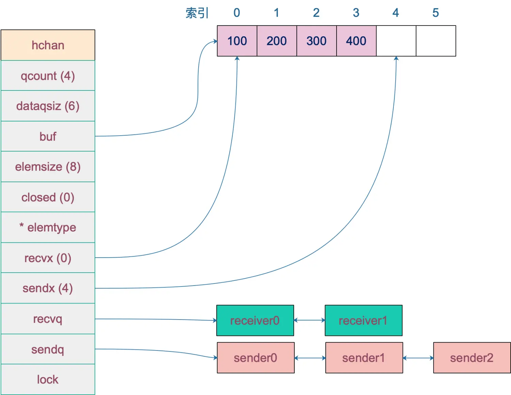

# Golang语言设计及实现

## 第一章 基础数据结构

**不要通过共享内存来通信，而要通过通信来实现内存共享。**

个人理解:  通过通信来共享内存”的真正含义， 真正意思是在chan中传递的控制流（或者是元数据，包含RAW数据的指针）， RAW数据（如视频流）是不用COPY到chan的，是共享内存（指针）给下一个goroutine的； 这就是 通过通信来共享内存

### 1.1map

mp:=map[int]bool{}

```go
type hmap struct {
    count     int // 元素个数，调用 len(map) 时，直接返回此值
    flags     uint8 //代表当前 map 的状态（是否处于正在写入的状态等）,如果并发,直接painc
    B         uint8  // buckets 的对数 log_2
    noverflow uint16 // 为 map 中溢出桶的数量。当溢出的桶太多时，map 会进行 same-size map growth，其实质是避免桶过大导致内存泄露
    hash0     uint32 // 代表生成 hash 的随机数种子
    buckets    unsafe.Pointer // 指向 buckets 数组，大小为 2^B，如果元素个数为0，就为 nil
    oldbuckets unsafe.Pointer // 是在map扩容时存储旧桶的，当所有旧桶数据都已经转移到了新桶中时，则清空
    nevacuate  uintptr        //在扩容时使用，用于标记当前旧桶中小于nevacuate 的数据都已经转移到了新桶中
    extra *mapextra // 存储 map 中的溢出桶
}
```

Map效率的关键点:

1.hash函数的选择  --- 哈希函数的结果能够尽可能的均匀分布

2.哈希冲突的解决  ----

  1.使用开放寻址法（当前地址被占用.移动到下一个不为空的地址）  

  2.拉链法(当前地址被占用,使用链表在该地址上串联)

#### **bmap（bucket桶）**：

源码中只定义了tophash,此字段顺序存储 key 的哈希值的前 8 位。

```go
type bmap struct {
    tophash [bucketCnt]uint8
}
```

根据编译期间的 [`cmd/compile/internal/gc.bmap`](https://draveness.me/golang/tree/cmd/compile/internal/gc.bmap) 函数重建它的结构：

```go
type bmap struct {
    topbits  [8]uint8
    keys     [8]keytype  //存储key
    values   [8]valuetype //存储value
    pad      uintptr
    overflow uintptr // 溢出bucket的地址
}
```

由此看出hmap和bucket的关系是这样的：


#### **哈希冲突:**

哈希函数返回的哈希会帮助我们选择一个桶，选择桶的方式是直接对哈希返回的结果取模

```go
index := hash("Key6") % array.len
```

一个bucket 最多可容纳8个键值对,当超过8个时,就会将多余的元素放在溢出桶内

#### **负载因子:**

 负载因子 = 键数量/bucket数量

哈希表需要将负载因子控制在合适的大小，超过其阀值需要进行rehash，也即键值对重新组织：

- 哈希因子过小，导致空间利用率低
- 哈希因子过大，导致冲突严重，存取效率低

每个哈希表的实现对负载因子容忍程度不同

- Golang 因为每个桶能存储8个元素,所以负载因子为6.5
- redis 负载因子为1
- java 负载因子为0.75

**Golang为6.5是开发团队做了实验,在空间利用率和存取效率之间取了一个中间值, 选择6.5**


#### **渐进式扩容**

触发扩容的情况:

根据触发扩容的原因,实行扩容的方案也不相同

**1.负载因子超过6.5**

 **翻倍扩容方案**: 将B+1 即 bucket数量翻倍,旧bucket数据搬迁到新的bucket。 考虑到如果map存储了数以亿计的key-value，一次性搬迁将会造成比较大的延时，Go采用逐步搬迁策略，即每次访问map时都会触发一次搬迁，每次搬迁2个键值对。

**overflow bucket 数量太多，导致 key 会很分散，查找插入效率低得吓人，因此出台第 2 点规定**:

**2.溢出桶数量过多**

频繁增删map，导致未被使用的overflow 的 bucket 数量过多：当 B 小于 15，也就是 bucket 总数 2^B 小于 2^15 时，如果 overflow 的 bucket 数量超过 2^B（**未用于存储的bucket数量过多**），就会触发扩容；当 B >= 15，也就是 bucket 总数 2^B 大于等于 2^15，如果 overflow 的 bucket 数量超过 2^15，就会触发扩容。

**等量扩容方案:**

因为频繁增删改,导致空余的溢出桶数量较多,键值对正好集中在一小部分的bucket，这样会造成overflow的bucket数量增多，但负载因子又不高

所谓等量扩容，实际上并不是扩大容量，buckets数量不变，重新做一遍类似增量扩容的搬迁动作，把松散的键值对重新排列一次，以使bucket的使用率更高，进而保证更快的存取。

**扩容过程:**

由于 map 扩容需要将原有的 key/value 重新搬迁到新的内存地址，如果有大量的 key/value 需要搬迁，会非常影响性能。因此 Go map 的扩容采取了一种称为“渐进式”地方式，原有的 key 并不会一次性搬迁完毕，每次最多只会搬迁 2 个 bucket。

hmap数据结构中oldbuckets成员指身原bucket，而buckets指向了新申请的bucket。新的键值对被插入新的bucket中。 后续对map的访问操作会触发迁移，将oldbuckets中的键值对逐步的搬迁过来。当oldbuckets中的键值对全部搬迁完毕后，删除oldbuckets。

#### **go中map的常见问题**

**1、Key为什么是无序的？**
 map 在扩容后，会发生 key 的搬迁，原来落在同一个 bucket 中的 key，搬迁后，有些 key 就要远走高飞了（bucket 序号加上了 2^B）。而遍历的过程，就是按顺序遍历 bucket，同时按顺序遍历 bucket 中的 key。搬迁后，key 的位置发生了重大的变化，有些 key 飞上高枝，有些 key 则原地不动。这样，遍历 map 的结果就不可能按原来的顺序了。

当我们在遍历 go 中的 map 时，并不是固定地从 0 号 bucket 开始遍历，每次都是从一个随机值序号的 bucket 开始遍历，并且是从这个 bucket 的一个随机序号的 cell 开始遍历。这样，即使你是一个写死的 map，仅仅只是遍历它，也不太可能会返回一个固定序列的 key/value 对了。

**2、float类型是否可以作为map的key？**
 从语法上看，是可以的。Go 语言中只要是可比较的类型都可以作为 key。除开 slice，map，functions 这几种类型，其他类型都是 OK 的。具体包括：布尔值、数字、字符串、指针、通道、接口类型、结构体、只包含上述类型的数组。这些类型的共同特征是支持 == 和 != 操作符，k1 == k2 时，可认为 k1 和 k2 是同一个 key。如果是结构体，只有 hash 后的值相等以及字面值相等，才被认为是相同的 key。很多字面值相等的，hash出来的值不一定相等，比如引用。

float 型可以作为 key，但是由于精度的问题，会导致一些诡异的问题，慎用之。

**3、map可以遍历的同时删除吗？**
 map 并不是一个线程安全的数据结构。同时读写一个 map 是未定义的行为，如果被检测到，会直接 panic。

上面说的是发生在多个协程同时读写同一个 map 的情况下。 如果在同一个协程内边遍历边删除，并不会检测到同时读写，理论上是可以这样做的。但是，遍历的结果就可能不会是相同的了，有可能结果遍历结果集中包含了删除的 key，也有可能不包含，这取决于删除 key 的时间：是在遍历到 key 所在的 bucket 时刻前或者后。

一般而言，这可以通过读写锁来解决：sync.RWMutex。

读之前调用 RLock() 函数，读完之后调用 RUnlock() 函数解锁；写之前调用 Lock() 函数，写完之后，调用 Unlock() 解锁。

另外，sync.Map 是线程安全的 map，也可以使用。

**4、可以对map元素取地址吗？**
 无法对 map 的 key 或 value 进行取址，将无法通过编译

如果通过其他 hack 的方式，例如 unsafe.Pointer 等获取到了 key 或 value 的地址，也不能长期持有，因为一旦发生扩容，key 和 value 的位置就会改变，之前保存的地址也就失效了。

**5、如何比较两个map是否相等？**
 map 深度相等的条件：

> 1. 都为 nil
> 2. 非空、长度相等，指向同一个 map 实体对象
> 3. 相应的 key 指向的 value “深度”相等
>     直接将使用 map1 == map2 是错误的。这种写法只能比较 map 是否为 nil。
>     因此只能是遍历map 的每个元素，比较元素是否都是深度相等。

**6、map是线程安全的吗？**
 map 不是线程安全的。

在查找、赋值、遍历、删除的过程中都会检测写标志，一旦发现写标志置位（等于1），则直接 panic。赋值和删除函数在检测完写标志是复位之后，先将写标志位置位，才会进行之后的操作。

检测写标志：

```go
if h.flags&hashWriting == 0 {
        throw("concurrent map writes") //这里的flags就是hmap里的flags
    }
```

## 第二章 Golang调度器 GMP模型

#### **1.GMP模型**

M(thread) 线程

G(goroutine) Go协程

P(Processor) Goroutine调度器

全局图:


1. **全局队列**（Global Queue）：存放等待运行的G。
2. **P的本地队列**：同全局队列类似，存放的也是等待运行的G，存的数量有限，不超过256个。新建G'时，G'优先加入到P的本地队列，如果队列满了，则会把本地队列中一半的G移动到全局队列。
3. **P列表**：所有的P都在程序启动时创建，并保存在数组中，最多有`GOMAXPROCS`(可配置)个。
4. **M**：线程想运行任务就得获取P，从P的本地队列获取G，P队列为空时，M也会尝试从全局队列**拿**一批G放到P的本地队列，或从其他P的本地队列**偷**一半放到自己P的本地队列。M运行G，G执行之后，M会从P获取下一个G，不断重复下去。

**Goroutine调度器和OS调度器是通过M结合起来的，每个M都代表了1个内核线程，OS调度器负责把内核线程分配到CPU的核上执行**。


G和P是处于用户态,cpu核,系统调度器和M内核线程 处于内核态

**因为G的切换时处于用户态的,CPU是不感知的,避免了不必要的上下文切换.极大程度避免了因上下文切换导致的资源浪费**

一个线程分为“内核态“线程和”用户态“线程。

再去细化去分类一下，内核线程依然叫“线程(thread)”，用户线程叫“协程(co-routine)",在GO中也就是Goroutine.


#### **2.调度器的设计策略**

**复用线程**：避免频繁的创建、销毁线程，而是对线程的复用。

**1.work stealing机制**

当本线程无可运行的G时，尝试从其他线程绑定的P偷取G，而不是销毁线程。

**2.hand off机制**

当本线程因为G进行系统调用阻塞时，线程释放绑定的P，把P转移给其他空闲的线程执行。

**利用并行**：`GOMAXPROCS`设置P的数量，最多有`GOMAXPROCS`个线程分布在多个CPU上同时运行。`GOMAXPROCS`也限制了并发的程度，比如`GOMAXPROCS = 核数/2`，则最多利用了一半的CPU核进行并行。

**抢占**：在coroutine中要等待一个协程主动让出CPU才执行下一个协程，在Go中，一个goroutine最多占用CPU 10ms，防止其他goroutine被饿死，这就是goroutine不同于coroutine的一个地方。

**全局G队列**：在新的调度器中依然有全局G队列，但功能已经被弱化了，当M执行work stealing从其他P偷不到G时，它可以从全局G队列获取G。


#### 3.go func() 调度流程


#### 4.调度器的生命周期


特殊的M0和G0

**M0**

`M0`是启动程序后的编号为0的主线程，这个M对应的实例会在全局变量runtime.m0中，不需要在heap上分配，M0负责执行初始化操作和启动第一个G， 在之后M0就和其他的M一样了。

**G0**

`G0`是每次启动一个M都会第一个创建的gourtine，G0仅用于负责调度的G，G0不指向任何可执行的函数, 每个M都会有一个自己的G0。在调度或系统调用时会使用G0的栈空间, 全局变量的G0是M0的G0。

#### 5.小结

总结，Go调度器很轻量也很简单，足以撑起goroutine的调度工作，并且让Go具有了原生（强大）并发的能力。**Go调度本质是把大量的goroutine分配到少量线程上去执行，并利用多核并行，实现更强大的并发。**


[[Go三关-典藏版\]Golang调度器GPM原理与调度全分析 - 知乎 (zhihu.com)](https://zhuanlan.zhihu.com/p/323271088)

## 第三章: Channel

[简书-channel底层原理][https://www.jianshu.com/p/5508fb735dc6]

#### 1.channel底层数据结构

源码:

```go
type hchan struct {
    // chan 里元素数量
    qcount   uint
    // chan 底层循环队列的长度
    dataqsiz uint
    // 指向底层循环队列的指针
    // 只针对有缓冲的 channel
    buf      unsafe.Pointer
    // chan 中元素大小
    elemsize uint16
    // chan 是否被关闭的标志
    closed   uint32
    // chan 中元素类型
    elemtype *_type // element type
    //有缓冲channel内的缓冲数组会被作为一个“环型”来使用。
    //当下标超过数组容量后会回到第一个位置，所以需要有两个字段记录当前读和写的下标位置
    sendx    uint   // 下一次发送数据的下标位置
    recvx    uint   // 下一次读取数据的下标位置
    //当循环数组中没有数据时，收到了接收请求，那么接收数据的变量地址将会写入读等待队列
    //当循环数组中数据已满时，收到了发送请求，那么发送数据的变量地址将写入写等待队列
    recvq    waitq  // 读等待队列
    sendq    waitq  // 写等待队列

    // 保护 hchan 中所有字段
    lock mutex
}
```

**总结hchan结构体的主要组成部分有四个：**

- **用来保存goroutine之间传递数据的循环队列指针。=====> buf。**
- **用来记录此循环链表当前发送或接收数据的下标值。=====> sendx和recvx。**
- **用于保存向该chan发送和从改chan接收数据的goroutine的队列。=====> sendq 和 recvq**
- **保证channel写入和读取数据时线程安全的锁。 =====> lock**

创建一个容量为 6 的，元素为 int 型的 channel 数据结构如下 ：



#### 2.channel 数据接受和读取

**1.无缓冲channel** 

在这里，我们暂时认为有 2 个 goroutine 在使用 channel 通信，按先写再读的顺序，则具体流程如下：


可以看到，由于 channel 是无缓冲的，所以 G1 暂时被挂在 sendq 队列里，然后 G1 调用了 gopark 休眠了起来。

接着，又有 goroutine 来 channel 读取数据了：


此时 G2 发现 sendq 等待队列里有 goroutine 存在，于是直接从 G1 copy 数据过来，并且会对 G1 设置 goready 函数，这样下次调度发生时， G1 就可以继续运行，并且会从等待队列里移除掉。

**2.有缓冲channel**

这一次会优先判断缓冲数据区域是否已满，如果未满，则将数据保存在缓冲数据区域，即环形队列里。如果已满，则和之前的流程是一样的。


当 G2 要读取数据时，会优先从缓冲数据区域去读取，并且在读取完后，会检查 sendq 队列，如果 goroutine 有等待队列，则会将它上面的 data 补充到缓冲数据区域，并且也对其设置 goready 函数。


##### 总结: 

1. 无缓冲channel因为无buf 会直接从sendq或者recvq(待接收发送队列)取数据
2. 有缓冲channel 有buf,会从buf 取数据,然后对应的recvq 会将数据补充到buf中


## 第四章  GC垃圾回收机制

#### 1.Golang GC发展历程

Go 1：串行三色标记清扫

Go 1.3：并行清扫，标记过程需要 STW，停顿时间在约几百毫秒（GO 1.3之前使用标记删除）

Go 1.5：目标是降低GC延迟，采用了**并发标记**和**并发清除**，**三色标记**，**write barrier**，以及实现了更好的**回收器调度**

Go 1.6：使用 bitmap 来记录回收内存的位置，大幅优化垃圾回收器自身消耗的内存，停顿时间在十毫秒以内

Go 1.7：停顿时间控制在两毫秒以内

Go 1.8：混合写屏障，停顿时间在半个毫秒左右

Go 1.9：彻底移除了栈的重扫描过程

Go 1.12：整合了两个阶段的 Mark Termination，但引入了一个严重的 GC Bug 至今未修（见问题 20），尚无该 Bug 对 GC 性能影响的报告

Go 1.13：着手解决向操作系统归还内存的，提出了新的 Scavenger

Go 1.14：替代了仅存活了一个版本的 scavenger，全新的页分配器，优化分配内存过程的速率与现有的扩展性问题，并引入了异步抢占，解决了由于密集循环导致的 STW 时间过长的问题


#### 2.GC方式介绍

一.**GO 1.3之前的标记删除**

1.第一步，暂停程序业务逻辑，找出不可达对象，和可达对象
2.第二部，开始标记，程序找出它所有的可达对象，并做上标记
3.标记完之后，开始清除未标记对象
4.停止暂停，让程序继续跑。然后循环重复这个过程直到process程序生命周期结束

**标记-清除方法的缺点**
1.stw（stop the world）让程序暂停，程序出现卡顿
2.标记需要扫描整个heap（堆）
3.清除数据会产生heap碎片
4.并发时，导致先前未被标记的误删除

**改进**
1.缩小stw范围，将清除挪出来，先恢复程序，再清除
2.使用三色标记法


二.  **三色标记法**(GO V1.5之后)

三色标记法将对象分为三类，并用不同的颜色相称：

1. **白色对象（可能死亡）**：未被回收器访问到的对象。在回收开始阶段，所有对象均为白色，当回收结束后，白色对象均不可达。
2. **灰色对象（波面）**：已被回收器访问到的对象，但回收器需要对其中的一个或多个指针进行扫描，因为他们可能还指向白色对象。
3. **黑色对象（确定存活）**：已被回收器访问到的对象，其中所有字段都已被扫描，黑色对象中任何一个指针都不可能直接指向白色对象。

标记过程如下：

- 第一步：起初所有的对象都是白色的；
- 第二步：从根对象出发扫描所有可达对象，标记为灰色，放入待处理队列；
- 第三步：从待处理队列中取出灰色对象，将其引用的对象标记为灰色并放入待处理队列中，自身标记为黑色；
- 重复第三步，直到待处理队列为空，此时白色对象即为不可达的“垃圾”，回收白色对象；

**缺点:**

 可能新引用的白色对象会被误删除

**可能方案**: 整个过程STW，浪费资源，且对用户程序影响较大，由此引入了屏障机制；


2.1**插入屏障:**

写入前，对指针所要指向的对象进行着色，在A对象引用B对象时，B对象被标记为灰色（将B挂在A的下游，B必须被标记为灰色）

**特点**：在标记开始时无需STW，可直接开始，并发进行，但结束时需要STW来重新扫描栈

**缺点：**

为了保证栈的速度，因此不会给栈加插入屏障
那么扫描结束时需要stw来重新扫描栈，大约需要10-100ms


2.2删除屏障

对象被删除时 触发的机制
具体操作：被删除的对象，如果自身为灰色或者白色，那么被标记为灰色

**删除写屏障的不足**

回收精度低，
一个对象即使被删除了最后一个指向它的指针也依旧可以活过这一轮，在下一轮GC中被清理掉


**三. 三色标记法+混合写屏障机制(Go V1.8)**

1.GC开始将栈上的对象全部扫描标记为黑色（之后不再进行二次重复扫描，无需stw）
2.GC期间，任何在栈上创建的新对象，均为黑色
3.被删除的对象标记为灰色（栈+堆）
4.被添加的对象标记为灰色

**优点**:Golang 中的混合屏障结合了删除写屏障和插入写屏障的优点，只需要在开始时并发扫描各goroutine的栈，使其变黑并一直保持，标记结束后，因为栈空间在扫描后始终是黑色的，无需进行re-scan，减少了STW 的时间。


**总结:**Go 的 GC 回收有三次演进过程，Go V1.3 之前普通标记清除（mark and sweep）方法，整体过程需要启动 STW，效率极低。GoV1.5 三色标记法，堆空间启动写屏障，栈空间不启动，全部扫描之后，需要重新扫描一次栈(需要 STW)，效率普通。GoV1.8 三色标记法，混合写屏障机制：栈空间不启动（全部标记成黑色），堆空间启用写屏障，整个过程不要 STW，效率高。

#### 3.GC 的触发时机？

初级必问，分为系统触发和主动触发。

1.gcTriggerHeap：当所分配的堆大小达到阈值（由控制器计算的触发堆的大小）时，将会触发。

2.gcTriggerTime：当距离上一个 GC 周期的时间超过一定时间时，将会触发。时间周期以runtime.forcegcperiod 变量为准，默认 2 分钟。

3.gcTriggerCycle：如果没有开启 GC，则启动 GC。

4.手动触发的 runtime.GC 方法。


## 第五章 Slice切片

#### 1.底层数据结构

- `Data` 是指向数组的指针;
- `Len` 是当前切片的长度；
- `Cap` 是当前切片的容量，即 `Data` 数组的大小：

```go
type SliceHeader struct {
	Data uintptr
	Len  int
	Cap  int
}
```

#### 2.扩容机制

len大于cap了，就会进行扩容

- 当旧的cap小于1024时，使用2 * 旧cap作为新数组的容量
- 否则新容量 = 旧cap * 1.25

截取:

```go
func main() {
   s := []int{1, 2, 3, 4, 5, 6}
   s1 := s[1:3]
   fmt.Println(s1, len(s1), cap(s1))
 
  //此时如果对往s1后面append，因为len还没超过cap，就会在data指向的数组后面追加，且该数组和s为同一个，就会修改原数组下标为3位置的值：
   s1 = append(s1, 8)

   fmt.Println(s1, len(s1), cap(s1))

   fmt.Println(s, len(s), cap(s))
}
// 结果
[2 3] 2 5

[2 3 8] 3 5

[1 2 3 8 5 6] 6 6
```

s1从s中，根据开头和结尾进行截取出[1,3)范围的数，截取出2个元素，因此len就是2，cap的值为此次截取的开头算到原切片的cap结尾，也就是5，data还是为为s的data

#### 3.Slice总结

每个切片都指向一个底层数组
每个切片都保存了当前切片的长度、底层数组可用容量
使用len()计算切片长度时间复杂度为O(1)，不需要遍历切片
使用cap()计算切片容量时间复杂度为O(1)，不需要遍历切片
通过函数传递切片时，不会拷贝整个切片，因为切片本身只是个结构体而以
使用append()向切片追加元素时有可能触发扩容，扩容后将会生成新的切片
