# 面试

系统架构 

Redis 哨兵模式 1主3从 4哨兵

微服务 分布式部署 4台节点 根据ingress-nginx 对应转发规则 分配到对应pod节点

数据库 主从架构，读写分离


可重复读 和 读已提交是如何实现的
contact 是如何实现的
udp 和tcp 可以监控同一个端口吗
shell 获取上一条命令值, 失败退出
grpc错误处理框架
sync.map和加锁 map 如何取舍
K8s service的内部pod 转发规则
删除大key 会造成哪些问题

算法实现字符串split分割


##### **deamon 和depolyment 区别**

deamon 一个节点只能有一个,常用于监控 防火墙

depolyment  常见的业务服务部署 pod控制器


##### 什么是socket

　　网络上的两个程序通过一个双向的通信连接实现数据的交换，这个连接的一端称为一个socket。

　　建立网络通信连接至少要一对端口号(socket)。socket本质是编程接口(API)，对TCP/IP的封装，TCP/IP也要提供可供程序员做网络开发所用的接口，这就是Socket编程接口；HTTP是轿车，提供了封装或者显示数据的具体形式；Socket是发动机，提供了网络通信的能力。

​      服务段的Socket 用户监听端口listen(),Accept() 客户端Socket用于通信Dial()

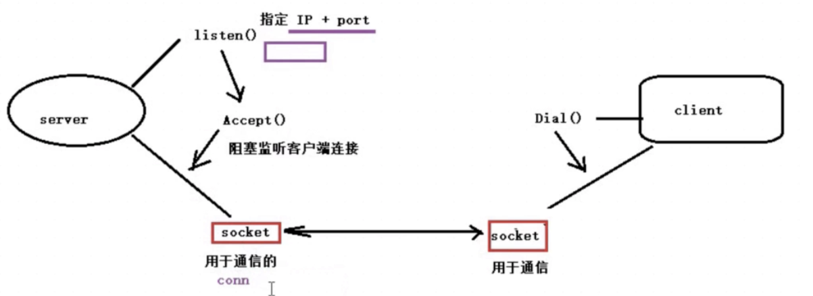

　　Socket的英文原义是“孔”或“插座”。作为BSD UNIX的进程通信机制，取后一种意思。通常也称作"套接字"，用于描述IP地址和端口，是一个通信链的句柄，可以用来实现不同虚拟机或不同计算机之间的通信。每种服务都打开一个Socket，并绑定到一个端口上，不同的端口对应于不同的服务。Socket正如其英文原意那样，像一个多孔插座。插座是用来给插头提供一个接口让其通电的，此时我们就可以将插座当做一个服务端,不同的插头当做客户端。

##### 什么是websocket(使用gorilla/websocket )

ReadMessage()读取客户端发送的消息，并使用conn.WriteMessage()发送回复消息。

webSocket是HTML5开始提供的一种在单个TCP连接上进行双工通讯的协议。

webSocket使得客户端和服务器之间的数据交换变的更加简单，允许服务端主动向客户端推送数据。

在webSocket API中，浏览器和服务器只需要完成一次握手，两者之间就直接可以创建持久性的连接，并进行双向数据传输。

**两者区别**

1. 运行在不同层次上：Socket运行在传输层（TCP/IP协议栈的第四层），而WebSocket运行在应用层（HTTP协议栈的第七层）。
2. 通信方式不同：Socket是一种面向字节流的通信方式，它可以实现双向、实时的数据传输，但需要自行定义协议以区分数据包。而WebSocket则是一种基于HTTP协议的双向通信方式，它使用HTTP的握手协议来建立连接，然后在连接建立后，双方可以通过send()和onmessage()方法来进行实时的双向通信。
3. 适用场景不同：Socket通常用于实现底层的网络通信，例如实现TCP或UDP协议的客户端/服务器应用程序。而WebSocket则更适用于实现实时的双向通信，例如聊天应用程序、在线游戏、远程桌面等。
4. 实现方式不同：在Golang中，Socket通常使用标准库中的net包来实现，而WebSocket则可以使用第三方库（例如gorilla/websocket）来实现。
5. 在webSocket API中，浏览器和服务器只需要完成一次握手，两者之间就直接可以创建持久性的连接，并进行双向数据传输。


##### 什么是RPC 和GRPC

Golang RPC（Remote Procedure Call，远程过程调用）是一种基于网络的通信方式，它可以让程序在不同的机器上进行函数调用。Golang标准库提供了net/rpc和net/rpc/json两个包来实现RPC功能。

Golang RPC的工作原理可以简单地描述为客户端调用远程函数时，客户端的RPC代理会将函数调用的参数序列化后发送给服务器端的RPC代理，服务器端的RPC代理再将结果序列化后发送给客户端。在这个过程中，客户端和服务器端之间的通信是通过网络进行的。

Golang RPC和gRPC都是用于实现不同服务或应用之间的通信的协议。Golang RPC是Go语言标准库中自带的RPC协议，支持自定义数据类型的序列化和反序列化。gRPC是Google开源的高性能RPC框架，支持多种语言，包括Go语言。相比于Golang RPC，gRPC支持更多的序列化方式，如**protobuf、JSON**等，并提供了更高的并发性能和更丰富的功能。

Protobuf是一种二进制序列化协议,它可以将结构化的数据序列化为紧凑的二进制格式，具有更小的数据体积和更快的序列化和反序列化速度。

JSON是一种文本序列化协议


**Grpc详解**

一. gRPC大致请求流程
1.客户端(gRPC Stub)调用A方法，发起RPC调用

2.对请求信息使用Protobuf进行对象序列化压缩（IDL）

3.服务端（gPRC Server)接收到请求后，解码请求体，进行业务逻辑处理并返回。

4.对响应结果使用Protobuf进行对象序列化压缩（IDL）

5.客户端接受到服务端响应，解码请求体。回调被调用的A方法，唤醒正在等待响应（阻塞）的客户端调用并返回响应结果

二。gRPC服务支持所有流组合：

一元（没有媒体流）：最简单的rpc调用，一个请求对象对应一个返回对象。客户端发起一次请求客户端相应一个数据，即标准的RPC通信。

服务器到客户端流：客户端流式rpc客户端传入多个请求对象。服务端返回一个响应结果。应用场景：物联网终端向服务器报送数据。

客户端到服务器流：服务端流式rpc一个请求对象，服务端可以传回多个结果对象。服务端流PRC下，客户端发出一个请求，但不会立即得到一个响应，而是在服务器与客户端之间建立一个单向的流，不断获取响应直到流关闭。应用场景举例：典型的例子是客户端向服务端发送一个股票代码，服务端就把该股票的实时数据源源不断的返回客户端

双向流媒体：双向流式RPC结合客户端流式RPC和服务端流式RPC，可以传入多个对象，返回多个响应对象。应用场景：聊天应用

三. 建议使用的场景：

微服务：gRPC设计为低延迟和高吞吐量通信，非常适用效率至关重要的轻型微服务

点对点实时通信：gRPC可以实时推送消息而无需轮询

多语言混合开发环境：支持所有流行开发语言

网络受限环境：使用Protobuf(一种轻量级消息格式)序列化gRPC消息。gRPC消息始终小于等效的JSON消息

不建议使用场景：

浏览器可访问的API：浏览器不支持gRPC,gRPC-Web有局限性而且还引入了服务器代理

广播实时通信

进程间通信

原文链接：https://blog.csdn.net/IAMZTDSF/article/details/125331008


##### Golang和JAVA相比有什么优缺点

1. java占用内存高,并且因为要加载Java虚拟机和大量的库文件，启动时间比较长
2. Golang并发性能优秀,因为提供了goroutine和channel,天生支持高并发
3. Golang的语法相对于JAVA来说要更加简介
4. Go生态系统相对较小,JAVA的第三方库比较丰富
5. Golang的对象继承不需要像JAVA一样显示声明 implement,只要实现了对应方法就是继承,不需要接口修改所有的实现类都修改,体现了高内聚低耦合


##### pv和pvc区别

PV : 持久化卷的意思，是对底层的共享存储的一种抽象
PVC（Persistent Volume Claim）是持久卷请求于存储需求的一种声明(PVC其实就是用户向kubernetes系统发出的一种资源需求申请。

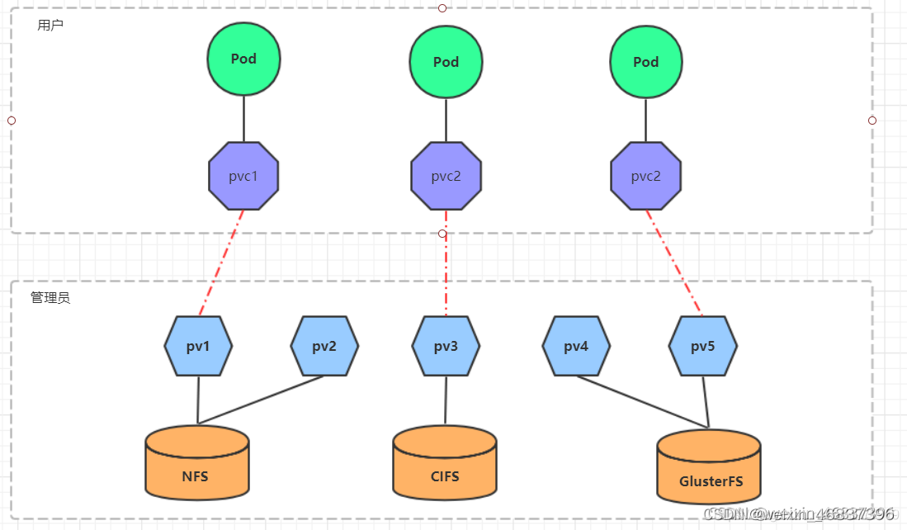

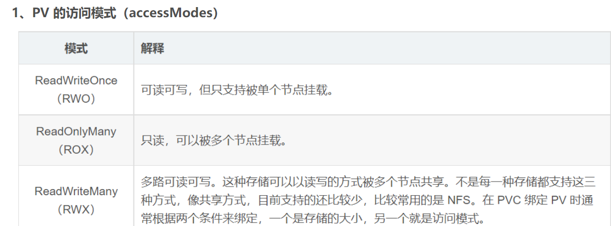

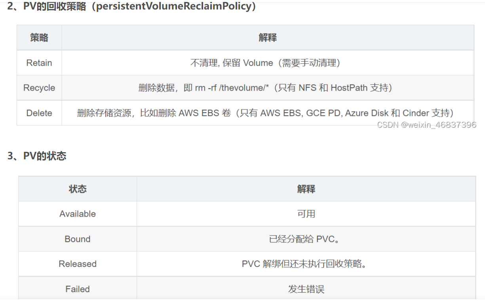


- goroute如何监控是否被kill

多个goroutine通过 signal.Notify 注册消息的接收，然后在每个 goroutine 中都可以捕捉到kill的信号


##### rune

答: rune类型是Go语言中的一个基本类型，其实就是一个**int32的别名**，主要用于表示一个字符类型大于一个字节小于等于4个字节的情况下，特别是**中文字符。**

比如 你好,世界 byte会打印出 13个byte码值(包含逗号),rune就正常打印出5个码值(包含逗号)


- 如何排查接口变慢

1.首先第一步 先明确是单个接口变慢 还是 多个服务多个接口都变慢 定位到大的方向,多个服务多个接口变慢,优先考虑系统共有资源问题

2.查看网络状态，延长时丢包率等

3.查看服务器共有资源, cpu 利用率，内存，i/o，磁盘空间,  使用TOP PS 命令等等

4.查看数据库的链接是否过多,是否锁表 事务未提交 锁表,读写性能达到瓶颈等等 (SHOW GLOBAL STATUS，)

5.如果是单个接口变慢,就看接口的整个链路,是哪个环节具体变慢了,并结合代码 具体分析


- Mysql  Explain 如何使用？

explain select * from t

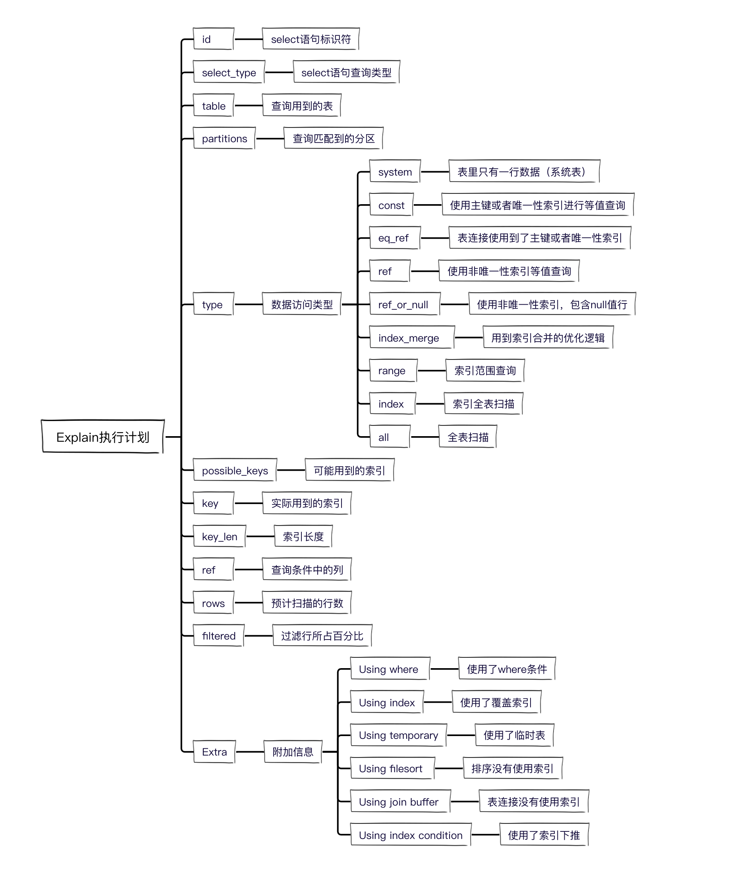

golang中的反射,优缺点,应用场景

- 反射就是程序能够在运行时动态的查看变量自己的所有属性和方法，能够调用他的任意方法和属性。
- GO的反射基础是接口和类型系统。
- 反射的优缺点：（优）简化代码、（缺）性能损失、难懂、脆弱

反射三定律

1. 反射可以从接口值得到反射对象；
2. 反射可以从反射对象获取接口值。
3. 若要修改一个反射对象，则其值必须为可以修改。

反射应用场景

- Golang的gRPC也是通过反射实现的。
- GO中的类型断言：判断接口型变量运行时的实际类型
- GIN参数校验


- **如何鉴权**

答案:在网关进行鉴权

1.定义了一个全局的拦截器。

2.对不在白名单中的url进行鉴权

3.解析jwt是否有效，如果jwt失效或者不正确，直接返回401

4.如果jwt有效，则解析jwt中的载荷信息用户id和用户名，并将用户id和用户名放到接口的请求头中。


- Go程序内存突然增大 怎么排查

使用pprof工具进行排查 可能涉及到GC,内存泄漏等


- 什么情况会造成内存泄漏

1.**select阻塞**

使用select时如果有case没有覆盖完全的情况且没有default分支进行处理，最终会导致内存泄漏

2.**channel阻塞**

channel阻塞主要分为写阻塞和读阻塞两种情况
 3.**申请过多的goroutine**
例如在for循环中申请过多的goroutine来不及释放导致内存泄漏

4.**I/O问题**
I/O连接未设置超时时间，导致goroutine一直在等待，代码会一直阻塞。

5.**死锁**

6.**slice 引起的内存泄漏**

当两个slice 共享地址，其中一个为全局变量，另一个也无法被GC；

append slice 后一直使用，没有进行清理。

   ————————————————
原文链接：https://blog.csdn.net/weixin_38299404/article/details/126805554

- **copy 和add 区别 yaml中**

答:copy 是从本地服务器 copy到容器内 (常用)

add  如果是压缩文件,复制进容器的时候会进行解压, 可以使用远程url获取远程文件 不一定要本地文件


- **产生死锁的条件，怎么解决死锁**

产生条件:

互斥：
指的是共享资源的互斥。
主要是因为多个线程都想访问同一个共享资源，但是该共享资源在某个时刻只能由一个进程访问。
持有并等待：
某进程持有一些资源并等待另外一些资源，在这一过程中，该进程并不会放弃自己已经持有的资源。
不可剥夺：
某线程持有的资源在其使用完之前不能被其他线程获取，只能由其自己使用完后释放。
环路等待：
两个或多个进程互相持有某些资源，并希望得到对方的资源，也可以说线程获取资源的顺序构成了环形链。

解决死锁:

死锁防止

防止是指在程序运行前就采取措施。
死锁防止主要策略是至少要破坏死锁产生的四个必要条件中的一个。

1.破坏互斥条件

使资源可以同时访问而不是互斥访问。
但是这种方法只适合只读资源，不能在独占性资源上采取。

2.破坏持有和等待条件

采用静态分配的方式，即进程必须在执行前申请所需的全部资源，否则不执行。
但是这种方式会严重降低资源的利用率，因为有些资源时在运行前期使用，而有些是在运行后期才使用的。

3.破坏不可剥夺条件

方法一：占有资源的进程若要申请新资源，必须主动释放已占有的资源。
方法二：资源分配管理程序为进程分配新资源时，若有则分配；否则将剥夺此进程已占有的全部资源，并让进程进入等待资源状态，资源充足后再唤醒它重新申请所有所需资源。

4.破坏等待循环条件

给系统所有资源编号，规定进程请求资源需按资源编号顺序进行。


- **分布式事务，讲一下两阶段提交，过程中节点故障的影响讨论** 

2PC是一个非常经典的强一致、中心化的原子提交协议

2PC(tow phase commit)两阶段提交。所谓的两个阶段是指：

1. 第一阶段：准备阶段(投票阶段)

   询问是否所有协调者资源均准备完成

2. 第二阶段：提交阶段（执行阶段）。

   2.1 正常执行提交

   2.2异常回滚

   

- **数据库的隔离级别**

**1.读未提交**

**2.读已提交**（Read Committed）：这是大多数数据库系统的默认隔离级别（但不是MySQL默认的）

**3.可重复读**（Repeatable Read）:这是MySQL InnoDB 引擎的默认事务隔离级别

**4.可串行化**（Serializable）：这是最高的隔离级别


- **脏读、幻读是什么** 

**脏读：**事务A读取了事务B更新的数据，然后B回滚操作，那么A读取到的数据是脏数据
**不可重复读：**事务 A 多次读取同一数据，事务 B 在事务A多次读取的过程中，对数据作了更新并提交，导致事务A多次读取同一数据时，结果因此本事务先后两次读到的数据结果会不一致。
**幻读：**幻读是指当事务不独立执行时，插入或者删除另一个事务当前影响的数据而发生的一种类似幻觉的现象。

出现幻读和不可重复读的原因很像，都是在多次操作数据的时候发现结果和原来的不一样了，出现了其他事务干扰的现象。

但是**幻读的偏重点是添加和删除数据**，多次操作数据得到的记录数不一样；不可重复读的偏重点是修改数据，多次读取数据发现数据的值不一样了。


- **linux 管道如何实现的** 

管道是[Linux](https://so.csdn.net/so/search?q=Linux&spm=1001.2101.3001.7020)中很重要的一种通信方式,是把一个程序的输出直接连接到另一个程序的输入,

其实bash在执行管道的时候，是同时创建左右两个进程，而且只会创建一次，并不是左边进程有输出再去创建右边进程处理。我们日常使用管道，多是左边进程很快结束的那种，对于左边进程是持续输出的情况（比如tail -f,tcpdump），以为是左边每输出一次内容就会去新建一个右边的进程来处理，其实管道右边的进程只会创建一次，他会持续的从管道读取数据并进行处理，


- **讲一下 TCP 三次握手，为什么需要三次**


**TCP**：是一个面向连接的、可靠的、基于字节流的传输层协议

面向连接：是指 TCP 是面向客户端和服务器端连接的通讯协议，使用它可以将客户端和服务器端进行连接。

可靠性：是指无论网络环境多差，TCP 都可以保证信息一定能够传递到接收端,当 TCP 意识到丢包了就会控制重发此包，这样就实现了 TCP 的可靠性。

面向字节流：是指 TCP 是以字节流的方式进行数据传输的

UDP：是无连接的、简单的、面向数据报的传输层协议

TCP VS UDP：

●可靠性，TCP 有“状态性”和“可控制性”可以保证消息不重复、按顺序、不丢失的发送和接收，而 UDP 则不能保证消息的可靠性；

●连接，TCP 是面向连接的传输层协议，传输数据前先要建立连接，而 UDP 发送数据之前无需建立连接；

●服务对象，TCP 服务的对象为一对一的双端应用，而 UDP 可以应用于一对一、一对多和多对多的通信场景；

●效率，TCP 的传输效率较低，而 UDP 的传输效率较高；

●流量控制，TCP 有滑动窗口可以用来控制流量，而 UDP 则不具备流量控制的能力；

●报文，TCP 是面向字节流的传输层协议，而 UDP 是面向报文的传输层协议；

●应用场景，TCP 的应用场景是对消息准确性和顺序要求较高的场景，而 UDP 则是应用于对通信效率较高、准确性要求相对较低的场景。

**滑动窗口**[https://blog.csdn.net/challenglistic/article/details/124769525]

TCP由于存在确认应答机制，在一方发出一条消息以后，另一方要发送ACK表明自己收到消息。如果按照下面这种形式，每次收到ACK才发出下一条消息，这种一发一收的效率太低。但是如果客户端不急着接收ACK，可以利用等待ACK的空挡直接发送下一批数据，这样就可以做到短时间内发送多批数据。这就是滑动窗口的基本思想。

窗口大小就是 这几批数据的所占字节数，以下面这个为例，窗口大小就是3000。在发送前三批数据的时候，可以不用等待ACK直接发送。
注意:**滑动窗口的大小取决与对方接收缓冲区的接受能力**

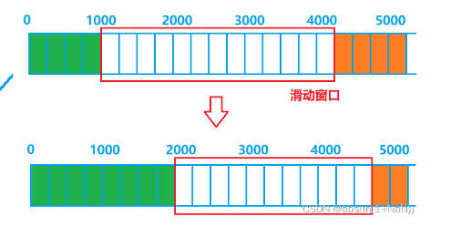


- 为什么需要3次握手？

1.防止重复连接

三次握手的主要原因是为了防止旧的重复连接引起连接混乱问题。

比如在网络状况比较复杂或者网络状况比较差的情况下，发送方可能会连续发送多次建立连接的请求。如果 TCP 握手的次数只有两次，那么接收方只能选择接受请求或者拒绝接受请求，但它并不清楚这次的请求是正常的请求，还是由于网络环境问题而导致的过期请求，如果是过期请求的话就会造成错误的连接。

所以如果 TCP 是三次握手的话，那么客户端在接收到服务器端 SEQ+1 的消息之后，就可以判断当前的连接是否为历史连接，如果判断为历史连接的话就会发送终止报文（RST）给服务器端终止连接；如果判断当前连接不是历史连接的话就会发送指令给服务器端来建立连接。
2.同步初始化序列化

那么在建立 TCP 连接时就需要同步初始化一个序列号来保证 TCP 的稳定性，因此它需要执行以下过程：

●首先客户端发送一个携带了初始序列号的 SYN 报文给服务器端；

●服务端接收到消息之后会回复一个 ACK 的应答报文，表示客户端的 SYN 报文已被服务端成功接收了；

●而客户端收到消息之后也会发送一个 ACK 给服务端，服务器端拿到这个消息之后，我们就可以得到一个可靠的初始化序列号了。

而如果是两次握手的话，就无法进行序列号的确认工作了，因此也就无法得到一个可靠的序列号了，所以 TCP 连接至少需要三次握手。


- **TCP 的 time_wait 状态了解吗？为什么需要该状态？如果 server 端存在大量处于 time_wait 状态的连接，会产生什么影响，该如何优化**

为什么有time_wait 状态？

1.可以保证可靠地终止 TCP 连接，如果处于 TIME_WAIT 的客户端发送给服务器确认报文段丢失的话，服务器将重新发送 FIN 报文段，所以客户端必须处于一个可接收的状态 TIME_WAIT 而不是 CLOSED 状态。

2.可以保证迟来的 TCP 报文段有足够的时间被识别并丢弃，某些情况，TCP 报文可能会延迟到达，为了避免迟到的 TCP 报文被误认为是新 TCP 连接的数据，需要在允许新创建 TCP 连接之前，保持一个不可用的状态，等待所有延迟报文的处理。


time_wait为什么是等待2MSL时间？

**MSL**（Maximum Segment Lifetime）是 TCP 协议数据报中任意一段数据在网络上被丢弃之前保持可用的最大时间

相当于至少允许报文丢失一次。比如，若 ACK 在一个 MSL 内丢失，这样被动方重发的 FIN 会在第 2 个 MSL 内到达，TIME_WAIT 状态的连接可以应对。


存在大量处于 time_wait 状态的连接，会产生什么影响？

1.客户端受端口资源限制：如果客户端 TIME_WAIT 过多，就会导致端口资源被占用，因为端口就 65536 个，被占满就会导致无法创建新的连接。

2.服务端受系统资源限制：理论上服务端可以建立很多连接，虽然只需监听一个端口但会把连接扔给处理线程，所以当服务端出现大量 TIME_WAIT 时，系统资源被占满时，会导致处理不过来新的连接。


如何优化？

调整短连接为长连接


- go 中有缓冲 channel 和无缓冲 channel 的区别，是否阻塞，读/写一个已关闭的 channel 会发生什么？

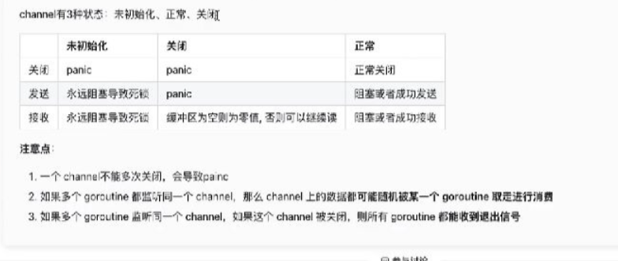


- 介绍一下 GC  [https://blog.csdn.net/qq_56999918/article/details/127538969] 

三色标记法
三色标记法的出现主要是为了减少这个STW时间或者不使用STW时间。下面我们一起来了解一下什么是三次标记法。
三色标记法 实际上就是通过三个阶段的标记来确定清楚的对象都有哪些，因此在三色标记法当中有三种颜色。下面分别解释一下这三种颜色分别代表什么意思：

白色:尚未访问过
黑色对象已访问过，而且本对象 引用到 的其他对象 也全部访问过了
灰色对象已访问过，但是本对象 引用到 的其他对象 尚未全部访问完。全部访问后，会转换为黑色。
清除的时候,清除的是白色对象

总结：

Golang中的混合写屏障满足弱三色不变式，结合了删除写屏障和插入写屏障的优点，只需要在开始时并发扫描各个goroutine的栈，使其变黑并一直保持，这个过程不需要STW，而标记结束后，因为栈在扫描后始终是黑色的，也无需再进行re-scan操作了，减少了STW的时间。

Go 1.3版本：普通标记清除法，整体过程需要启动STW，效率极低。
Go 1.5版本: 三色标记法， 堆空间启动写屏障，栈空间不启动，全部扫描之后，需要重新扫描一次栈(需要STW)，效率普通
Go 1.8版本：三色标记法，混合写屏障机制， 栈空间不启动，堆空间启动。整个过程几乎不需要STW，效率较高。


- defer  机制  

是一个延迟函数,常用于一些IO的关闭 是一个栈结构 先进后出


- goroutine 和线程的区别

Goroutine:是 Go语言中的轻量级线程实现，由 Go 运行时（runtime）管理

线程:是操作系统能够进行运算调度的最小单位。它被包含在进程之中，是进程中的实际运作单位。一个进程中可以并发多个线程，每条线程并行执行不同的任务。

调度区别: 

线程是通过OS操作系统调度器控制,切换需要一个完成的上下文切换时间

Goroutine 是由Go自带的Process 调度器控制, 与线程形成M:N的调度，即能利用多核cpu资源，也能尽可能减少上下文切换成本，成为Go语言最为人知的特点，天生支持高并发与高效。

Goroutine  处于用户态的线程,切换对于操作系统来说是不感知的,但是线程是出于内核态,切换上下文 OS是感知的


- **go 中如何限制 goroutine 的数量**  

答: 1. 使用channel 和 select控制 goroutine退出, channel 和sync.WaitGroup()控制并发数量 ｛add() Done() wait()｝

通过限制channel的队列长度来控制同时运行的goroutine数量

```go
func main()  {
    count := 9 // 要运行的goroutine数量
    limit := 3 // 同时运行的goroutine为3个
    ch := make(chan bool, limit)
    wg := sync.WaitGroup{}
    wg.Add(count)
    for i:=0; i < count; i++{
        go func(num int) {
            defer wg.Done()
            ch <- true // 发送信号
            fmt.Printf("%d 我在干活 at time %d\n",num,time.Now().Unix())
            time.Sleep(2 * time.Second)
            <- ch // 接收数据代表退出了
        }(i)
    }
    wg.Wait()
}
```

2.协程池 `ants`、`go-playground/pool`、`jeffail/tunny`等

链接: https://segmentfault.com/a/1190000040563884?sort=votes


- go 中如何控制一个 goroutine  的退出  

1.for-select (向退出通道发出退出信号)

2.使用 context.withcancel方法 控制多个goroutine退出

3.主函数退出

4.runtime.Goexit


- 讲一下 go 中的 context 

`Context` 是Go 语言独有功能之一，用于上下文控制，可以在 `goroutine` 中进行传递。

`context` 与 `select-case` 联合，还可以实现上下文的截止时间、信号控制、信息传递等跨 `goroutine` 的操作

Done:会返回一个channel，当该context被取消的时候，该channel会被关闭，同时对应的使用该context的routine也应该结束并返回。

WithCancel：基于父级 context，创建一个可以取消的新 context。
WithDeadline：基于父级 context，创建一个具有截止时间(Deadline)的新 context。
WithTimeout：基于父级 context，创建一个具有超时时间(Timeout)的新 context。
Background：创建一个空的 context，一般常用于作为根的父级 context。
TODO：创建一个空的 context，一般用于未确定时的声明使用。
WithValue：基于某个 context 创建并存储对应的上下文信息。

- 介绍一下 go 中的锁 

 sync.mutex 互斥锁 

sync.rwmutex 读写互斥锁  2个线程可以同时读，但是如果有 写的话 就会锁住  针对读多写少


- go 中有哪些数据是引用类型 

1.值类型：int、float、bool，数组array 和string这些类型都属于值类型

2.引用类型: slice(切片),map,channel,接口interface、函数func


- go 中的 interface 有什么用，判断 interface 是不是 nil 

主要是面向对象 不同于java 属于侵入式接口声明，一旦接口更改,所有的实现类都需要更改.

不像java 需要使用implement 声明，GO不需要显示的继承接口, 

非侵入式也体现了代码的设计原则：高内聚，低耦合


判断 interface 是不是 nil ？

interface 组成分为2部分 type和data

interface 如果要为nil的话 type 和data都必须为nil

如果要判断interface的data是否为nil 可以使用	反射来实现 reflect.valueof


- 设计模式

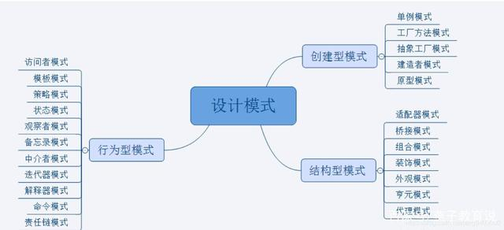


- rpc微服务框架

spring Cloud, gRPC


- ##### runtime包里面的方法

runtime.GC 垃圾回收

NumCPU：返回当前系统的 CPU 核数量

GOMAXPROCS：设置最大的可同时使用的 CPU 核数

Goexit：退出当前 goroutine(但是defer语句会照常执行)


- redis过期策略和内存淘汰策略

定时删除	设置某个Key的过期时间的同事，创建一个定时器，到时间就删除该key
惰性删除	设置key的过期时间后，再次使用该key时检查该key是否过期
定期删除	定期检查一些key，过期则删除

使用的是:  **定期删除+惰性删除**。

淘汰策略:

allkeys-lru：当内存不足以容纳新写入数据时，在键空间中，移除最近最少使用的 key（这个是最常用的）

allkeys-random：在键空间中，随机移除某个 key，这个一般没人用吧
volatile-lru：在设置了过期时间的键空间中，移除最近最少使用的 key（这个一般不太合适）。
volatile-random：在设置了过期时间的键空间中，随机移除某个 key。

- sql索引优化问题[https://blog.csdn.net/wszhm123/article/details/79798162]

待回去验证

- 一个update语句的执行过程

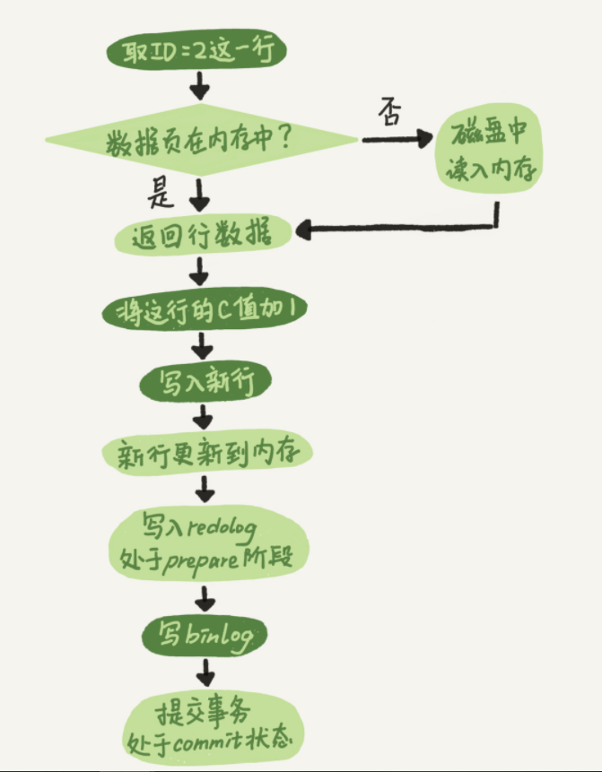

- go的profile工具？

profile 就是定时采样，收集 cpu，内存等信息，进而给出性能优化指导。

可以通过编译后文件，查看火焰图，查看函数执行时长、内存分析，CPU 执行时长。

- http和tcp有什么区别

1、TCP对应与[传输层](https://so.csdn.net/so/search?q=传输层&spm=1001.2101.3001.7020)、而HTTP对应于应用层，所以HTTP协议是建立在TCP协议之上的；

2、HTTP底层是利用TCP/UDP协议传输的，所以支持HTTP也就一定支持TCP/UDP；

3、TCP是网络传输协议， HTTP是超文本传输协议；

- 用netstat看tcp连接的时候有关注过time_wait和close_wait吗？

time_wait 是等待2msl时间 防止自身ACK报文丢失,接收对方重发的FIN报文

close_wait 是服务端收到客户端的FIN报文 断开连接,然后将自身还未发送的报文进行发送完成后,发给客户端FIN报文

- fork的底层实现方式

fork函数是非常重要的函数，他从一个已存在的进程中创建一个新进程


- go语言的时候垃圾回收，写代码的时候如何减少小对象分配

通常小对象过多会导致GC三色标记法消耗过多的CPU,可以适当减少小对象分配

1.小对象合并成结构体一次分配，减少内存分配次数

2.slice和map创建时，预估大小和指定容量

3.避免频繁创建临时变量

##### redis的存储结构？

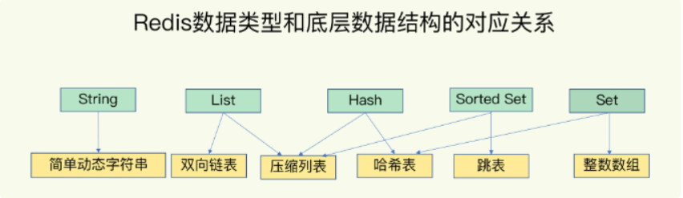

String：缓存、限流、计数器、分布式锁、分布式Session
Hash：存储用户信息、用户主页访问量、组合查询
List：微博关注人时间轴列表、简单队列
Set：赞、踩、标签、好友关系
Zset：排行榜  

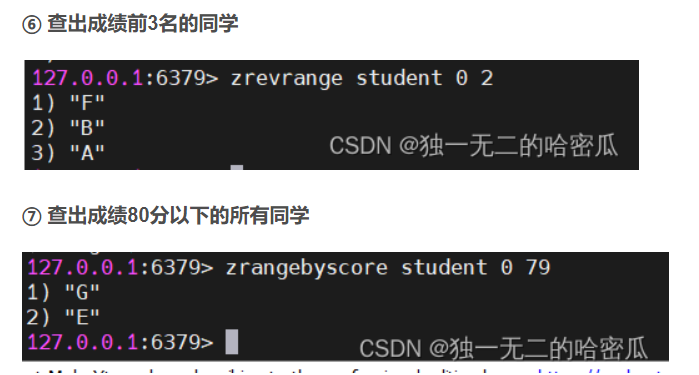

具体命令 https://blog.csdn.net/wwzzzzzzzzzzzzz/article/details/127217156 

- 实现map的方法除了哈希还有哪些？

Go语言中的map是也基于哈希表实现的，它解决哈希冲突的方式是链地址法，即通过使用数组+链表的数据结构来表达map

- redis的setnx底层怎么实现的？

根据源码分析，setnx 命令并没有加锁，也没有必要加锁，因为redis是单线程

问题1：codis(redis二次封装)是如何保证setnx名字原子执行的

codis主要是执行转发操作的，一个key值只能存在一台机器上，根据hash值索引，因此可以保证原子性

问题2：在代码中执行加锁时，使用以下写法是否有问题

SETNX key value
EXPIRE key 30
有问题的，对于客户端来说这是两种操作，如果执行第一步时出现了问题，就会导致key永久存储

redis 提供了 SET key value NX PX 过期值


- gin框架的路由是怎么处理的？

gin框架路由使用字典树（前缀树），路由注册的过程是构造前缀树的过程，路由匹配的过程就是查找前缀树的过程。另外，gin框架不支持路由的正则匹配。

动态路由优点:

 1.当增加或删除网络时，管理员维护路由配置的工作量少

 2.配置不容易错。

 3.扩展性好，网络规模越大，越能体现出[动态路由](https://so.csdn.net/so/search?q=动态路由&spm=1001.2101.3001.7020)的优势。


- mysql索引结构

B+树

MySQL索引的存储方式取决于具体的存储引擎。不同的存储引擎有不同的索引实现方式。

以 InnoDB 存储引擎为例，它的索引存储方式如下：

1. 索引数据结构：InnoDB 使用 B+ 树作为索引的数据结构，其中叶子节点存储了索引的值，以及指向对应数据行的物理地址。

2. 索引文件：InnoDB 的每个索引都会存储在磁盘上的一个独立文件中，文件名与表名和索引名相关。

3. 索引缓存：InnoDB 通过缓存索引来提高查询性能，它会将最常用的索引存储在内存中的缓存区域（即 InnoDB Buffer Pool）中，以减少磁盘 I/O 操作。

4. 辅助索引：InnoDB 的辅助索引（Secondary Index）会在叶子节点存储主键的值作为指向对应数据行的物理地址，因此查询辅助索引时需要先查询主键索引，然后再根据主键的值查询对应的数据行。

总之，InnoDB 使用 B+ 树作为索引的数据结构，并将索引分别存储在独立的文件中。同时，InnoDB 通过索引缓存来提高查询性能，并使用辅助索引来支持查询操作。


- B+树和B树有什么区别

1.B+树内节点不存储数据，所有 data 存储在叶节点导致查询时间复杂度固定为 log n。而B-树查询时间复杂度不固定，与 key 在树中的位置有关，最好为O(1)。

2.相对于内存存取，I/O存取的消耗要高几个数量级

- sql查询性能瓶颈处理方式

1. 避免使用select * 
2. 用 INNER JOIN（不是 WHERE）创建连接
3. 合理使用通配符  张%
4. 少使用is not null 
5. 添加索引
6. 避免在数据库层面做大量复杂查询的运算,可以将查出多个结果 放在业务层面进行计算


- SQL优化方式

SQL语句优化的注意点主要包括以下几个方面：

1. 避免使用“*”通配符：在查询时，尽量避免使用“*”通配符，因为它会导致查询的数据量增大，从而降低查询性能。

2. 避免使用子查询：子查询是比较低效的操作，尽量避免使用。可以通过其他方式代替子查询，如使用连接查询、临时表等。

3. 使用连接查询：连接查询是一种常用的查询方式。可以通过使用内连接、外连接、自连接等方式来优化查询性能。

4. 使用索引：索引是提高查询性能的有效方式之一。可以根据实际业务需求和查询场景来选择创建哪些索引。

5. 避免在查询中使用函数：在查询中使用函数会降低查询性能。如果必须使用函数，尽量将函数应用在查询条件中而不是查询结果中。

6. 避免在查询中使用 LIKE 操作符：LIKE 操作符会导致全表扫描，因此在查询时尽量避免使用。如果必须使用，可以使用前缀匹配来优化查询性能。

7. 优化表结构：可以通过调整表结构来优化查询性能。如合理设计表结构、拆分大表、使用数据类型等。

8. 使用 UNION ALL 代替 UNION：在使用 UNION 操作符时，尽量使用 UNION ALL 代替，因为 UNION ALL 不会去重，查询性能更高。

9. 避免在查询中使用 ORDER BY 操作符：在查询中使用 ORDER BY 操作符会增加排序的消耗，因此尽量避免使用。

总之，SQL语句优化需要根据实际情况进行，需要综合考虑系统性能、业务需求、数据量等因素。需要注意避免使用低效的操作，并选择合适的索引、表结构、查询方式等来提高查询性能。


- sql索引优化方式，explain字段含义

explain 可以查看复杂查询执行的子查询顺序,以及是否使用了索引，当前通过什么样的方式对数据库表进行分访问

- gmp具体的调度策略

1.复用线程:避免频繁的创建、销毁线程,而是对线程的复用。 

2.work stealing机制(偷取机制)

3.hand off机制(如果当前协程阻塞,会将该P交由其他M执行)
4.利用并行 GOMAYPROCS限定P的个数
5.抢占策略
6.全局队列 

- B+树细节优势，和哈希索引的区别，是为了解决什么问题？

哈希索引

1.等值查询更快(一般情况下)但是却无法进行范围查询

2:hash索引不支持模糊查询以及多列索引的最左前缀匹配,因为hash函数的不可预测，eg:AAAA和AAAAB的索引没有相关性

3.hash索引虽然在等值上查询叫快,但是不稳定,性能不可预测,当某个键值存在大量重复的时候,发生hash碰撞,此时查询效率可能极差


- 非聚簇索引一定会回表查询吗?
  不一定,这涉及到查询语句所要求的字段是否全部命中了索引,如果全部命中了索引,那么就不必在进行回表查询了.

eg:假设我们在员工表的年龄上建立了索引,那么当进行select age from employee where age<20的查询时,在索引的叶子节点上,已经包含了age信息,不会再次进行回表查询.


- 事务四个特性四个隔离级别

特性:（ACID）原子性、一致性、隔离性、持久性

隔离级别:

**1.读未提交**

**2.读已提交**（Read Committed）：这是大多数数据库系统的默认隔离级别（但不是MySQL默认的）

**3.可重复读**（Repeatable Read）:这是MySQL InnoDB 引擎的默认事务隔离级别

**4.可串行化**（Serializable）：这是最高的隔离级别

- httptime_wait状态分析

时间2MSL 为了防止 ack报文丢失 服务端重新发送FIN报文 能收到并反馈

- nginx负载均衡策略

1、轮询策略

轮询策略其实是一个特殊的加权策略，不同的是，服务器组中的各个服务器的权重都是1

2、轮询加权策略

通过加入 weight的值进行加权处理，权重值越大，服务器越容易被访问，因此，性能好的服务器应适当加大权重值

3、ip 哈希策略

ip_hash 策略能够将某个客户端IP的请求固定到同一台服务器上,解决多台服务器Session不共享的问题

- es内部实现原理，如何保证数据一致性，如何降低压力


- linux查看磁盘、io、内存情况的命令

​       **free**

1. **top**    监控整体服务器，cpu，内存，磁盘，网络等

2. dstat -d 查看当前磁盘每秒的读取，写入量，单位K

3. dstat -r 查看当前磁盘随机的读IOPS，写IOPS

4. dstat -n 查看网卡每秒接收，发送量，单位K，不足1K时显示Byte数

5. pidstat 统计各个进程的磁盘IO，也可以监控指定进程，还可以监控cpu和内存

6. iotop 类似top命令，不过iotop是只监控io相关的进程

7. **vmstat** 监控io活跃的进程，还可以监控内存，cpu相关

8. mpstat命令主要用于多CPU环境下，它能显示各个CPU状态。


- 分库分表联表查询有哪些方式

分表:通过对应的分表规则 算出对应的数据在哪个表

分库:分别查询 然后将结果做处理,因为数据量大,建议查出数据 线下处理

离线数仓: 大数据平台 会将每天数据汇总，通过大数据平台进行查询

- 覆盖索引&回表查询

回表查询:执行2次B+树查询

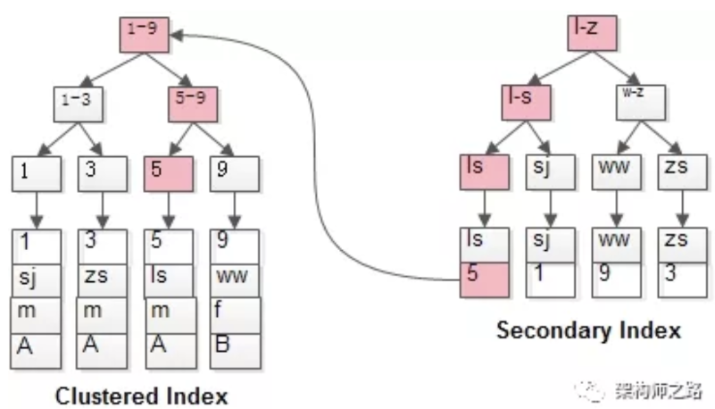


如**粉红色**路径，需要扫码两遍索引树：

（1）先通过普通索引定位到主键值id=5；

（2）在通过聚集索引定位到行记录；

https://blog.csdn.net/qq_44182694/article/details/124032842

那么解决回表查询的关键就是：**索引覆盖**

就是name 与 sex 可以建立联合索引。这就是索引覆盖

- 聚簇索引&非聚簇索引

在聚集索引中，B+树上会存储这一行的全部数据，但是非聚集索引只会存储该列对应的值和相应行的主键。

如果定义了主键索引 那么主键索引就是 聚簇索引 ,当我们没有定义主键索引时，MYSQL会指定从左到有的第一个加了唯一索引和非空约束的列建立聚集索引，用它来代替主键索引。

- go实现不重启热部署

go get -u github.com/cosmtrek/air

air 实现热部署

- go性能分析工具

net/http/pprof
对于在线服务，对于一个 HTTP Server，访问 pprof 提供的 HTTP 接口，获得性能数据。当然，实际上这里底层也是调用的 runtime/pprof 提供的函数，封装成接口对外提供网络访问。

方法一:   分析采样图

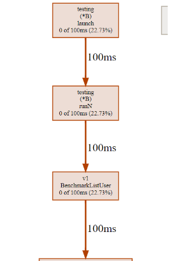

方法二：分析火焰图

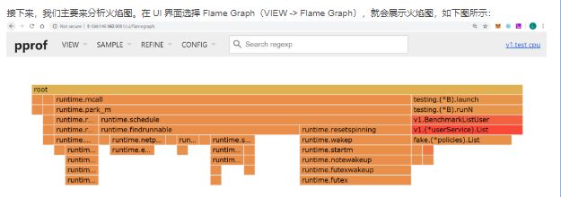

- tcp如何保证稳定性

校验和、序列号、确认应答、超时重传、连接管理(3次握手,4次挥手)、流量控制、拥塞控制。

https://blog.csdn.net/qq_53267860/article/details/125695561

- http和http2区别

1，二进制传输
http2采用二进制传输，相对于http1的文本传输安全性要高

2，多路复用
http一个链接只能提交一个请求，而http2能同时处理无数个请求，可以降低连接的数量，提高网络的吞吐量。

3，头部压缩
http2通过gzip与compress对头部进行压缩，并且在客户端与服务端各维护了一份头部索引表，只需要根据索引id就可以进行头部信息的传输，缩小了头部容量，间接提升了传输效率。

4，服务端推送
http2可以主动推送资源到客户端，避免客户端花过多时间逐个请求，降低相应时间

- https的连接过程

https://www.jianshu.com/p/8140c68d86e7

- kafka如何做到高可用


- 分布式锁如何实现

redis 提供了 SET key value NX PX 过期值


- goroutine创建数量有限制吗？

没有。但**理论上会受内存的影响**，假设一个 Goroutine 创建需要 2-4k

**P 的数量受环境变量 `GOMAXPROCS` 的直接影响**。 runtime.GOMAXPROCS

在 Go 语言中，**M 的默认数量限制是 10000**


- 锁的可重入

JAVA里面的ReentrantLock


- 常用限流算法

1.固定窗口

2.滑动窗口

3.令牌桶算法

4.漏桶算法

https://blog.csdn.net/qq_36059306/article/details/118610485

- 布隆过滤器

布隆过滤器由一个初值都为 0 的 bit 数组和 N 个哈希函数组成，可以用来快速判断某个数据是否存在。当我们想标记某个数据存在时（例如，数据已被写入数据库），布隆过滤器会通过三个操作完成标记：

1.使用 N 个哈希函数，分别计算这个数据的哈希值，得到 N 个哈希值。

2.我们把这 N 个哈希值对 bit 数组的长度取模，得到每个哈希值在数组中的对应位置。

3.我们把对应位置的 bit 位设置为 1，这就完成了在布隆过滤器中标记数据的操作。

注意:如果布隆过滤器数值太小,就会导致数值绝大多数全都是1,基本上也就失去了过滤的效果

布隆过滤器的误判率是跟 **bit数值大小** 和 **要经过多少个哈希函数** 判断标记有关的 

- rpc调用过程

调用方持续把请求参数对象序列化成二进制数据，经过 TCP 传输到服务提供方；
服务提供方从 TCP 通道里面接收到二进制数据；
根据 RPC 协议，服务提供方将二进制数据分割出不同的请求数据，经过反序列化将二进制数据逆向还原出请求对象，找到对应的实现类，完成真正的方法调用；
然后服务提供方再把执行结果序列化后，回写到对应的 TCP 通道里面；
调用方获取到应答的数据包后，再反序列化成应答对象。
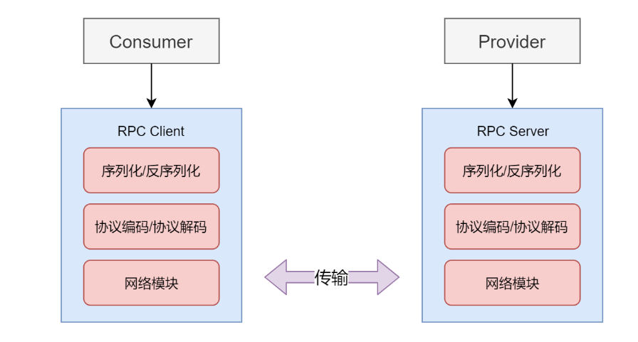


- 什么操作会影响联表查询效率

1. 多表关联：当需要对多个表进行关联查询时，可能会导致查询效率变慢。因为在进行关联查询时，需要对多个表进行扫描和匹配操作，数据量越大，查询效率就越低。
2. 大表关联小表：当需要对一个大表和一个小表进行关联查询时，可能会导致查询效率变慢。因为在进行关联查询时，需要对大表的每一行都扫描小表，这会导致查询效率变慢。
3. 无索引关联：当进行联表查询时，如果没有合适的索引来优化查询，也可能会影响查询效率。因为在进行关联查询时，需要对多个表进行扫描和匹配操作，如果没有合适的索引，查询效率会变得非常低。
4. 多次关联同一表：当需要对同一张表进行多次关联查询时，也可能会影响查询效率。因为每次关联查询都需要对同一张表进行扫描和匹配操作，这会导致查询效率变慢。

总之，联表查询是一种非常有用的 SQL 操作，但需要注意一些可能会影响查询效率的操作，如多表关联、大表关联小表、无索引关联和多次关联同一表等。需要根据实际情况进行调整和优化，以提高查询效率。

- 一个sql的查询过程

一个 SQL 查询的过程可以大致分为以下几个步骤：

1. 语法分析：数据库会对 SQL 查询进行语法分析，检查查询语句是否符合 SQL 语法规范，如果语法错误则会返回错误信息，否则继续执行。
2. 语义分析：数据库会对 SQL 查询进行语义分析，检查查询语句是否符合语义规范，如表是否存在、列是否存在、权限是否足够等，如果不符合语义规范则会返回错误信息，否则继续执行。
3. 查询优化：数据库会对 SQL 查询进行优化，生成一个最优的查询计划，以便在执行查询时能够快速地获取结果。优化的过程包括索引选择、查询重写、连接方式选择等。
4. 执行查询：数据库根据生成的查询计划开始执行查询操作，包括数据的读取、过滤、排序、聚合等操作。
5. 返回结果：当查询执行完成后，数据库会将查询结果返回给客户端，客户端可以根据需要对结果进行处理，如显示、保存等。


- redis单线程是如何做到支持高并发的

Redis 之所以能够支持高并发，主要是因为以下几个原因：

1. 单线程模型：Redis 采用单线程模型，即所有的命令都是在一个单独的线程中执行的。虽然这个线程只能处理一个命令，但是由于 Redis 的内部实现采用了异步 IO 和非阻塞 IO，所以这个线程可以处理大量的客户端请求，并且处理得非常快速。
2. 高效的内存操作：Redis 将数据存储在内存中，并且采用了高效的数据结构，如哈希表、有序集合、列表等，这些数据结构的底层实现都是基于数组和指针的，能够快速地进行数据操作。
3. 非阻塞 IO：Redis 采用了非阻塞 IO，可以在 I/O 操作未完成的情况下继续执行其他操作，从而提高了并发性能。
4. 异步 IO：Redis 利用异步 IO，可以在等待 I/O 操作的同时，执行其他操作，从而提高了系统的并发性能。
5. 多路复用技术：Redis 采用了多路复用技术，可以同时处理多个客户端连接，并且在这些连接之间进行切换，从而提高了系统的并发性能。

总之，Redis 之所以能够支持高并发，主要是因为它采用了单线程模型、高效的内存操作、非阻塞 IO、异步 IO 和多路复用技术等多种技术手段，从而提高了系统的并发性能。


- IO多路复用

poll和select 缺点:

1. 由于是采用轮询方式全盘扫描，会随着文件描述符 FD 数量增多而性能下降。
2. 每次调用 select()，都需要把 fd 集合从用户态拷贝到内核态，并进行遍历(消息传递都是从内核到用户空间)。

epoll:

1.没有 fd 个数限制，用户态拷贝到内核态只需要一次

2.使用回调通知而不是轮询的方式，不会随着 FD 数目的增加效率下降

- 为什么内存操作很快

硬盘是机械结构，通过磁头的转动读取数据。

内存是通电存储数据的，无机械结构,电的速度比磁头快多了

内存的本质上是 RAM存储器，它是一种半导体存储器件。

- innoDB为什么支持事务

在 InnoDB 中，事务的支持是通过以下机制实现的：

1. 事务日志：InnoDB 在执行事务期间会将所有的修改操作记录在事务日志中，以便在回滚操作或者系统崩溃时进行恢复。
2. 锁机制：InnoDB 采用了多种锁机制，如行级锁、表级锁等，以保证在事务执行期间数据的一致性和完整性。
3. MVCC：InnoDB 采用了多版本并发控制 (MVCC) 技术，这种技术可以在多个事务同时访问同一行数据时，保证数据的一致性和可靠性。

总之，InnoDB 之所以支持事务，主要是为了保证数据的一致性、可靠性和完整性，同时采用了事务日志、锁机制和 MVCC 等技术手段来实现这种机制。


- k8s各种组件


- gomap并发安全问题，如何解决

sync.map

- 一个进程能创建的线程数量受到哪些制约？

理论上，一个进程可用虚拟空间是2G，默认情况下，线程的栈的大小是1MB，所以理论上最多只能创建 2048个线程。如果要创建多于2048的话，必须修改编译器的设置。


- redis主从同步怎么做的

通过RDB 快照同步,后续同步期间新增的数据通过repl buffer同步

- k8s组件及其作用
- k8s基本操作
- docker底层实现原理

Docker的底层原理是利用了linux的Cgroups和Namespace技术。cgroups是用来制造约束的主要手段，而namespace技术是用来修改进程视图（隔离）的主要方法。

**Docker和虚拟机不同点**：

1.虚拟机是硬件层抽象，虚拟硬件和操作系统，而Docker是应用层抽象，只虚拟化操作系统

2.Docker相比虚拟机更加轻量级和便携

3.Docker启动速度更快


- docker基本操作
- linux常用操作

- linux内核
- etcd

是基于go语言实现，主要用于共享配置和服务发现的组件，最初用于解决集群管理系统中 os 升级时的分布式并发控制、配置文件的存储与分发等问题。因此，etcd是在分布式系统中提供强一致性、高可用性的组件，用来存储少量重要的数据。

v3版本使用 gRPC + protobuf 取代 v2版本的http + json 通信，提高通信效率。gRPC 只需要一条连接，http是每个请求建立一条连接，建立连接会耗费大量时间；protobuf 加解密比json加解密速度得到数量级的提升，包体也更小。

- kafka
- es
- 数据库分库分表，啥时候分库啥时候分表

分库:当数据库连接到达上限的时候

分表:当单表数量过大,比如mysql超过2KW的时候,会变成4层B+树

1.水平分表

2.垂直分表


- 数据库的存储引擎有哪些，区别是啥
- innodb索引用的是啥，为什么不用b、红黑

红黑树:是一种平衡二叉树，其中**叉代表的是子树指针的数量**，和所有二叉树一样，它的叉=2，树高是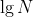，，它适合作为内存中的一种有序的结构来使用，但是面对磁盘千万级的数据量，它的树高将达到两位数，很不利于磁盘中的操作。

为什么是B+树而不是B树:

1.叶子节点通过链表链接了起来，比较适合范围查找，

2.是把数据指针都放在叶子节点上，在同等树高下，存储的数据量更多。

 对比了B树、B+树和红黑树，红黑树首先被排除在外了，比如同样2000w数据，M=1170的B+树树高只有3层左右，而红黑树则有24层：


- redis底层数据结构实现

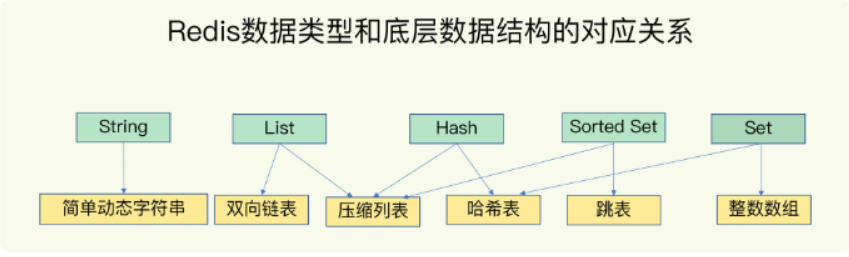

- mysql索引，mongodb和mysql索引的区别

可以看出由于关系型数据库和非关系型数据的设计方式上的不同。导致在关系型数据中，遍历操作比较常见，因此采用 B + 树作为索引，时间复杂度固定为 log(n),比较合适。而在非关系型数据库中，单一查询比较常见，因此采用 B 树作为索引，比较合适。

hash 哈希   单查询复杂度 o(1) 但是遍历要o(n),

单记录查询非常常见，但是对于遍历数据也需要有相对较好的性能支持，哈希这种性能表现较为极端的数据结构往往只能在简单、极端的场景下使用。


- 高并发限流、降级、熔断

限流:限制流量 令牌桶 滑动窗口

降级: 某些非重要功能不可用

熔断: 微服务C不可用,避免影响同一链路上的其他服务 就直接返回错误,不再请求C


- 长连接和短链接(怎么实现的、区别以及应用场景)

前言:

1. HTTP/1.0默认使用短连接，HTTP/1.1开始默认使用长连接；
2. HTTP协议的长连接和短连接，实质就是TCP协议的长连接和短连接；
3. TCP协议建立连接需要3次握手，断开连接需要4次握手，这个过程会消耗网络资源和时间；

使用场景：
短连接：适用于网页浏览等数据刷新频度较低的场景。一般而言像及京东，淘宝这些大型网站，随时都会有成千上万的用户请求，一般使用短连接，用户量太大，服务器扛不住那么多长连接；
长连接：适用于客户端和服务端通信频繁的场景，例如：聊天室，实时游戏等场景。即时通讯（QQ）般使用的都是长连接，但并不是永久连接（比如20分钟，半个小时），因为即时通讯是频繁的发送请求，使用长连接只需要建立一次连接，同时再根据业务设置保持时间，超过这个时间就会断开连接，一定程度上保证了服务器的压力不会过大。
https://blog.csdn.net/castletower/article/details/104048920


- 协程和线程的区别，内核态和用户态
- 二叉树中序遍历，递归和非递归两种方式

（1）[先序遍历](https://so.csdn.net/so/search?q=先序遍历&spm=1001.2101.3001.7020)：（根左右）

（2）中序遍历：（左根右）

（3）后序遍历：（左右根）

- **kafka如何保证消息有序，消息的重复和丢失**

**消息有序 :** 

kafka 中的每个 partition 中的消息在写入时都是有序的，而且单独一个 partition 只能由一个消费者去消费，可以在里面保证消息的顺序性。但是分区之间的消息是不保证有序的。

在Kafka中，**只保证Partition(分区)内有序，不保证Topic所有分区都是有序的**

**解决方案1：**

一个 topic，一个 partition，一个 consumer，**内部单线程消费，单线程吞吐量太低，不建议使用**

**消息的重复:**

mq无法判断消息是否重复,需要业务层进行判断

**消息丢失:**

设置 ACK + 重试机制

NoResponse RequiredAcks = 0：这个代表的就是不进行消息推送是否成功的确认。
WaitForLocal RequiredAcks = 1：当local(Leader)确认接收成功后，就可以返回了。
WaitForAll RequiredAcks = -1：当所有的Leader和Follower都接收成功时，才会返回。

- 验签

将报文通过密钥加密 和将报文进行hash算法后,在进行密钥加密 发给接收端,接收方2个都解密后进行比对是否一致,判断内容是否被篡改

https://zhuanlan.zhihu.com/p/457435473


##### http和https的区别，https建立连接的过程

https://blog.csdn.net/weixin_43844995/article/details/125742436]

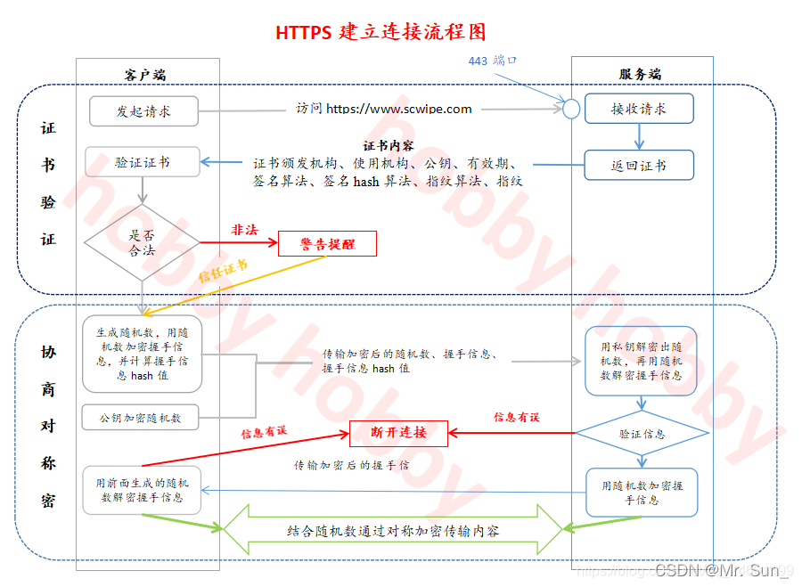

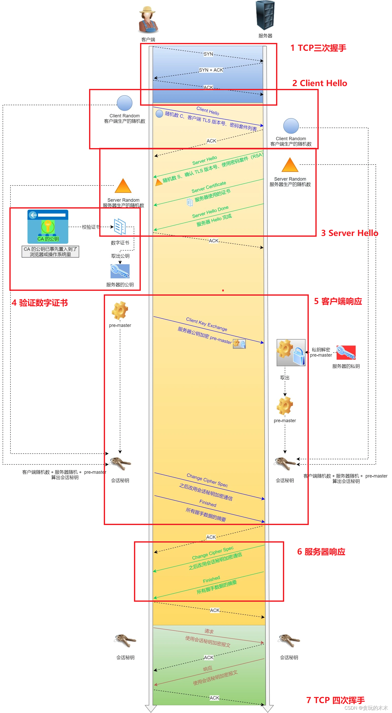

- 缓存和数据库一致性的问题

1.延迟双删 比较难界定 时间多久

2.先更新数据库后删除缓存

- 在微服务架构中，监控系统按照原理和作用大致可以分为三类：

  日志监控（Log） ：ELK

  调用链调用监控（Tracing）

  度量监控（Metrics） : 时序数据库

- syncpool的实现原理

对象的创建和销毁会消耗一定的系统资源（内存，gc等），过多的创建销毁对象会带来内存不稳定与更长的gc停顿，Pool用于核心的功能就是Put和Get。当我们需要一个对象的时候通过Get获取一个，创建的对象也可以Put放进池子里，通过这种方式可以反复利用现有对象，这样gc就不用高频的促发内存gc了。

- hash冲突解决办法，有什么弊端

1.使用链表处理hash冲突元素 比如golang map

2.顺延当前hash值往后，找到最近一个没有冲突的地方

- redis  zset怎么使用的，底层怎么实现的，适用于什么场景

排行榜 底层 压缩列表+跳表  


- 线上问题一般怎么排查，比如oom


- docker和虚拟机区别

虚拟机是在物理资源层面实现的隔离，相对于虚拟机，Docker是你APP层面实现的隔离，并且省去了虚拟机操作系统（Guest OS）），从而节省了一部分的系统资源

docker与宿主机共享内核、文件系统等资源

虚拟机与容器docker的区别，在于**vm多了一层guest OS，虚拟机的Hypervisor会对硬件资源也进行虚拟化，而容器Docker会直接使用宿主机的硬件资源**。

- k8s底层原理
- linux文件系统
- 网络七层模型和五层模型

应用层(应用层,表示层,会话层,)，传输层，网络层,数据链路层,物理层

- 同一个协程里面，对无缓冲channel同时发送和接收数据有什么问题

都会阻塞

- channel和锁对比一下

并发问题可以用channel解决也可以用Mutex解决，但是它们的擅长解决的问题有一些不同。

channel关注的是并发问题的数据流动，适用于数据在多个协程中流动的场景。

而mutex关注的是是数据不动，某段时间只给一个协程访问数据的权限，适用于数据位置固定的场景。

- channel的应用场景

1. 使用 chan 实现程序的 graceful shutdown，在退出之前执行一些连接关闭、文件 close、缓存落盘等一些动作。

2. 信号传递
3. 超时控制
4. 定时任务

https://www.cnblogs.com/mango1997/p/16812479.html

- slice和array区别

1.array 值类型 slice 引用类型

2.slice可以动态扩容,array不行

- 向为nil的channel发送数据会怎么样


- map取一个key，然后修改这个值，原map数据的值会不会变化

需要看值的类型

对于基本类型（如 `int`, `float64`, `bool`, `string` 等）和结构体，`map` 存储的是值的副本。因此，当你尝试修改一个基本类型或结构体类型的值时，原 `map` 数据的值不会更改。

对于引用类型（如 `slice`, `map`, `channel` 等） 值会更改

- Hash实现、冲突解决、应用
- 输入URL发生的整个网络过程

1.看host文件有没有配置对应IP

2.查询本地DNS服务器 （中国电信，移动等）

3.如果本地DNS服务器也没有缓存,向DNS根服务器进行查询

4.然后本地DNS会向域服务器查询,查询到结果进行缓存

5.建立HTTP连接，发送HTTP请求，服务器处理请求并返回HTTP报文，浏览器解析渲染页面，连接结束。

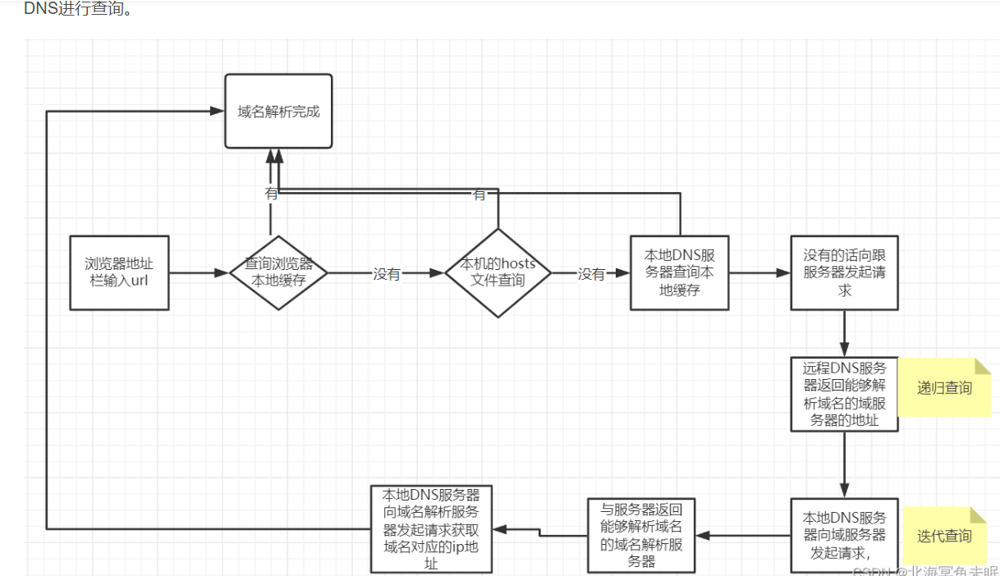

- TCP流量控制、拥塞控制

1.滑动窗口机制

- TCP半连接队列

syn_recd 状态，表示 服务端 接收的套接字 是半连接 ，在半连接队列 ， 完成了第一次 握手

- TCP半关闭状态

四次分数的 close_wait状态，接收到客户端的FIN报文,但自身还没回复FIN，正在发送还未发送的数据

- TCPTIME_WAIT状态

等待2MSL,等待确认关闭

- 100枚硬币，其中有一枚硬币重量不一样，用天平秤怎么快速找到这一枚硬币

分3份

- MVCC原理

MVCC（Multi-Version Concurrency Control）是一种并发控制的技术，用于解决多个事务并发访问数据库时可能出现的数据不一致问题。MVCC 主要应用于数据库中读写并发场景，通过为每个事务创建多个版本的数据，实现了读写之间的隔离性和并发性。

MVCC 的原理如下：

1. 每个数据行都有一个版本号，用于标识该数据行的版本。
2. 在事务开始时，会创建一个事务版本号，用于标识该事务的版本。
3. 在读操作时，只能读取版本号小于或等于该事务版本号的数据行，这样可以保证读操作只能读取到已提交的数据。
4. 在写操作时，会创建一个新的版本号，并将该版本号与写操作的数据行关联起来，这样可以保证写操作不会影响已提交的数据。
5. 在提交事务时，会将该事务版本号设置为最新的版本号，这样可以保证该事务提交的数据对其他事务可见。
6. 在并发访问时，读操作不会阻塞写操作，写操作也不会阻塞读操作，这样可以提高数据库的并发性能。

MVCC 的优势在于，在并发访问的情况下，可以保证数据的一致性和隔离性，同时提高了数据库的并发性能。但是 MVCC 也会带来一些额外的开销，如版本号的维护和数据的复制等，需要在实际使用中权衡利弊


- ACID的涵义，MYSQL是如何保证的

1.原子性由undolog日志来保证，它记录了需要回滚的日志信息，事务回滚时撤销已经执行成功的sql
2.隔离性是由MVCC来保证
3.持久性由redolog来保证，mysq|修改数据的时候会在redolog中记录一份日志数据，就算数据没有保存成功，只要日志保存成功了，数据仍然不会丢失
4.一致性由其他三大特性保证，程序代码要保证业务上的一致性

- 缓存失效的几种场景，以及解决方案

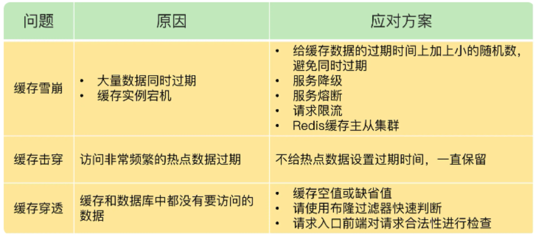

- protobuf为什么快

1.二进制传输

2.压缩率高

3.多语言支持

- 分布式系统优缺点，一致性是如何保证的
- 最终一致性

微服务与微服务之间是采用最终一致性,失败会有重试机制

服务内部是采用实时一致性,如果检测到失败 会调用cancel()rollback 进行回滚

举例: 用户用积分换取优惠卷 涉及到用户中心和营销平台

- mysql分布式id

自增主键来做唯一标识，因为项目虽然是主从分离,但是写请求是一台数据库

- mysql索引慢分析：线上开启slowlog，提取慢查询，然后仔细分析explain中tye字段以及extra字段，发生的具体场景及mysql是怎么做的
- mysql分库分表平滑扩容方案

https://mp.weixin.qq.com/s?__biz=MzAxODcyNjEzNQ==&mid=2247567010&idx=2&sn=ce135810df0286b1abcd2c7321f04e31&chksm=9bd26b3aaca5e22c2ea7efff607696aa198c453ea8075b4a32d53498d0340a3609ca284f70ff&scene=27

- gowaitgroup的坑

使用时,作为传参,需要传入waitgroup对象的指针

https://blog.51cto.com/u_15912066/5936035

- etcd原理

ETCD使用Raft协议来维护集群内各个节点状态的一致性。简单说，ETCD集群是一个分布式系统，由多个节点相互通信构成整体对外服务，每个节点都存储了完整的数据，并且通过Raft协议保证每个节点维护的数据是一致的。
每个ETCD节点都维护了一个状态机，并且，任意时刻至多存在一个有效的主节点。主节点处理所有来自客户端写操作，通过Raft协议保证写操作对状态机的改动会可靠的同步到其他节点。
ETCD工作原理核心部分在于Raft协议和watch机制。
原文链接：https://blog.csdn.net/songfeihu0810232/article/details/123786357

- gostruct能不能比较

1.不同的 struct 之间不能进行比较，编译期就会报错（GoLand 会直接提示）

2.同一个的 struct 也分为两种情况

​      2.1struct 的所有成员都是可以比较的，则该 strcut 的不同实例可以比较

​      2.2struct 中含有不可比较的成员（如 Slice,map 引用类型），则该 struct 不可以比较

- context包的用途

context包可以提供一个请求从API请求边界到各goroutine的请求域数据传递、取消信号及截至时间等能力。

- 主协程如何等其余协程完再操作

sync.waitgroup 

- slice，len，cap，共享，扩容

slice的数据结构由指向数组的指针、len,cap组成，在使用append扩容的时候，会查看有没有可用的连续内存，如果有直接添加，没有就重新组成一个大的数组，原切片小于1024的时候,扩容总是cap的2倍数执行，如果原切片的容量大于等于1024时，每次增加25%。扩容slice后，指向的数组的指针发生改变，已不再指向原数组

- map如何顺序读取

Go中map如果要实现顺序读取的话,可以先把map中的key,通过sort包排序

- 数据库如何建索引

create index name_index on 表名(name);  以name字段创建普通索引

- tcp与udp区别，udp优点，适用场景

**TCP**：是一个面向连接的、可靠的、基于字节流的传输层协议

面向连接：是指 TCP 是面向客户端和服务器端连接的通讯协议，使用它可以将客户端和服务器端进行连接。

可靠性：是指无论网络环境多差，TCP 都可以保证信息一定能够传递到接收端,当 TCP 意识到丢包了就会控制重发此包，这样就实现了 TCP 的可靠性。

面向字节流：是指 TCP 是以字节流的方式进行数据传输的

UDP：是无连接的、简单的、面向数据报的传输层协议

TCP VS UDP：

可靠性，TCP 有“状态性”和“可控制性”可以保证消息不重复、按顺序、不丢失的发送和接收，而 UDP 则不能保证消息的可靠性；

连接，TCP 是面向连接的传输层协议，传输数据前先要建立连接，而 UDP 发送数据之前无需建立连接；

服务对象，TCP 服务的对象为一对一的双端应用，而 UDP 可以应用于一对一、一对多和多对多的通信场景；

效率，TCP 的传输效率较低，而 UDP 的传输效率较高；

流量控制，TCP 有滑动窗口可以用来控制流量，而 UDP 则不具备流量控制的能力；

报文，TCP 是面向字节流的传输层协议，而 UDP 是面向报文的传输层协议；

应用场景，TCP 的应用场景是对消息准确性和顺序要求较高的场景，而 UDP 则是应用于对通信效率较高、准确性要求相对较低的场景。

- raft算法是那种一致性算法

raft:分布式一致性算法 

1.选举 Leader

2.日志复制
3.安全性

- 一个请求到达pod的过程、configmap、dockerfile

请求到达pod过程

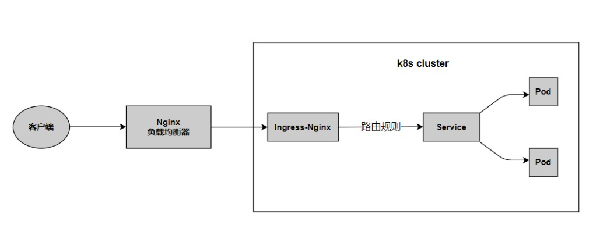

configmap:

ConfigMap是k8s的一个**配置管理组件**，可以将配置以key-value的形式传递，通常用来**保存不需要加密的配置信息**，加密信息则需用到Secret

1.使用k8s部署应用，当你将应用配置写进代码中，就会存在一个问题，更新配置时也需要打包镜像，ConfigMap可以将配置信息和docker镜像解耦。
2.使用微服务架构的话，存在多个服务共用配置的情况，如果每个服务中单独一份配置的话，那么更新配置就很麻烦，使用ConfigMap可以友好的进行配置共享。

- 消息队列技术选型（Kafka + RocketMQ）

总结：

1.Kafka更适用于日志传输，对复杂业务支持不够；复杂业务还得使用RocketMQ
2.Kafka主要是针对海量数据场景使用的，对数据的正确度要求不是十分严格。对于交易相关的，对数据可靠性、实时性、消息队列的个数要求很高的业务场景，RocketMQ更合适
3.当业务成长到一定规模时，必然要修改源码。kafka是使用scala编写的，而RocketMQ是使用Java编写的，用java编写的软件修改起来，维护成本更低

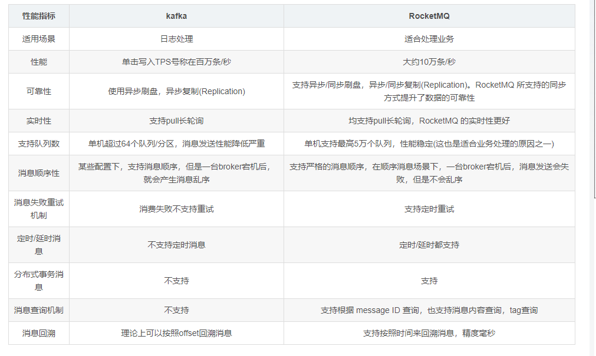

- 如何保证消息的幂等性

  方法1，比如消费者拿数据是要写库的，先根据主键查一下，有就不插入或者update，否则就插入

  方法2，比如消费者是要写redis，反正每次都是set，天然幂等性

  方法3，生产者发送每条数据时，加一个全局的唯一id，类似订单id，到消费者消费的时候，先拿id去比如redis里查一下，之前若没消费过，就处理id写redis，若消费过，就不处理了，保证别重复消费相同 的消息即可；

  方法4，或者基于数据库的唯一键来保证重复数据不会重复插入多条，跟方法1类似。