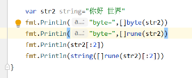

# 面试

**1.deamon 和depolyment 区别**

**2.pv和pvc区别**

3.goroute如何监控是否被kill

**4.rune**

答: rune类型是Go语言中的一个基本类型，其实就是一个**int32的别名**，主要用于表示一个字符类型大于一个字节小于等于4个字节的情况下，特别是**中文字符。**

比如 你好,世界 byte会打印出 13个byte码值(包含逗号),rune就正常打印出5个码值(包含逗号)

5.如何排查接口变慢

**6.如何鉴权**

答案:在网关进行鉴权

1.定义了一个全局的拦截器。

2.对不在白名单中的url进行鉴权

3.解析jwt是否有效，如果jwt失效或者不正确，直接返回401

4.如果jwt有效，则解析jwt中的载荷信息用户id和用户名，并将用户id和用户名放到接口的请求头中。

7.Go程序内存突然增大 怎么排查

**8.copy 和add 区别 yaml中**

答:copy 是从本地服务器 copy到容器内 (常用)

add  如果是压缩文件,复制进容器的时候会进行解压, 可以使用远程url获取远程文件 不一定要本地文件

9.gdb 调试的时候中断是怎么实现的 

10.产生死锁的条件，怎么解决死锁

分布式事务，讲一下两阶段提交，过程中节点故障的影响讨论 

数据库的隔离级别了解吗 

脏读、幻读是什么 

linux 管道如何实现的 

讲一下 TCP 三次握手，为什么需要三次

TCP 的 time_wait 状态了解吗？为什么需要该状态？如果 server 端存在大量处于 time_wait 状态的连接，会产生什么影响，该如何优化

go 中有缓冲 channel 和无缓冲 channel 的区别，是否阻塞，读/写一个已关闭的 channel 会发生什么

介绍一下 GC   

介绍一下 GMP 模型   

defer  机制  

goroutine 和线程的区别  

go 中如何限制 goroutine 的数量  

go 中如何控制一个 goroutine  的退出  

讲一下 go 中的 context 

介绍一下 go 中的锁 

go 中有哪些数据是引用类型 

go 中的 interface 有什么用，判断 interface 是不是 nil 

设计模式