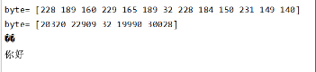

# 面试

**1.deamon 和depolyment 区别**

**2.pv和pvc区别**

3.goroute如何监控是否被kill

**4.rune**

答: rune类型是Go语言中的一个基本类型，其实就是一个**int32的别名**，主要用于表示一个字符类型大于一个字节小于等于4个字节的情况下，特别是**中文字符。**

比如 你好,世界 byte会打印出 13个byte码值(包含逗号),rune就正常打印出5个码值(包含逗号)

5.如何排查接口变慢

**6.如何鉴权**

答案:在网关进行鉴权

1.定义了一个全局的拦截器。

2.对不在白名单中的url进行鉴权

3.解析jwt是否有效，如果jwt失效或者不正确，直接返回401

4.如果jwt有效，则解析jwt中的载荷信息用户id和用户名，并将用户id和用户名放到接口的请求头中。

7.Go程序内存突然增大 怎么排查

**8.copy 和add 区别 yaml中**

答:copy 是从本地服务器 copy到容器内 (常用)

add  如果是压缩文件,复制进容器的时候会进行解压, 可以使用远程url获取远程文件 不一定要本地文件

**产生死锁的条件，怎么解决死锁**

产生条件:

互斥：
指的是共享资源的互斥。
主要是因为多个线程都想访问同一个共享资源，但是该共享资源在某个时刻只能由一个进程访问。
持有并等待：
某进程持有一些资源并等待另外一些资源，在这一过程中，该进程并不会放弃自己已经持有的资源。
不可剥夺：
某线程持有的资源在其使用完之前不能被其他线程获取，只能由其自己使用完后释放。
环路等待：
两个或多个进程互相持有某些资源，并希望得到对方的资源，也可以说线程获取资源的顺序构成了环形链。

解决死锁:

死锁防止

防止是指在程序运行前就采取措施。
死锁防止主要策略是至少要破坏死锁产生的四个必要条件中的一个。

1.破坏互斥条件

使资源可以同时访问而不是互斥访问。
但是这种方法只适合只读资源，不能在独占性资源上采取。

2.破坏持有和等待条件

采用静态分配的方式，即进程必须在执行前申请所需的全部资源，否则不执行。
但是这种方式会严重降低资源的利用率，因为有些资源时在运行前期使用，而有些是在运行后期才使用的。

3.破坏不可剥夺条件

方法一：占有资源的进程若要申请新资源，必须主动释放已占有的资源。
方法二：资源分配管理程序为进程分配新资源时，若有则分配；否则将剥夺此进程已占有的全部资源，并让进程进入等待资源状态，资源充足后再唤醒它重新申请所有所需资源。

4.破坏等待循环条件

给系统所有资源编号，规定进程请求资源需按资源编号顺序进行。

分布式事务，讲一下两阶段提交，过程中节点故障的影响讨论 

数据库的隔离级别了解吗 

脏读、幻读是什么 

linux 管道如何实现的 

讲一下 TCP 三次握手，为什么需要三次

TCP 的 time_wait 状态了解吗？为什么需要该状态？如果 server 端存在大量处于 time_wait 状态的连接，会产生什么影响，该如何优化

go 中有缓冲 channel 和无缓冲 channel 的区别，是否阻塞，读/写一个已关闭的 channel 会发生什么

介绍一下 GC   

介绍一下 GMP 模型   

defer  机制  

goroutine 和线程的区别  

**go 中如何限制 goroutine 的数量**  

答:使用channel 和sync.WaitGroup() ｛add() Done() wait()｝

go 中如何控制一个 goroutine  的退出  

讲一下 go 中的 context 

介绍一下 go 中的锁 

go 中有哪些数据是引用类型 

go 中的 interface 有什么用，判断 interface 是不是 nil 

设计模式