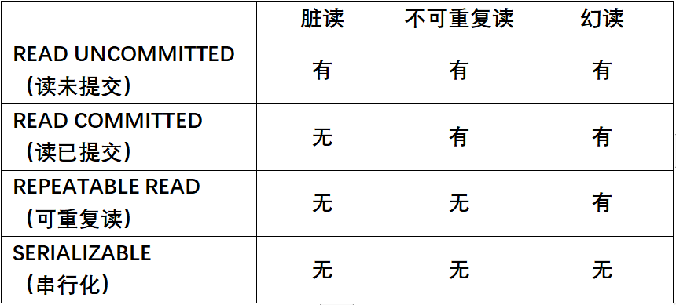

# Mysql

### 面试题:

##### 1.Mysql引擎有哪些

1. InnoDB是 MySQL 5.1 之后默认的存储引擎，它支持事务、支持外键、支持崩溃修复和自增列。
2. MyISA是 MySQL 5.1 之前默认的[数据库引擎](https://so.csdn.net/so/search?q=数据库引擎&spm=1001.2101.3001.7020)，读取效率较高，占用数据空间较少，但不支持事务、不支持行级锁、不支持外键等特性。因为不支持行级锁，因此在添加和修改操作时，会执行锁表操作，所以它的写入效率较低。
3. MEMORY

**1.事务四大特性（ACID）原子性、一致性、隔离性、持久性？**

[原子性](https://baike.baidu.com/item/原子性?fromModule=lemma_inlink)（atomicity，或称不可分割性）、[一致性](https://baike.baidu.com/item/一致性?fromModule=lemma_inlink)（consistency）、[隔离性](https://baike.baidu.com/item/隔离性?fromModule=lemma_inlink)（isolation，又称独立性）、[持久性](https://baike.baidu.com/item/持久性?fromModule=lemma_inlink)（durability）

**原子性：**一个事务（transaction）中的所有操作，要么全部完成，要么全部不完成，不会结束在中间某个环节。。事务在执行过程中发生错误，会被恢复（Rollback）到事务开始前的状态，就像这个事务从来没有执行过一样。
**一致性：**在事务开始之前和事务结束以后，数据库的完整性没有被破坏。这表示写入的资料必须完全符合所有的预设规则，这包含资料的精确度、串联性以及后续数据库可以自发性地完成预定的工作。
**隔离性：**数据库允许多个并发事务同时对其数据进行读写和修改的能力，隔离性可以防止多个事务并发执行时由于交叉执行而导致数据的不一致。事务隔离分为不同级别，包括读未提交（Read uncommitted）、读提交（read committed）、可重复读（repeatable read）和串行化（Serializable）。
**持久性：**事务处理结束后，对数据的修改就是永久的，即便系统故障也不会丢失。

**2.事务的并发问题: 脏读,不可重复读,幻读**

**脏读：**事务A读取了事务B更新的数据，然后B回滚操作，那么A读取到的数据是脏数据
**不可重复读：**事务 A 多次读取同一数据，事务 B 在事务A多次读取的过程中，对数据作了更新并提交，导致事务A多次读取同一数据时，结果因此本事务先后两次读到的数据结果会不一致。
**幻读：**幻读是指当事务不独立执行时，插入或者删除另一个事务当前影响的数据而发生的一种类似幻觉的现象。

出现幻读和不可重复读的原因很像，都是在多次操作数据的时候发现结果和原来的不一样了，出现了其他事务干扰的现象。

但是**幻读的偏重点是添加和删除数据**，多次操作数据得到的记录数不一样；不可重复读的偏重点是修改数据，多次读取数据发现数据的值不一样了。

**3.四种隔离级别**

**1.读未提交**

**2.读已提交**（Read Committed）：这是大多数数据库系统的默认隔离级别（但不是MySQL默认的）

**3.可重复读**（Repeatable Read）:这是MySQL InnoDB 引擎的默认事务隔离级别

**4.可串行化**（Serializable）：这是最高的隔离级别

4. count(1)和count(*)效率 [https://blog.csdn.net/qq_34827674/article/details/122336347]

结论: count(*)=count(1)>count(主键)>count(字段)

count(*)和count(1) :使用主键索引 但是不需要记录字段,因为是常量

count(主键):使用主键索引,需要记录主键字段

count(字段):使用二级索引,通过二级索引找到主键,再进行主键索引  (回表查询)

5.索引优化

1. 避免select *  只select指定字段
2. 避免大表驱动小表 inner join 使用小表驱动大表
3. 避免很复杂的SQL连接查询,可以放在业务层处理
4. 索引失效 最左原则 like %, ！=, 尽量使用覆盖索引：
5. 查询列和索引列一致，不写 select *,
6. is null 可以使用索引，is not null 不可以用到索引
7. 字符串不加单引号索引失效（比如字符串为一串数字，不加单引号的话会被认为是数字，发生了函数转化）
8. EXISTS 后接大表，IN 后接小表，两表大小无差别两者都行