# Redis

## 基础篇

### 02


为了实现从键到值的快速访问，Redis 使用了一个全局哈希表来保存所有键值对。


当链表数据到达一定的阈值的时候，会进行rehash，Redis采用的是渐进式hash


在第二步拷贝数据时，Redis 仍然正常处理客户端请求，每处理一个请求时，从哈希表 1 中的第一个索引位置开始，顺带着将这个索引位置上的所有 entries 拷贝到哈希表 2 中；等处理下一个请求时，再顺带拷贝哈希表 1 中的下一个索引位置的 entries。如下图所示：


这节课，我们学习了 Redis 的底层数据结构，这既包括了 Redis 中用来保存每个键和值的全局哈希表结构，也包括了支持集合类型实现的双向链表、压缩列表、整数数组、哈希表和跳表这五大底层结构。

Redis 之所以能快速操作键值对，一方面是因为 O(1) 复杂度的哈希表被广泛使用，包括 String、Hash 和 Set，它们的操作复杂度基本由哈希表决定，另一方面，Sorted Set 也采用了 O(logN) 复杂度的跳表。不过，集合类型的范围操作，因为要遍历底层数据结构，复杂度通常是 O(N)。这里，我的建议是：用其他命令来替代，例如可以用 SCAN 来代替，避免在 Redis 内部产生费时的全集合遍历操作。

当然，我们不能忘了复杂度较高的 List 类型，它的两种底层实现结构：双向链表和压缩列表的操作复杂度都是 O(N)。因此，我的建议是：因地制宜地使用 List 类型。例如，既然它的 POP/PUSH 效率很高，那么就将它主要用于 FIFO 队列场景，而不是作为一个可以随机读写的集合。

**问题：整数数组和压缩列表在查找时间复杂度方面并没有很大的优势，那为什么 Redis 还会把它们作为底层数据结构呢？**

答：**1、内存利用率，数组和压缩列表都是非常紧凑的数据结构，它比链表占用的内存要更少。Redis是内存数据库，大量数据存到内存中，此时需要做尽可能的优化，提高内存的利用率。** 

**2、数组对CPU高速缓存支持更友好，所以Redis在设计时，集合数据元素较少情况下，默认采用内存紧凑排列的方式存储，同时利用CPU高速缓存不会降低访问速度。当数据元素超过设定阈值后，避免查询时间复杂度太高，转为哈希和跳表数据结构存储，保证查询效率。**

### 03 “为什么单线程的 Redis 能那么快？”


**问题1：Redis 真的只有单线程吗？**

单线程是指网络io和数据读写操作是由一个线程完成的（6.0版本后,redis将网络IO也通过使用其他线程，多线程进行处理）数据清理，持久化，主从复制也使用到了其他线程。

**问题2：为什么用单线程？**

免了不必要的上下文切换和竞争条件，也不存在多进程或者多线程导致的切换而消耗 CPU，不用去考虑各种锁的问题，避免因为共享资源之间的竞争浪费资源

**问题3：单线程为什么这么快？**

1.基于内存

2.高效的底层数据结构 hash表 跳表 等

3.采用了更高效的epoll非阻塞I/O

**问题3详细版本：Redis 是单线程还是多线程，又是如何做到“单线程，高性能”的？**

答：其实，Redis 确实是单线程的。通常说的单线程，主要是指 Redis 对外提供的键值存储服务的主要流程是单线程，也就是网络IO和数据读写是由单个线程来完成的**（6.0版本后,redis将网络IO也通过使用其他线程，多线程进行处理）**。除此外 Redis 的其他功能，
比如持久化、 异步删除、集群数据同步等，是由额外的线程来执行的。这样做的好处是可以 。因此，严格地说 Redis 并不是全面单线程。

由于Redis是基于内存的操作，查找和操作的时间复杂度都是O(1)，因此CPU并不是Redis的瓶颈。 Redis的瓶颈很可能是机器内存或网络带宽的大小。 既然单线程易于实现并且CPU不会成为瓶颈，那采用单线程解决方案是合乎逻辑的了。

1、完全基于内存操作

Redis中绝大部分请求是纯粹的内存操作，非常快速。数据存在内存中，类似于HashMap的数据结构，对数据操作也简单。

2、降低了CPU的消耗

采用单线程，避免了不必要的上下文切换和竞争条件，也不存在多进程或者多线程导致的切换而消耗 CPU，不用去考虑各种锁的问题，不存在加锁释放锁操作，没有因为可能出现死锁而导致的性能消耗。

3、采用了更高效的非阻塞I/O

Redis采用epoll做为I/O多路复用技术的实现，再加上Redis自身的事件处理模型将epoll中的连接，读写，关闭都转换为了事件，不在I/O上浪费过多的时间，使得Redis在网络 IO 操作中能并发处理大量的客户端请求，实现了高吞吐率。

二、Redis索引类型
Redis采用哈希表作为索引，很大一部分原因在于，其键值数据基本都是保存在内存中的，而内存的高性能随机访问特性可以很好地与哈希表 O(1) 的操作复杂度相匹配。

**问题4：在“Redis 基本 IO 模型”图中，你觉得还有哪些潜在的性能瓶颈吗？**

答：Redis单线程处理IO请求性能瓶颈主要包括2个方面： 

1、任意一个请求在server中一旦发生耗时，都会影响整个server的性能，也就是说后面的请求都要等前面这个耗时请求处理完成，自己才能被处理到。耗时的操作包括以下几种： 

a、操作bigkey：写入一个bigkey在分配内存时需要消耗更多的时间，同样，删除bigkey释放内存同样会产生耗时； 

b、使用复杂度过高的命令：例如SORT/SUNION/ZUNIONSTORE，或者O(N)命令，但是N很大，例如lrange key 0 -1一次查询全量数据； 

c、大量key集中过期：Redis的过期机制也是在主线程中执行的，大量key集中过期会导致处理一个请求时，耗时都在删除过期key，耗时变长； 

d、淘汰策略：淘汰策略也是在主线程执行的，当内存超过Redis内存上限后，每次写入都需要淘汰一些key，也会造成耗时变长；

 e、AOF刷盘开启always机制：每次写入都需要把这个操作刷到磁盘，写磁盘的速度远比写内存慢，会拖慢Redis的性能； 

f、主从全量同步生成RDB：虽然采用fork子进程生成数据快照，但fork这一瞬间也是会阻塞整个线程的，实例越大，阻塞时间越久；

 2、并发量非常大时，单线程读写客户端IO数据存在性能瓶颈，虽然采用IO多路复用机制，但是读写客户端数据依旧是同步IO，只能单线程依次读取客户端的数据，无法利用到CPU多核。 

针对问题1，一方面需要业务人员去规避，一方面Redis在4.0推出了lazy-free机制，把bigkey释放内存的耗时操作放在了异步线程中执行，降低对主线程的影响。 

针对问题2，Redis在6.0推出了多线程，可以在高并发场景下利用CPU多核多线程读写客户端数据，进一步提升server性能，当然，只是针对客户端的读写是并行的，每个命令的真正操作依旧是单线程的。

### 04 AOF日志：宕机了，Redis如何避免数据丢失？

**AOF 日志是如何实现的？**

AOF是写后日志，Redis 是先执行命令，把数据写入内存，然后才记录日志

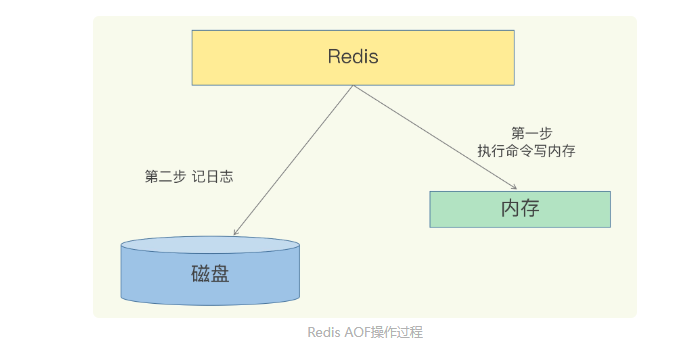

三种写回策略

其实，对于这个问题，AOF 机制给我们提供了三个选择，也就是 AOF 配置项 appendfsync 的三个可选值。

Always，**同步写回**：每个写命令执行完，立马同步地将日志写回磁盘；

**同步操作是在主进程的主线程中进行的，由于fsync的阻塞特性，会导致其挂起，在此期间无法服务新的请求，因而吞吐量下降，但确实能够保证内存和硬盘中数据的一致性。**

Everysec，**每秒写回**：每个写命令执行完，只是先把日志写到 AOF 文件的内存缓冲区，每隔一秒把缓冲区中的内容写入磁盘；（）

**通过后台I/O线程进行的，由于是在子线程中进行，所以主线程并不会被阻塞，可以继续服务新的请求，但是内存和硬盘中的数据会有1秒的差别（不一定精准），这是一种折衷的方案，寻求了一个平衡。**

No，操作系统控制的写回：每个写命令执行完，只是先把日志写到 AOF 文件的内存缓冲区，由**操作系统决定何时将缓冲区内容写回磁盘**。

**同步操作的控制权交由操作系统，不阻塞主线程，但是数据一致性可能会偏差很大。**


**日志文件太大了怎么办？**

AOF 重写机制：将多个命令合并，只显示最后的值结果（相同key的操作，只保留最新的记录）

**AOF 重写会阻塞吗?**

重写过程

 1.主线程 fork 出后台的 bgrewriteaof 子进程，fork 会把主线程的内存拷贝一份给 bgrewriteaof 子进程，这里面就包含了数据库的最新数据。然后，bgrewriteaof 子进程就可以在不影响主线程的情况下，逐一把拷贝的数据写成操作

2.因为主线程未阻塞，仍然可以处理新来的操作。此时，如果有写操作，将数据分别写入旧AOF日志和有由bgrewriteaof 子进程控制的新的AOF日志

总结来说，每次 AOF 重写时，Redis 会先执行一个内存拷贝，用于重写；然后，使用两个日志保证在重写过程中，新写入的数据不会丢失。而且，因为 Redis 采用额外的线程进行数据重写，所以，这个过程并不会阻塞主线程。

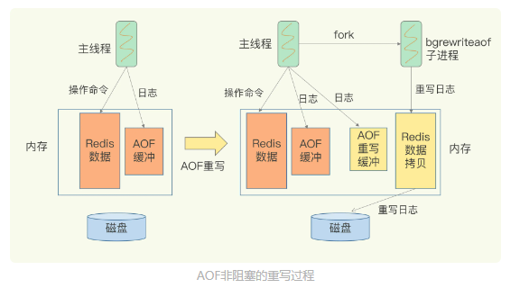

问题1：AOF 重写也有一个重写日志，为什么它不共享使用 AOF 本身的日志呢？

答：避免父子进程同时写一个文件产生的竞争+防止写失败污染原日志文件

AOF重写不复用AOF本身的日志，一个原因是父子进程写同一个文件必然会产生竞争问题，控制竞争就意味着会影响父进程的性能。二是如果AOF重写过程中失败了，那么原本的AOF文件相当于被污染了，无法做恢复使用。所以Redis AOF重写一个新文件，重写失败的话，直接删除这个文件就好了，不会对原先的AOF文件产生影响。等重写完成之后，直接替换旧文件即可。


### 05 | 内存快照RDB：宕机后，Redis如何实现快速恢复？

RDB内存快照：所谓内存快照，就是指内存中的数据在某一个时刻的状态记录

对于 Redis 而言，它的单线程模型就决定了，我们要尽量避免所有会阻塞主线程的操作，所以，针对任何操作，我们都会提一个灵魂之问：“**它会阻塞主线程吗**?”RDB 文件的生成是否会阻塞主线程，这就关系到是否会降低 Redis 的性能。

Redis 提供了两个命令来生成 RDB 文件，分别是 save 和 bgsave。

- save：在主线程中执行，会导致阻塞；
- bgsave：创建一个子进程，专门用于写入 RDB 文件，避免了主线程的阻塞，这也是 Redis RDB 文件生成的默认配置。

**问题2.快照时数据能修改吗?**

Redis 就会借助操作系统提供的写时复制技术（Copy-On-Write, COW），在执行快照的同时，正常处理写操作。

如果主线程要修改一块数据（例如图中的键值对 C），那么，这块数据就会被复制一份，生成该数据的副本（键值对 C’）。然后，主线程通过修改自己的映射，映射到新副本上，在这个数据副本上进行修改。同时，bgsave 子进程可以继续把原来的数据（键值对 C）写入 RDB 文件。

**写时复制技术** 指的是 子进程复制了主线程的页表，所以通过页表映射，能读到主线程的原始数据，而当有新数据写入或数据修改时，**主线程会把新数据或修改后的数据写到一个新的物理内存地址上，并修改主线程自己的映射**，**映射到新地址。**所以，子进程读到的类似于原始数据的一个副本，而主线程也可以正常进行修改。


**问题3：可以每秒做一次快照吗？**

不建议 

快照时间过短会加大磁盘写入压力+频繁fork子进程 fork过程会阻塞主线程

**(虽然子进程不会阻塞主线程，但是fork子进程的过程，会阻塞主线程，而且主线程的内存越大，阻塞时间越长)**


**问题4：有什么可以鱼与熊掌兼得的策略吗？**

Redis 4.0 中提出了一个混合使用 AOF 日志和内存快照

设置的参数是： aof-use-rdb-preamble yes

简单来说，内存快照以一定的频率执行，在两次快照之间，使用 AOF 日志记录这期间的所有命令操作。


最后，关于 AOF 和 RDB 的选择问题，我想再给你提三点建议：

数据不能丢失时，内存快照和 AOF 的混合使用是一个很好的选择；

如果允许分钟级别的数据丢失，可以只使用 RDB；

如果只用 AOF，优先使用 everysec 的配置选项，因为它在可靠性和性能之间取了一个平衡。


课后

**问题1：2核CPU、4GB内存、500G磁盘，Redis实例占用2GB，写读比例为8:2，此时做RDB持久化，产生的风险？**

主要在于 CPU资源 和 内存资源 这2方面： 	

a、内存资源风险：Redis fork子进程做RDB持久化，由于写的比例为80%，那么在持久化过程中，“写实复制”会重新分配整个实例80%的内存副本，大约需要重新分配1.6GB内存空间，**这样整个系统的内存使用接近饱和，如果此时父进程又有大量新key写入，很快机器内存就会被吃光**，如果机器开启了Swap机制，那么Redis会有一部分数据被换到磁盘上，当Redis访问这部分在磁盘上的数据时，性能会急剧下降，已经达不到高性能的标准（可以理解为武功被废）。如果机器没有开启Swap，会直接触发OOM，父子进程会面临被系统kill掉的风险。 	

b、CPU资源风险：虽然子进程在做RDB持久化，但生成RDB快照过程会消耗大量的CPU资源，虽然Redis处理处理请求是单线程的，但Redis Server还有其他线程在后台工作，例如AOF每秒刷盘、异步关闭文件描述符这些操作。由于机器只有2核CPU，这也就意味着父进程占用了超过一半的CPU资源，此时子进程做RDB持久化，可能会产生CPU竞争，导致的结果就是父进程处理请求延迟增大，子进程生成RDB快照的时间也会变长，整个Redis Server性能下降。 	

c、另外，可以再延伸一下，老师的问题没有提到Redis进程是否绑定了CPU，如果绑定了CPU，那么子进程会继承父进程的CPU亲和性属性，子进程必然会与父进程争夺同一个CPU资源，整个Redis Server的性能必然会受到影响！所以如果Redis需要开启定时RDB和AOF重写，进程一定不要绑定CPU。


### 06 | 数据同步：主从库如何实现数据一致？

**主从库模式 读写分离：**

Redis 提供了主从库模式，以保证数据副本的一致，主从库之间采用的是读写分离的方式。

读操作：主库、从库都可以接收；

写操作：首先到主库执行，然后，主库将写操作同步给从库。

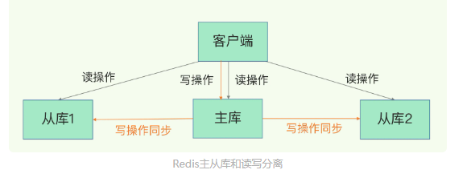

**问题1：主从库间如何进行第一次同步？**

```
replicaof  172.16.19.3  6379//使用命令 成为19.3的从库
```

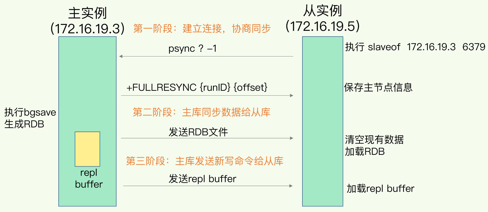

- 第一阶段 主从库间建立连接、协商同步的过程

从库给主库发送 psync 命令，表示要进行数据同步，主库根据这个命令的参数来启动复制。psync 命令包含了主库的 runID（第一次是runID=？） 和复制进度 offset= -1（表示全量复制） 两个参数。

- 第二阶段，主库将所有数据同步给从库。从库收到数据后，在本地完成数据加载。这个过程依赖于内存快照生成的 RDB 文件。主库会在内存中用专门的 replication buffer，记录 RDB 文件生成后收到的所有写操作。
- 第三阶段，主库会把第二阶段执行过程中新收到的写命令，再发送给从库。具体的操作是，当主库完成 RDB 文件发送后，就会把此时 replication buffer 中的修改操作发给从库，从库再重新执行这些操作

**replication buffer**:类似于一个TCP连接，专门负责进行主库和从库之间数据的传输，主节点为各个从节点分别创建一个缓冲区，由于各个从节点的处理能力差异，各个缓冲区数据可能不同。

repl_backlog_buffer用于主从间的增量同步。主节点只有一个repl_backlog_buffer缓冲区，各个从节点的offset偏移量都是相对该缓冲区而言的。

**问题2：主从库间第一次数据同步，对于主库来说，需要完成两个耗时的操作：生成 RDB 文件和传输 RDB 文件。如何分担主库压力？**

通过“主 - 从 - 从”模式将主库生成 RDB 和传输 RDB 的压力，以级联的方式分散到从库上。

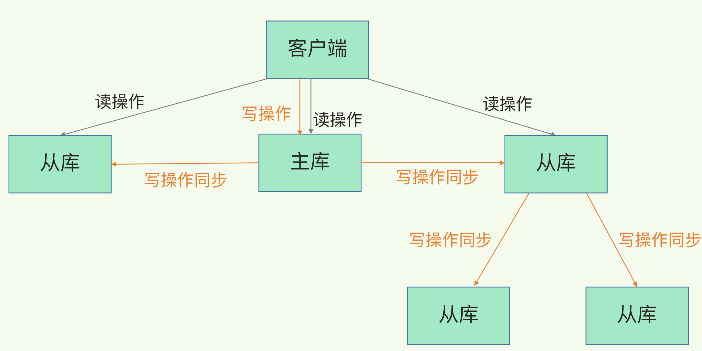

主从从模式能够减少主库同步给所有从库的压力； **一旦主库和从库完成全量复制，就会一直维护一个网络连接**，主库会把之后收到的命令通过这个连接同步给从库，基于长连接的命令传播。

**问题3：主从库间网络断了怎么办？**

主库会一直维护一个repl_backlog_buffer ，他是一个环形缓冲区，主库会记录自己写到的位置，从库则会记录自己已经读到的位置。

当从库断连又重连之后，通过psync命令告诉主库自己的slave_repl_offset，然后主库根据自己的master_repl_offset和slave_repl_offset来判断是需要全量同步还是把两者之间的命令增量同步给从库，判断依据如下（同步的方式就是通过主库与每个从库建立连接之后的这个所谓的replication buffer）

因为 repl_backlog_buffer 是一个环形缓冲区，所以在缓冲区写满后，主库会继续写入，此时，就会覆盖掉之前写入的操作

1. 当从库还未读的数据被覆盖后，就会进行全量备份

2. 如果没被覆盖，则会通过replication buffer 进行增量备份

**课后问题1：为什么主从库间的复制不使用 AOF 而 使用RDB呢？**

答：简单版：1.RDB文件小,传输会降低网络带宽消耗 2.AOF是记录写操作，而RDB是二进制文件，恢复起来速度更快 3. 使用AOF必须选择对应的刷盘策略，会影响Redis性能。

1、RDB文件内容是经过压缩的二进制数据（不同数据类型数据做了针对性优化），文件很小。而AOF文件记录的是每一次写操作的命令，写操作越多文件会变得很大，其中还包括很多对同一个key的多次冗余操作。在主从全量数据同步时，传输RDB文件可以尽量降低对主库机器网络带宽的消耗，从库在加载RDB文件时，一是文件小，读取整个文件的速度会很快，二是因为RDB文件存储的都是二进制数据，从库直接按照RDB协议解析还原数据即可，速度会非常快，而AOF需要依次重放每个写命令，这个过程会经历冗长的处理逻辑，恢复速度相比RDB会慢得多，所以使用RDB进行主从全量同步的成本最低。

2、假设要使用AOF做全量同步，意味着必须打开AOF功能，打开AOF就要选择文件刷盘的策略，选择不当会严重影响Redis性能。而RDB只有在需要定时备份和主从全量同步数据时才会触发生成一次快照。而在很多丢失数据不敏感的业务场景，其实是不需要开启AOF的。


### 07 | 哨兵机制：主库挂了，如何不间断服务？

答：使用哨兵机制，重新选取从库当主库

**哨兵机制的基本流程**

哨兵的主要职责： 

1、监控：通过PING来监控主从 

2、选主：主库挂了，从从库中按一定的机制选择一个新主库 

3、通知：通知其他从库和客户端新的主库信息

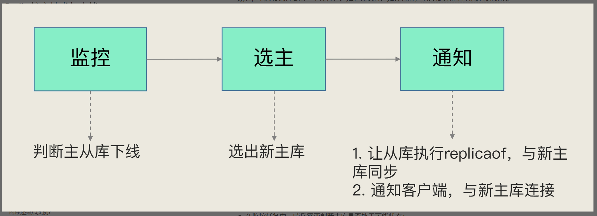

**一：监控**

主观下线和客观下线

哨兵进程会使用 PING 命令检测它自己和主、从库的网络连接情况，用来判断实例的状态。如果哨兵发现主库或从库对 PING 命令的响应超时了，那么，哨兵就会先把它标记为“主观下线”。

从库可以简单的标记为主观下线，如果是主库，很可能发生误判，误判一般会发生在**集群网络压力较大、网络拥塞，或者是主库本身压力较大**的情况下。为了降低误判的概率，通常采用哨兵集群部署，**当多数哨兵都认为主观下线时，就会被标记为客观下线**，所以一般哨兵的个数为奇数个

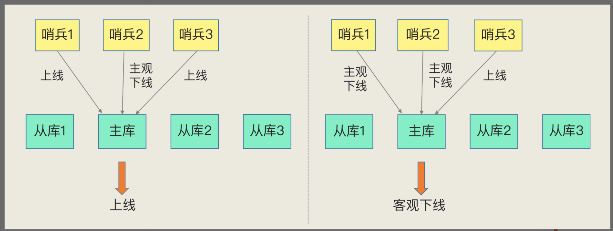

**二：选主，问题：如何选定新主库？**

1. 筛选

   1.检查从库的当前在线状态

   2.判断它之前的网络连接状态，

   使用配置项down-after-milliseconds * 10。表示当主从库断连超过10次时，就断定改从库网络不佳，被排除在外

   其中，down-after-milliseconds 是我们认定主从库断连的最大连接超时时间

2. 打分

   1. 查看用户设定的优先级

      用户可以通过 slave-priority 配置项，给不同的从库设置不同优先级，数值越低，优先级越高，如10，25，100中  10的优先级最高

   2. 和旧主库同步程度最接近的从库得分高。

      slave_repl_offset 这个值记录当前的复制进度，通过每个从库slave_repl_offset的值，判定同步程度最高的从库。

      slave_repl_offset和repl_backlog_buffer 都是单调递增的

   3. ID 号小的从库得分高。

      **注意：**Redis server启动时，会生成一个40字节长的随机字符串作为runID，具体算法用的是SHA-1算法。 

      所以 id小的 并不是连接早的

**三：通知 其他从库和客户端，新的主库信息**

哨兵提升一个从库为新主库后，哨兵会把新主库的地址写入自己实例的pubsub（switch-master）中。客户端需要订阅这个pubsub，当这个pubsub有数据时，客户端就能感知到主库发生变更。


**课后问题1：哨兵在操作主从切换的过程中，客户端能否正常地进行请求操作？**

 答：如果客户端使用了读写分离，那么读请求可以在从库上正常执行，不会受到影响。但是由于此时主库已经挂了，而且哨兵还没有选出新的主库，所以在这期间写请求会失败，失败持续的时间 = 哨兵切换主从的时间 + 客户端感知到新主库 的时间。 如果不想让业务感知到异常，客户端只能把写失败的请求先缓存起来或写入消息队列中间件中，等哨兵切换完主从后，再把这些写请求发给新的主库，但这种场景只适合对写入请求返回值不敏感的业务，而且还需要业务层做适配，另外主从切换时间过长，也会导致客户端或消息队列中间件缓存写请求过多，切换完成之后重放这些请求的时间变长。 

哨兵检测主库多久没有响应就提升从库为新的主库，这个时间是可以配置的（down-after-milliseconds参数）。配置的时间越短，哨兵越敏感，哨兵集群认为主库在短时间内连不上就会发起主从切换，这种配置很可能因为网络拥塞但主库正常而发生不必要的切换，当然，当主库真正故障时，因为切换得及时，对业务的影响最小。如果配置的时间比较长，哨兵越保守，这种情况可以减少哨兵误判的概率，但是主库故障发生时，业务写失败的时间也会比较久，缓存写请求数据量越多。

**问题2：应用程序不感知服务的中断，还需要哨兵和客户端做些什么？**

答：当哨兵完成主从切换后，客户端需要及时感知到主库发生了变更，然后把缓存的写请求写入到新库中，保证后续写请求不会再受到影响，

具体做法如下：哨兵提升一个从库为新主库后，哨兵会把新主库的地址写入自己实例的pubsub（switch-master）中。客户端需要订阅这个pubsub，当这个pubsub有数据时，客户端就能感知到主库发生变更，同时可以拿到最新的主库地址，然后把写请求写到这个新主库即可，这种机制属于哨兵主动通知客户端。

 如果客户端因为某些原因错过了哨兵的通知，或者哨兵通知后客户端处理失败了，安全起见，客户端也需要支持主动去获取最新主从的地址进行访问。 所以，**客户端需要访问主从库时，不能直接写死主从库的地址了，而是需要从哨兵集群中获取最新的地址（sentinel get-master-addr-by-name命令）**，这样当实例异常时，哨兵切换后或者客户端断开重连，都可以从哨兵集群中拿到最新的实例地址。


### 08 | 哨兵集群：哨兵挂了，主从库还能切换吗？


**基于 pub/sub 机制的哨兵集群组成**

在配置哨兵的信息时，我们只需要用到下面的这个配置项，设置主库的 IP 和端口，并没有配置其他哨兵的连接信息。

`sentinel monitor <master-name> <ip> <redis-port> <quorum> `

**问题1：哨兵实例既然都不知道彼此的地址，又是怎么组成集群的呢？**

答：Redis 提供的 pub/sub 机制，也就是发布 / 订阅机制。哨兵只要和主库建立起了连接，就可以在主库上发布消息了，比如说发布它自己的连接信息（IP 和端口）。

同时，它也可以从主库上订阅消息，获得其他哨兵发布的连接信息。当多个哨兵实例都在主库上做了发布和订阅操作后，它们之间就能知道彼此的 IP 地址和端口。

Redis有不同的频道，当消息类别相同时，它们就属于同一个频道。反之，就属于不同的频道。只有订阅了同一个频道的应用，才能通过发布的消息进行信息交换。

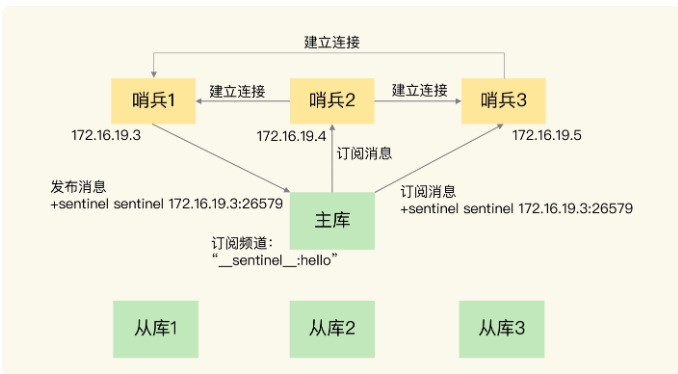

**问题2：哨兵是如何知道从库的 IP 地址和端口的呢？**

也需要依赖订阅/发布的模式，哨兵会向主库发送 INFO 命令来获取从库的节点信息。

就像下图所示，哨兵 2 给主库发送 INFO 命令，主库接受到这个命令后，就会把从库列表返回给哨兵。接着，哨兵就可以根据从库列表中的连接信息，和每个从库建立连接，并在这个连接上持续地对从库进行监控。哨兵 1 和 3 可以通过相同的方法和从库建立连接。

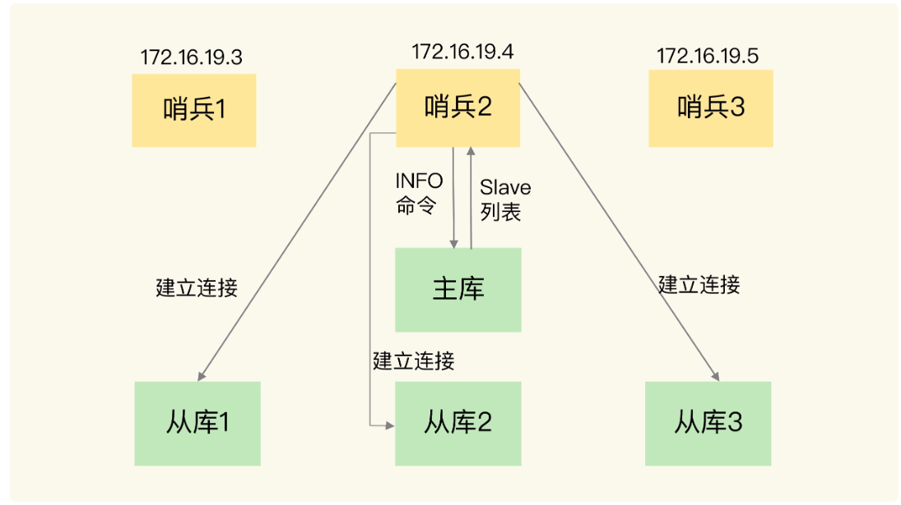


**基于 pub/sub 机制的客户端事件通知**

哨兵就是一个运行在特定模式下的 Redis 实例，只不过它并不服务请求操作，只是完成监控、选主和通知的任务。所以，每个哨兵实例也提供 pub/sub 机制，客户端可以从哨兵订阅消息。哨兵提供的消息订阅频道有很多，不同频道包含了主从库切换过程中的不同关键事件。

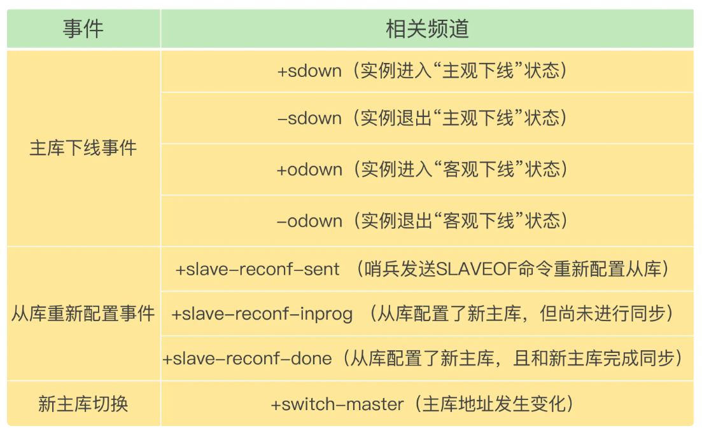

客户端可以通过订阅哨兵的频道来获取信息 如：

`SUBSCRIBE +odown`：订阅“所有实例进入客观下线状态的事件


**由哪个哨兵执行主从切换？**

1.首先要进行判断主库是否客观下线

quorum：确认odown的最少的哨兵数量

任何一个实例只要自身判断主库“主观下线”后，就会给其他实例发送 is-master-down-by-addr 命令。接着，其他实例会根据自己和主库的连接情况，做出 Y 或 N 的响应，Y 相当于赞成票，N 相当于反对票。

也就是投赞成票的要达到配置quorum的数量，例如 5台哨兵 quorum=2 要2台哨兵同意才可以

2.进行leader选举

majority：授权进行主从切换的最少的哨兵数量，值为半数以上

当其中任意一个哨兵 获得半数以上的票时候，就会被选举为leader 负责主从切换。

**重点：只有进入到选举流程的哨兵，才能自己给自己先投一票，如果它还没有进入选举流程，只能给别人投票。**


**课后问题：假设有一个 Redis 集群，是“一主四从”，同时配置了包含 5 个哨兵实例的集群，quorum 值设为 2。在运行过程中，如果有 3 个哨兵实例都发生故障了，此时，Redis 主库如果有故障，还能正确地判断主库“客观下线”吗？如果可以的话，还能进行主从库自动切换吗？此外，哨兵实例是不是越多越好呢，如果同时调大 down-after-milliseconds 值，对减少误判是不是也有好处呢？**

答：1、可以正确的判断主库“客观下线”，因为其中一个哨兵可以获得了“客观下线”所需要的投票数； 

2、不能进行自动的主从切换，因为在主从切换的时候，必须选择出一个主哨兵，但是选择主哨兵有2个条件： 

​    2.1 拿到半数以上的赞成票； 

​    2.2 拿到的票数同时还需要大于等于哨兵配置文件中的 quorum 值。 此时可以满足投票数，但是拿不到半数以上的投票，因此无法选出主哨兵，所以无法进行主从切换。 

3、哨兵的实例不是越多越好，因为哨兵的选举使用的是Raft协议，这个协议是Paxos协议的变种，这种协议在选主时，需要所有的节点参与投票，所以节点越多，选举耗时可能就会更久，所以根据对服务SLA的要求，评估一个节点可能出现问题的概率，选择合适的哨兵数量。 

4、down-after-milliseconds不是越大越好的，虽然可以减少误判的概率，但是问题真正发生时，主从切换的时间也会更久，所以down-after-milliseconds要根据真实的业务场景，进行取舍。


### 09 | 切片集群：数据增多了，是该加内存还是加实例？

答：可以使用切片集群，也叫分片集群，就是指启动多个 Redis 实例组成一个集群，然后按照一定的规则，把收到的数据划分成多份，每一份用一个实例来保存。

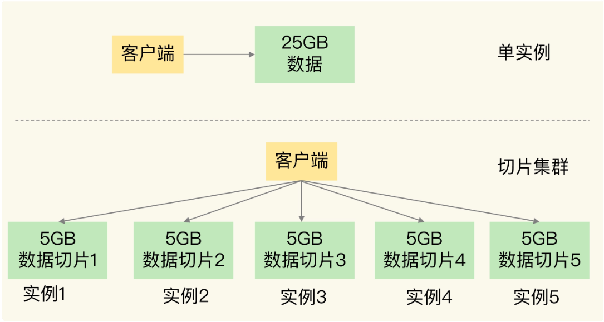

在切片集群中，实例在为 5GB 数据生成 RDB 时，数据量就小了很多，fork 子进程一般不会给主线程带来较长时间的阻塞。采用多个实例保存数据切片后，我们既能保存 25GB 数据，又避免了 fork 子进程阻塞主线程而导致的响应突然变慢。


**问题1：如何保存更多数据？**

- 纵向扩展：升级单个 Redis 实例的资源配置，包括增加内存容量、增加磁盘容量、使用更高配置的 CPU。就像下图中，原来的实例内存是 8GB，硬盘是 50GB，纵向扩展后，内存增加到 24GB，磁盘增加到 150GB。

- 横向扩展：横向增加当前 Redis 实例的个数，就像下图中，原来使用 1 个 8GB 内存、50GB 磁盘的实例，现在使用三个相同配置的实例。

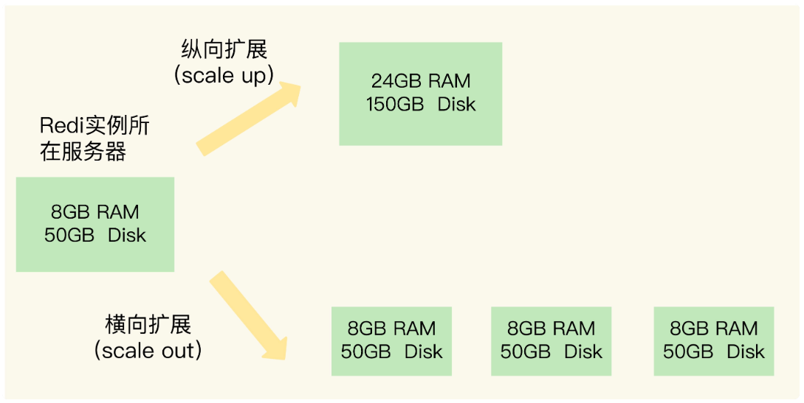

纵向扩展问题：

1.受限于硬件成本，当内存线性增加时，成本并不是线性增加

2.如果后续数据量继续增多，主线程 fork 子进程时就可能由会阻塞

**问题2：数据切片后，在多个实例之间如何分布？**

官方提供了一个名为 Redis Cluster 的方案，在这个方案中，一个切片集群共有 16384 个哈希槽，这些哈希槽类似于数据分区，每个键值对都会根据它的 key，被映射到一个哈希槽中。

1. 首先根据键值对的 key，按照CRC16 算法计算一个 16 bit 的值；然后，再用这个 16bit 值对 16384 取模，得到 0~16383 范围内的模数，每个模数代表一个相应编号的哈希槽。

2. 可以使用 cluster create 命令创建集群，此时，Redis 会自动把这些槽平均分布在集群实例上。例如，如果集群中有 N 个实例，那么，每个实例上的槽个数为 16384/N 个。

   或者当每台机器上，内存大小不平均时，也可以手动分配hash槽，**注意：要把16384哈希槽全部分配完成**

   ```
   redis-cli -h 172.16.19.3 –p 6379 cluster addslots 0,1
   redis-cli -h 172.16.19.4 –p 6379 cluster addslots 2,3
   redis-cli -h 172.16.19.5 –p 6379 cluster addslots 4
   ```


**问题3：客户端怎么确定想要访问的数据在哪个实例上？**

客户端和集群实例建立连接后，实例就会把哈希槽的分配信息发给客户端。

客户端收到哈希槽信息后，会把哈希槽信息缓存在本地。当客户端请求键值对时，会先计算键所对应的哈希槽，然后就可以给相应的实例发送请求了。

但是在集群中，实例和哈希槽的对应关系并不是一成不变的，最常见的变化有两个：

1. 在集群中，实例有新增或删除，Redis 需要重新分配哈希槽；

2. 为了负载均衡，Redis 需要把哈希槽在所有实例上重新分布一遍。（比如有热点key 导致服务器压力差别大。）

这时候Redis Cluster 方案提供了一种重定向机制，客户端给一个实例发送数据读写操作时，这个实例上并没有相应的数据，客户端要再给一个新实例发送操作命令。

```
GET hello:key
(error) MOVED 13320 172.16.19.5:6379
```

MOVED到新的地址上。MOVED 命令会更新客户端缓存的哈希槽分配信息

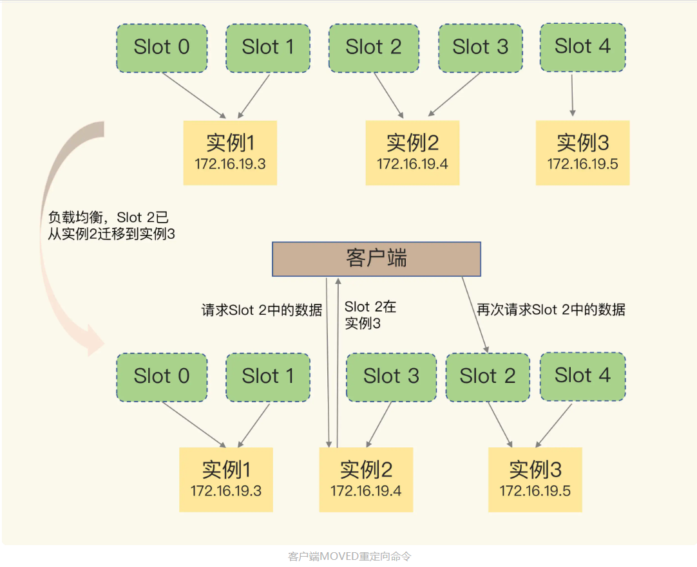

上图时当数据完全迁移完成的情况，**但是如果当Slot 2 部分数据key3，key4 迁移到实例3，key 1和 key2 还在实例2中时**，

请求key1和key2时，实例2会直接返回结果

请求key3和key4时候 ,实例2先MOVED 返回实例3地址，然后实例3会返回ASK命令，相当于请求客户端授权，让这个实例允许执行客户端接下来发送的命令

```
GET hello:key
(error) MOVED 13320 172.16.19.4:6379

GET hello:key
(error) ASK 13320 172.16.19.5:6379

GET hello:key 
返回对应值
```

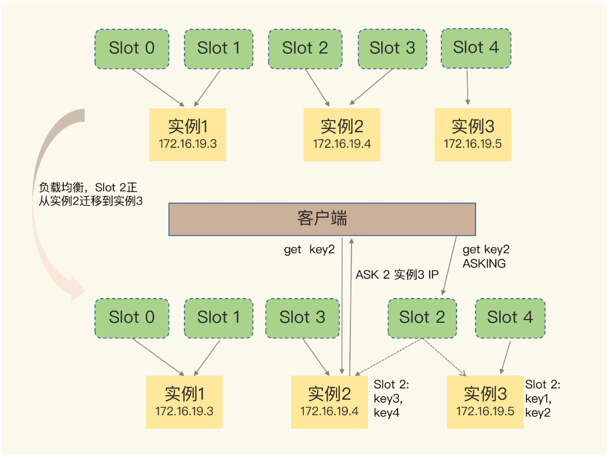


**课后问题：Redis Cluster不采用把key直接映射到实例的方式，而采用哈希槽的方式原因？**

可用使Redis集群设计：简洁，高效，有弹性              

不使用的劣势 

①：集群中的key无法预估，直接存key对应实例的映射关系，需占用的内存空间不可控                

②：Cluster是去中心化设计，所有实例都需保存完整的映射关系，采用直接的映射，会导致节点间信息交换成本高昂

③：key与实例直接映射，在集群扩缩容时，需要数据迁移，所有的key都需要重新映射              

使用的好处

①：在中间增加一层哈希槽，可以将数据与节点解耦，使数据分配均匀 key通过hsah计算在取模，可以把数据打的更散，                        只需要关心映射到了哪个哈希槽，通过哈希槽映射表找到对应的实例

②：增加哈希槽可以使得映射表比较小，有利于客户端和服务端保存，节点间信息交换

③：集群扩缩容，数据均衡时，操作单位是哈希槽，可以简化操作难度

### 10 | 第1～9讲课后思考题答案及常见问题答疑

**问题 1：rehash 的触发时机和渐进式执行机制**

**1.Redis 什么时候做 rehash？**

装载因子的计算方式是，哈希表中所有 entry 的个数除以哈希表的哈希桶个数。

- 装载因子≥1，同时，哈希表被允许进行 rehash（例如，实例没有正在生成 RDB 或者重写 AOF）；
- 装载因子≥5，哈希桶里会有大量的链式哈希存在，性能会受到严重影响，会立马进行rehash；

**2.采用渐进式 hash 时，如果实例暂时没有收到新请求，是不是就不做 rehash 了？**

其实不是的。Redis 会执行定时任务，定时任务中就包含了 rehash 操作。所谓的定时任务，就是按照一定频率（例如每 100ms/ 次）执行的任务。

在 rehash 被触发后，即使没有收到新请求，Redis 也会定时执行一次 rehash 操作，而且，每次执行时长不会超过 1ms，以免对其他任务造成影响。


**问题 2：主线程、子进程和后台线程的联系与区别**

从操作系统的角度来看，进程一般是指资源分配单元，例如一个进程拥有自己的堆、栈、虚存空间（页表）、文件描述符等；而线程一般是指 CPU 进行调度和执行的实体。

**Redis 中用 fork 创建的子进程有哪些？**

- 创建 RDB 的后台子进程，同时由它负责在主从同步时传输 RDB 给从库；

- 通过无盘复制方式传输 RDB 的子进程；

- bgrewriteaof 子进程。

Redis 也开始使用 pthread_create 创建线程，这些线程在创建后，一般会自行执行一些任务，例如执行异步删除任务。相对于完成主要工作的主线程来说，我们一般可以称这些线程为后台线程。

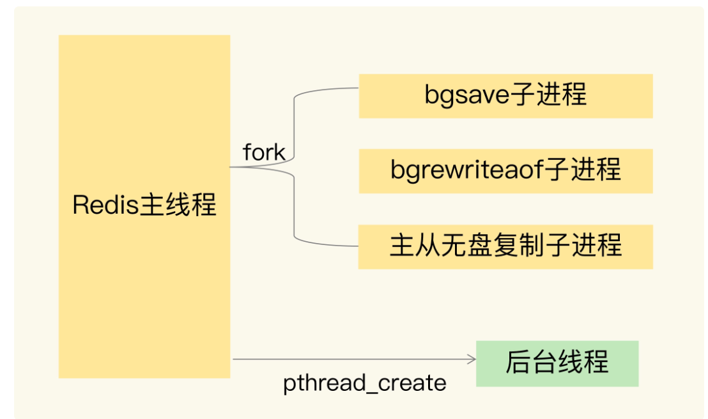


**问题 3：写时复制的底层实现机制**

主线程 fork 出 bgsave 子进程后，bgsave 子进程实际是复制了主线程的页表。这些页表中，就保存了在执行 bgsave 命令时，主线程的所有数据块在内存中的物理地址。这样一来，bgsave 子进程生成 RDB 时，就可以根据页表读取这些数据，再写入磁盘中。如果此时，主线程接收到了新写或修改操作，那么，主线程会使用写时复制机制。具体来说，写时复制就是指，主线程在有写操作时，才会把这个新写或修改后的数据写入到一个新的物理地址中，并**修改自己的页表映射**。

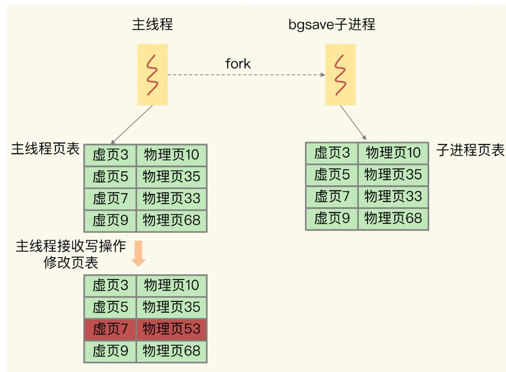


## 实践篇

### 11 | “万金油”的String，为什么不好用了？
