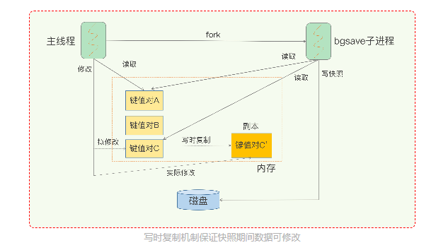

# Redis

## 基础篇

### 02

为了实现从键到值的快速访问，Redis 使用了一个全局哈希表来保存所有键值对。

当链表数据到达一定的阈值的时候，会进行rehash，Redis采用的是渐进式hash

在第二步拷贝数据时，Redis 仍然正常处理客户端请求，每处理一个请求时，从哈希表 1 中的第一个索引位置开始，顺带着将这个索引位置上的所有 entries 拷贝到哈希表 2 中；等处理下一个请求时，再顺带拷贝哈希表 1 中的下一个索引位置的 entries。如下图所示：

这节课，我们学习了 Redis 的底层数据结构，这既包括了 Redis 中用来保存每个键和值的全局哈希表结构，也包括了支持集合类型实现的双向链表、压缩列表、整数数组、哈希表和跳表这五大底层结构。

Redis 之所以能快速操作键值对，一方面是因为 O(1) 复杂度的哈希表被广泛使用，包括 String、Hash 和 Set，它们的操作复杂度基本由哈希表决定，另一方面，Sorted Set 也采用了 O(logN) 复杂度的跳表。不过，集合类型的范围操作，因为要遍历底层数据结构，复杂度通常是 O(N)。这里，我的建议是：用其他命令来替代，例如可以用 SCAN 来代替，避免在 Redis 内部产生费时的全集合遍历操作。

当然，我们不能忘了复杂度较高的 List 类型，它的两种底层实现结构：双向链表和压缩列表的操作复杂度都是 O(N)。因此，我的建议是：因地制宜地使用 List 类型。例如，既然它的 POP/PUSH 效率很高，那么就将它主要用于 FIFO 队列场景，而不是作为一个可以随机读写的集合。

**问题：整数数组和压缩列表在查找时间复杂度方面并没有很大的优势，那为什么 Redis 还会把它们作为底层数据结构呢？**

答：**1、内存利用率，数组和压缩列表都是非常紧凑的数据结构，它比链表占用的内存要更少。Redis是内存数据库，大量数据存到内存中，此时需要做尽可能的优化，提高内存的利用率。** 

**2、数组对CPU高速缓存支持更友好，所以Redis在设计时，集合数据元素较少情况下，默认采用内存紧凑排列的方式存储，同时利用CPU高速缓存不会降低访问速度。当数据元素超过设定阈值后，避免查询时间复杂度太高，转为哈希和跳表数据结构存储，保证查询效率。**

### 03 “为什么单线程的 Redis 能那么快？”

**问题1：Redis 真的只有单线程吗？**

单线程是指网络io和数据读写操作是由一个线程完成的（6.0版本后,redis将网络IO也通过使用其他线程，多线程进行处理）数据清理，持久化，主从复制也使用到了其他线程。

**问题2：为什么用单线程？**

免了不必要的上下文切换和竞争条件，也不存在多进程或者多线程导致的切换而消耗 CPU，不用去考虑各种锁的问题，避免因为共享资源之间的竞争浪费资源

**问题3：单线程为什么这么快？**

1.基于内存

2.高效的底层数据结构 hash表 跳表 等

3.采用了更高效的epoll非阻塞I/O

**问题3详细版本：Redis 是单线程还是多线程，又是如何做到“单线程，高性能”的？**

答：其实，Redis 确实是单线程的。通常说的单线程，主要是指 Redis 对外提供的键值存储服务的主要流程是单线程，也就是网络IO和数据读写是由单个线程来完成的**（6.0版本后,redis将网络IO也通过使用其他线程，多线程进行处理）**。除此外 Redis 的其他功能，
比如持久化、 异步删除、集群数据同步等，是由额外的线程来执行的。这样做的好处是可以 。因此，严格地说 Redis 并不是全面单线程。

由于Redis是基于内存的操作，查找和操作的时间复杂度都是O(1)，因此CPU并不是Redis的瓶颈。 Redis的瓶颈很可能是机器内存或网络带宽的大小。 既然单线程易于实现并且CPU不会成为瓶颈，那采用单线程解决方案是合乎逻辑的了。

1、完全基于内存操作

Redis中绝大部分请求是纯粹的内存操作，非常快速。数据存在内存中，类似于HashMap的数据结构，对数据操作也简单。

2、降低了CPU的消耗

采用单线程，避免了不必要的上下文切换和竞争条件，也不存在多进程或者多线程导致的切换而消耗 CPU，不用去考虑各种锁的问题，不存在加锁释放锁操作，没有因为可能出现死锁而导致的性能消耗。

3、采用了更高效的非阻塞I/O

Redis采用epoll做为I/O多路复用技术的实现，再加上Redis自身的事件处理模型将epoll中的连接，读写，关闭都转换为了事件，不在I/O上浪费过多的时间，使得Redis在网络 IO 操作中能并发处理大量的客户端请求，实现了高吞吐率。

二、Redis索引类型
Redis采用哈希表作为索引，很大一部分原因在于，其键值数据基本都是保存在内存中的，而内存的高性能随机访问特性可以很好地与哈希表 O(1) 的操作复杂度相匹配。

**问题4：在“Redis 基本 IO 模型”图中，你觉得还有哪些潜在的性能瓶颈吗？**

答：Redis单线程处理IO请求性能瓶颈主要包括2个方面： 

1、任意一个请求在server中一旦发生耗时，都会影响整个server的性能，也就是说后面的请求都要等前面这个耗时请求处理完成，自己才能被处理到。耗时的操作包括以下几种： 

a、操作bigkey：写入一个bigkey在分配内存时需要消耗更多的时间，同样，删除bigkey释放内存同样会产生耗时； 

b、使用复杂度过高的命令：例如SORT/SUNION/ZUNIONSTORE，或者O(N)命令，但是N很大，例如lrange key 0 -1一次查询全量数据； 

c、大量key集中过期：Redis的过期机制也是在主线程中执行的，大量key集中过期会导致处理一个请求时，耗时都在删除过期key，耗时变长； 

d、淘汰策略：淘汰策略也是在主线程执行的，当内存超过Redis内存上限后，每次写入都需要淘汰一些key，也会造成耗时变长；

 e、AOF刷盘开启always机制：每次写入都需要把这个操作刷到磁盘，写磁盘的速度远比写内存慢，会拖慢Redis的性能； 

f、主从全量同步生成RDB：虽然采用fork子进程生成数据快照，但fork这一瞬间也是会阻塞整个线程的，实例越大，阻塞时间越久；

 2、并发量非常大时，单线程读写客户端IO数据存在性能瓶颈，虽然采用IO多路复用机制，但是读写客户端数据依旧是同步IO，只能单线程依次读取客户端的数据，无法利用到CPU多核。 

针对问题1，一方面需要业务人员去规避，一方面Redis在4.0推出了lazy-free机制，把bigkey释放内存的耗时操作放在了异步线程中执行，降低对主线程的影响。 

针对问题2，Redis在6.0推出了多线程，可以在高并发场景下利用CPU多核多线程读写客户端数据，进一步提升server性能，当然，只是针对客户端的读写是并行的，每个命令的真正操作依旧是单线程的。

### 04 AOF日志：宕机了，Redis如何避免数据丢失？

**AOF 日志是如何实现的？**

AOF是写后日志，Redis 是先执行命令，把数据写入内存，然后才记录日志

三种写回策略

其实，对于这个问题，AOF 机制给我们提供了三个选择，也就是 AOF 配置项 appendfsync 的三个可选值。

Always，**同步写回**：每个写命令执行完，立马同步地将日志写回磁盘；

**同步操作是在主进程的主线程中进行的，由于fsync的阻塞特性，会导致其挂起，在此期间无法服务新的请求，因而吞吐量下降，但确实能够保证内存和硬盘中数据的一致性。**

Everysec，**每秒写回**：每个写命令执行完，只是先把日志写到 AOF 文件的内存缓冲区，每隔一秒把缓冲区中的内容写入磁盘；（）

**通过后台I/O线程进行的，由于是在子线程中进行，所以主线程并不会被阻塞，可以继续服务新的请求，但是内存和硬盘中的数据会有1秒的差别（不一定精准），这是一种折衷的方案，寻求了一个平衡。**

No，操作系统控制的写回：每个写命令执行完，只是先把日志写到 AOF 文件的内存缓冲区，由**操作系统决定何时将缓冲区内容写回磁盘**。

**同步操作的控制权交由操作系统，不阻塞主线程，但是数据一致性可能会偏差很大。**

**日志文件太大了怎么办？**

AOF 重写机制：将多个命令合并，只显示最后的值结果（相同key的操作，只保留最新的记录）

**AOF 重写会阻塞吗?**

重写过程

 1.主线程 fork 出后台的 bgrewriteaof 子进程，fork 会把主线程的内存拷贝一份给 bgrewriteaof 子进程，这里面就包含了数据库的最新数据。然后，bgrewriteaof 子进程就可以在不影响主线程的情况下，逐一把拷贝的数据写成操作

2.因为主线程未阻塞，仍然可以处理新来的操作。此时，如果有写操作，将数据分别写入旧AOF日志和有由bgrewriteaof 子进程控制的新的AOF日志

总结来说，每次 AOF 重写时，Redis 会先执行一个内存拷贝，用于重写；然后，使用两个日志保证在重写过程中，新写入的数据不会丢失。而且，因为 Redis 采用额外的线程进行数据重写，所以，这个过程并不会阻塞主线程。

问题1：AOF 重写也有一个重写日志，为什么它不共享使用 AOF 本身的日志呢？

答：避免父子进程同时写一个文件产生的竞争+防止写失败污染原日志文件

AOF重写不复用AOF本身的日志，一个原因是父子进程写同一个文件必然会产生竞争问题，控制竞争就意味着会影响父进程的性能。二是如果AOF重写过程中失败了，那么原本的AOF文件相当于被污染了，无法做恢复使用。所以Redis AOF重写一个新文件，重写失败的话，直接删除这个文件就好了，不会对原先的AOF文件产生影响。等重写完成之后，直接替换旧文件即可。

### 05 | 内存快照：宕机后，Redis如何实现快速恢复？

RDB内存快照：所谓内存快照，就是指内存中的数据在某一个时刻的状态记录

对于 Redis 而言，它的单线程模型就决定了，我们要尽量避免所有会阻塞主线程的操作，所以，针对任何操作，我们都会提一个灵魂之问：“**它会阻塞主线程吗**?”RDB 文件的生成是否会阻塞主线程，这就关系到是否会降低 Redis 的性能。

Redis 提供了两个命令来生成 RDB 文件，分别是 save 和 bgsave。

- save：在主线程中执行，会导致阻塞；
- bgsave：创建一个子进程，专门用于写入 RDB 文件，避免了主线程的阻塞，这也是 Redis RDB 文件生成的默认配置。

**问题2.快照时数据能修改吗?**

Redis 就会借助操作系统提供的写时复制技术（Copy-On-Write, COW），在执行快照的同时，正常处理写操作。

如果主线程要修改一块数据（例如图中的键值对 C），那么，这块数据就会被复制一份，生成该数据的副本（键值对 C’）。然后，主线程通过修改自己的映射，映射到新副本上，在这个数据副本上进行修改。同时，bgsave 子进程可以继续把原来的数据（键值对 C）写入 RDB 文件。

**写时复制技术** 指的是 子进程复制了主线程的页表，所以通过页表映射，能读到主线程的原始数据，而当有新数据写入或数据修改时，**主线程会把新数据或修改后的数据写到一个新的物理内存地址上，并修改主线程自己的映射**，**映射到新地址。**所以，子进程读到的类似于原始数据的一个副本，而主线程也可以正常进行修改。

**问题3：可以每秒做一次快照吗？**

不建议 

快照时间过短会加大磁盘写入压力+频繁fork子进程 fork过程会阻塞主线程

**(虽然子进程不会阻塞主线程，但是fork子进程的过程，会阻塞主线程，而且主线程的内存越大，阻塞时间越长)**

**问题4：有什么可以鱼与熊掌兼得的策略吗？**

Redis 4.0 中提出了一个混合使用 AOF 日志和内存快照

设置的参数是： aof-use-rdb-preamble yes

简单来说，内存快照以一定的频率执行，在两次快照之间，使用 AOF 日志记录这期间的所有命令操作。

最后，关于 AOF 和 RDB 的选择问题，我想再给你提三点建议：

数据不能丢失时，内存快照和 AOF 的混合使用是一个很好的选择；

如果允许分钟级别的数据丢失，可以只使用 RDB；

如果只用 AOF，优先使用 everysec 的配置选项，因为它在可靠性和性能之间取了一个平衡。

课后

**问题1：2核CPU、4GB内存、500G磁盘，Redis实例占用2GB，写读比例为8:2，此时做RDB持久化，产生的风险？**

主要在于 CPU资源 和 内存资源 这2方面： 	

a、内存资源风险：Redis fork子进程做RDB持久化，由于写的比例为80%，那么在持久化过程中，“写实复制”会重新分配整个实例80%的内存副本，大约需要重新分配1.6GB内存空间，**这样整个系统的内存使用接近饱和，如果此时父进程又有大量新key写入，很快机器内存就会被吃光**，如果机器开启了Swap机制，那么Redis会有一部分数据被换到磁盘上，当Redis访问这部分在磁盘上的数据时，性能会急剧下降，已经达不到高性能的标准（可以理解为武功被废）。如果机器没有开启Swap，会直接触发OOM，父子进程会面临被系统kill掉的风险。 	

b、CPU资源风险：虽然子进程在做RDB持久化，但生成RDB快照过程会消耗大量的CPU资源，虽然Redis处理处理请求是单线程的，但Redis Server还有其他线程在后台工作，例如AOF每秒刷盘、异步关闭文件描述符这些操作。由于机器只有2核CPU，这也就意味着父进程占用了超过一半的CPU资源，此时子进程做RDB持久化，可能会产生CPU竞争，导致的结果就是父进程处理请求延迟增大，子进程生成RDB快照的时间也会变长，整个Redis Server性能下降。 	

c、另外，可以再延伸一下，老师的问题没有提到Redis进程是否绑定了CPU，如果绑定了CPU，那么子进程会继承父进程的CPU亲和性属性，子进程必然会与父进程争夺同一个CPU资源，整个Redis Server的性能必然会受到影响！所以如果Redis需要开启定时RDB和AOF重写，进程一定不要绑定CPU。

### 06 | 数据同步：主从库如何实现数据一致？

