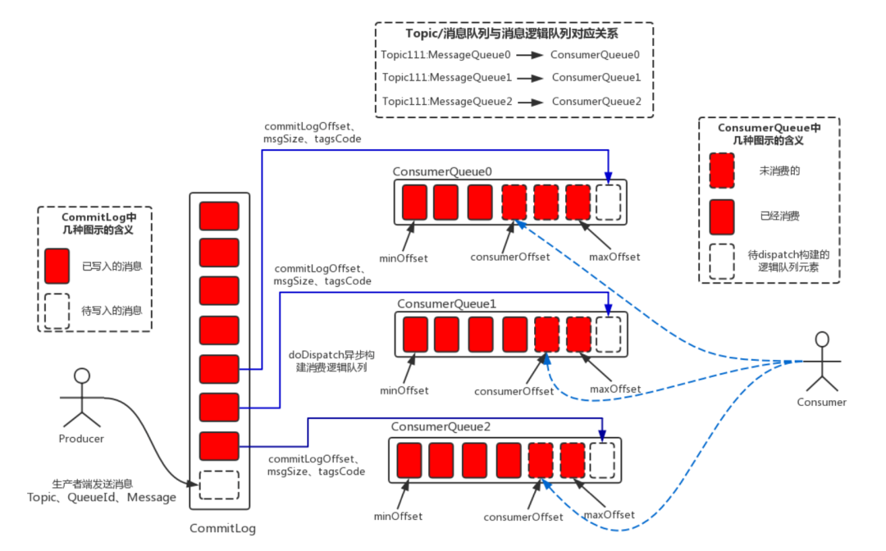
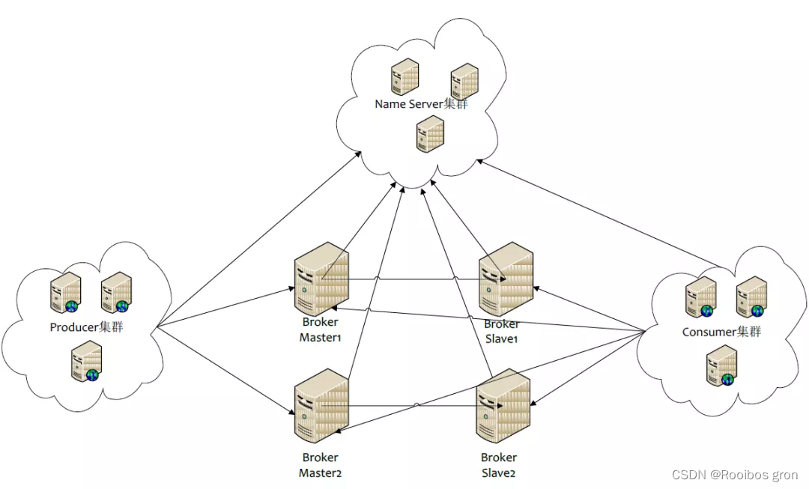
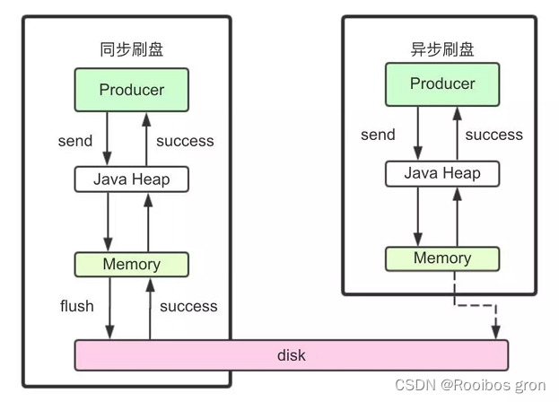

## RocketMQ

[https://blog.csdn.net/qq_42877546/article/details/125425061]

#### 1、RocketMQ Broker中的消息被消费后会立即删除吗？

不会，每条消息都会持久化到CommitLog中，每个Consumer连接到Broker后会维持消费进度信息，当有消息消费后只是当前Consumer的消费进度（CommitLog的offset）更新了。

追问：**那么消息会堆积吗？什么时候清理过期消息？**
默认72小时后会删除不再使用的CommitLog文件

检查这个文件最后访问时间
判断是否大于过期时间
指定时间删除，默认凌晨4点

#### 2、RocketMQ消费模式有几种？

消费模型由Consumer决定，消费维度为Topic。

**集群消费**
一条消息只会被同Group中的一个Consumer消费
多个Group同时消费一个Topic时，每个Group都会有一个Consumer消费到数据

**广播消费**
消息将对一个Consumer Group下的各个Consumer实例都消费一遍。即使这些Consumer属于同一个Consumer Group，消息也会被Consumer Group中的每个Consumer都消费一次。

#### 3、消费消息是push还是pull？

RocketMQ没有真正意义的push，都是pull，虽然有push类，但实际底层实现采用的是长轮询机制，即拉取方式。

broker端属性 longPollingEnable 标记是否开启长轮询。默认开启

追问：为什么要主动拉取消息而不使用事件监听方式？
事件驱动方式是建立好长连接，由事件（发送数据）的方式来实时推送。

如果broker主动推送消息的话有可能push速度快，消费速度慢的情况，那么就会造成消息在consumer端堆积过多，同时又不能被其他consumer消费的情况。而pull的方式可以根据当前自身情况来pull，不会造成过多的压力而造成瓶颈。所以采取了pull的方式。

#### 4、broker如何处理拉取请求的？

Consumer首次请求Broker

Broker中是否有符合条件的消息
有 ->响应Consumer
等待下次Consumer的请求
没有
PullRequestHoldService 来Hold连接，每个5s执行一次检查pullRequestTable有没有消息，有的话立即推送
每隔1ms检查commitLog中是否有新消息，有的话写入到pullRequestTable
当有新消息的时候返回请求
挂起consumer的请求，即不断开连接，也不返回数据使用consumer的offset。

#### 6、消息重复消费

影响消息正常发送和消费的重要原因是网络的不确定性。

引起重复消费的原因

ACK
正常情况下在consumer真正消费完消息后应该发送ack，通知broker该消息已正常消费，从queue中剔除
当ack因为网络原因无法发送到broker，broker会认为此条消息没有被消费，此后会开启消息重投机制把消息再次投递到consumer

消费模式
在CLUSTERING模式下，消息在broker中会保证相同group的consumer消费一次，但是针对不同group的consumer会推送多次

解决方案
去重操作直接放在了消费端，消费端处理消息的业务逻辑保持幂等性。那么不管来多少条重复消息，可以实现处理的结果都一样。
数据库表
处理消息前，使用消息主键在表中带有约束的字段中insert。建立一张日志表，使用消息主键作为表的主键，在处理消息前，先insert表，再做消息处理。这样可以避免消息重复消费

Map
单机时可以使用map ConcurrentHashMap -> putIfAbsent guava cache

Redis
分布式锁搞起来。

#### 7、如何让RocketMQ保证消息的顺序消费

你们线上业务用消息中间件的时候，是否需要保证消息的顺序性?

如果不需要保证消息顺序，为什么不需要?假如我有一个场景要保证消息的顺序，你们应该如何保证?

首先多个queue只能保证单个queue里的顺序，queue是典型的FIFO，天然顺序。多个queue同时消费是无法绝对保证消息的有序性的。所以总结如下：

同一topic，同一个QUEUE，发消息的时候一个线程去发送消息，消费的时候 一个线程去消费一个queue里的消息。

追问：怎么保证消息发到同一个queue？
Rocket MQ给我们提供了MessageQueueSelector接口，可以自己重写里面的接口，实现自己的算法，举个最简单的例子：判断i % 2 == 0，那就都放到queue1里，否则放到queue2里。

#### 8、RocketMQ如何保证消息不丢失 

首先在如下三个部分都可能会出现丢失消息的情况：

Producer端
Broker端
Consumer端

##### 8.1、Producer端如何保证消息不丢失

采取send()同步发消息，发送结果是同步感知的。
发送失败后可以重试，设置重试次数。默认3次。
producer.setRetryTimesWhenSendFailed(10);

集群部署，比如发送失败了的原因可能是当前Broker宕机了，重试的时候会发送到其他Broker上。

##### 8.2、Broker端如何保证消息不丢失

修改刷盘策略为同步刷盘。默认情况下是异步刷盘的。
flushDiskType = SYNC_FLUSH

集群部署，主从模式，高可用。

##### 8.3、Consumer端如何保证消息不丢失

完全消费正常后在进行手动ack确认。

#### 9、rocketMQ的消息堆积如何处理

下游消费系统如果宕机了，导致几百万条消息在消息中间件里积压，此时怎么处理?

你们线上是否遇到过消息积压的生产故障?如果没遇到过，你考虑一下如何应对?

首先要找到是什么原因导致的消息堆积，是Producer太多了，Consumer太少了导致的还是说其他情况，总之先定位问题。

然后看下消息消费速度是否正常，正常的话，可以通过上线更多consumer临时解决消息堆积问题

**追问：如果Consumer和Queue不对等，上线了多台也在短时间内无法消费完堆积的消息怎么办？**
**准备一个临时的topic**
queue的数量是堆积的几倍
queue分布到多Broker中
上线一台Consumer做消息的搬运工，把原来Topic中的消息挪到新的Topic里，不做业务逻辑处理，只是挪过去
上线N台Consumer同时消费临时Topic中的数据
改bug
恢复原来的Consumer，继续消费之前的Topic
**追问：堆积时间过长消息超时了？**
RocketMQ中的消息只会在commitLog被删除的时候才会消失，不会超时。也就是说未被消费的消息不会存在超时删除这情况。

**追问：堆积的消息会不会进死信队列？**
不会，消息在消费失败后会进入重试队列，取决与retryMaxTimes 数值,默认16次,才会进入死信队列（%DLQ%+ConsumerGroup）。

**首先要分析一下消息堆积可能造成的原因**

1、如果是机器本身的原因，比如消费者组有几个消费者服务挂掉了，剩下少量消费者消费能力不足导致的消费积压，那就正常重新启动，然后慢慢再去消费积压的消息。

2、如果是生产者端由业务暴增引起的生产过快，而消费者端消费能力不足，这个时候就可以采取生产者端限流或者进行消费者扩容；这个时候要注意，如果生产者只是短期暴增或者消息的业务不是很重要可以采用限流，如果是长期暴增真正的业务量上涨就必须要进行消费者扩容。

3、比如说消费者挂了，然后broker堆积了很多消息，然后可以先把堆积的消息读到别的地方比如mysql或者es然后去后续进行处理，然后把RocketMQ堆积的消息删掉，启动消费者保障消费者正常消费，这里要注意的是删除堆积消息之前，需要停止mq。

#### 10、RocketMQ在分布式事务支持这块机制的底层原理?

你们用的是RocketMQ?RocketMQ很大的一个特点是对分布式事务的支持，你说说他在分布式事务支持这块机制的底层原理?

分布式系统中的事务可以使用TCC（Try、Confirm、Cancel）、2pc来解决分布式系统中的消息原子性

RocketMQ 4.3+提供分布事务功能，通过 RocketMQ 事务消息能达到分布式事务的最终一致

RocketMQ实现方式：

Half Message：预处理消息，当broker收到此类消息后，会存储到RMQ_SYS_TRANS_HALF_TOPIC的消息消费队列中

检查事务状态：Broker会开启一个定时任务，消费RMQ_SYS_TRANS_HALF_TOPIC队列中的消息，每次执行任务会向消息发送者确认事务执行状态（提交、回滚、未知），如果是未知，Broker会定时去回调在重新检查。

超时：如果超过回查次数，默认回滚消息。

也就是他并未真正进入Topic的queue，而是用了临时queue来放所谓的half message，等提交事务后才会真正的将half message转移到topic下的queue。

#### 12、看过RocketMQ 的源码没有。如果看过，说说你对RocketMQ 源码的理解?

里面比较典型的设计模式有单例、工厂、策略、门面模式。单例工厂无处不在，策略印象深刻比如发消息和消费消息的时候queue的负载均衡就是N个策略算法类，有随机、hash等，这也是能够快速扩容天然支持集群的必要原因之一。持久化做的也比较完善，采取的CommitLog来落盘，同步异步两种方式。

#### 13、高吞吐量下如何优化生产者和消费者的性能?

开发
同一group下，多机部署，并行消费
单个Consumer提高消费线程个数
批量消费
消息批量拉取
业务逻辑批量处理
运维
网卡调优
jvm调优
多线程与cpu调优
Page Cache

#### 14、说说RocketMQ是如何保证数据的高容错性的?

在不开启容错的情况下，轮询队列进行发送，如果失败了，重试的时候过滤失败的Broker
如果开启了容错策略，会通过RocketMQ的预测机制来预测一个Broker是否可用。
如果上次失败的Broker可用那么还是会选择该Broker的队列
如果上述情况失败，则随机选择一个进行发送
在发送消息的时候会记录一下调用的时间与是否报错，根据该时间去预测broker的可用时间。其实就是send消息的时候queue的选择。

#### **15、任何一台Broker突然宕机了怎么办？**

Broker主从架构以及多副本策略。
Master收到消息后会同步给Slave，Master宕机了还有slave中的消息可用，**保证了MQ的可靠性和高可用性**。而且Rocket MQ4.5.1开始就支持了Dlegder模式，基于raft做到了真正意义的HA。

#### **16、Broker把自己的信息注册到哪个NameServer上？**

Broker会向所有的NameServer上注册自己的信息，而不是某一个，是全部。多线程的方式向所有NameServer上注册。

#### **17、RocketMQ由哪些角色组成，每个角色作用和特点是什么？**

Nameserver 无状态，动态列表；这也是和zookeeper的重要区别之一。zookeeper是有状态的。
Producer 消息生产者，负责发消息到Broker。
Broker 就是MQ本身，负责收发消息、持久化消息等。
Consumer 消息消费者，负责从Broker上拉取消息进行消费，消费完进行ack。

#### **18、RocketMQ中的Topic和JMS的queue有什么区别？**

queue就是来源于数据结构的FIFO队列。而Topic是个抽象的概念，每个Topic底层对应N个queue，而数据也真实存在queue上的。

#### **19、为什么要用RocketMq？**

总得来说，RocketMq具有以下几个优势：

吞吐量高：单机吞吐量可达十万级
可用性高：分布式架构
消息可靠性高：经过参数优化配置，消息可以做到0丢失
功能支持完善：MQ功能较为完善，还是分布式的，扩展性好
支持10亿级别的消息堆积：不会因为堆积导致性能下降
源码是java：方便我们查看源码了解它的每个环节的实现逻辑，并针对不同的业务场景进行扩展
可靠性高：天生为金融互联网领域而生，对于要求很高的场景，尤其是电商里面的订单扣款，以及业务削峰，在大量交易涌入时，后端可能无法及时处理的情况
稳定性高：RoketMQ在上可能更值得信赖，这些业务场景在阿里双11已经经历了多次考验

#### 19.rocketMQ的可靠性如何保证

消息完整链路可以划分为以下三个阶段：

**生产阶段**：消息在 Producer 发送端创建出来，经过网络传输发送到 Broker 存储端。

通过同步发送以及重试策略来保证

**存储阶段**：消息在 Broker 端存储，如果是主备或者多副本，消息会在这个阶段被复制到其他的节点或者副本上。

1.单机的刷盘机制 同步刷盘

主从之间的数据复制 同步复制

**消费阶段**：Consumer 消费端从 Broker存储端拉取消息，经过网络传输发送到 Consumer 消费端上，并通过重试来最大限度的保证消息的消费。

1 消费重试

2.死信队列

3.消息回溯

#### 20、RocketMq的部署架构了解吗？

这个是rocketMq的集群架构图，里面包含了四个主要部分：NameServer集群,Producer集群,Cosumer集群以及Broker集群

NameServer 担任路由消息的提供者。生产者或消费者能够通过NameServer查找各Topic相应的Broker IP列表分别进行发送消息和消费消息。nameServer由多个无状态的节点构成，节点之间无任何信息同步

broker会定期向NameServer以发送心跳包的方式，轮询向所有NameServer注册以下元数据信息：

1）broker的基本信息（ip port等）

2）主题topic的地址信息

3）broker集群信息

4）存活的broker信息

5）filter 过滤器

也就是说，每个NameServer注册的信息都是一样的，而且是当前系统中的所有broker的元数据信息

**Producer**负责生产消息，一般由业务系统负责生产消息。一个消息生产者会把业务应用系统里产生的消息发送到broker服务器。RocketMQ提供多种发送方式，同步发送、异步发送、顺序发送、单向发送。同步和异步方式均需要Broker返回确认信息，单向发送不需要

**Broker**，消息中转角色，负责存储消息、转发消息。在RocketMQ系统中负责接收从生产者发送来的消息并存储、同时为消费者的拉取请求作准备

**Consumer负责**消费消息，一般是后台系统负责异步消费。一个消息消费者会从Broker服务器拉取消息、并将其提供给应用程序。从用户应用的角度而言提供了两种消费形式：拉取式消费、推动式消费

#### 21、它有哪几种部署类型？分别有什么特点？

RocketMQ有4种部署类型

**1）单Master**
单机模式, 即只有一个Broker, 如果Broker宕机了, 会导致RocketMQ服务不可用, 不推荐使用

**2）多Master模式**
组成一个集群, 集群每个节点都是Master节点, 配置简单, 性能也是最高, 某节点宕机重启不会影响RocketMQ服务

缺点：如果某个节点宕机了, 会导致该节点存在未被消费的消息在节点恢复之前不能被消费

**3）多Master多Slave模式，异步复制**

每个Master配置一个Slave, 多对Master-Slave, Master与Slave消息采用异步复制方式, 主从消息一致只会有毫秒级的延迟

优点是弥补了多Master模式（无slave）下节点宕机后在恢复前不可订阅的问题。在Master宕机后, 消费者还可以从Slave节点进行消费。采用异步模式复制，提升了一定的吞吐量。总结一句就是，采用多Master多Slave模式，异步复制模式进行部署，系统将会有较低的延迟和较高的吞吐量

缺点就是如果Master宕机, 磁盘损坏的情况下, 如果没有及时将消息复制到Slave, 会导致有少量消息丢失

**4）多Master多Slave模式，同步双写**

与多Master多Slave模式，异步复制方式基本一致，唯一不同的是消息复制采用同步方式，只有master和slave都写成功以后，才会向客户端返回成功

优点：数据与服务都无单点，Master宕机情况下，消息无延迟，服务可用性与数据可用性都非常高

缺点就是会降低消息写入的效率，并影响系统的吞吐量

**实际部署中，一般会根据业务场景的所需要的性能和消息可靠性等方面来选择后两种**

#### **22、你自己部署过RocketMq吗？简单说一下你当时部署的过程**

由于我们项目中主要使用rocketMq做链路跟踪功能，因此需要比较高的性能，并且偶尔丢失几条消息也关系不大，所以我们就选择多Master多Slave模式，异步复制方式进行部署
我部署的是双master和双slave模式集群，并部署了两个nameserver节点
**1）服务器分配**
分配是两台服务器，A和B，其中A服务器部署nameserv1,master1,slave2;B服务器部署nameserv2,master2和slave1节点

**2）broker的配置**
分别配置rocketmq安装目录下四个配置文件：

master1:/conf/2m-2s-async/broker-a.properties
slave1:/conf/2m-2s-async/broker-a-s.properties

总的思路是：
a.master节点的brokerId为0，slave节点的brokerId为1（大于0即可）；
b.同一组broker的broker-Name相同，如master1和slave1都为broker-a;
c.每个broker节点配置相同的NameServer;
d.复制方式配置：master节点配置为ASYNC-MASTER，slave节点配置为SLAVE即可；
e.刷盘方式分为同步刷盘和异步刷盘，为了保证性能而不去考虑少量消息的丢失，因此统一配置为异步刷盘

**3）启动集群**
a 检查修改参数
启动前分别检查修改runbroker.sh和runserver.sh两个文件中的JVM参数，默认的JAVA_OPT参数的值比较大，若直接启动可能会失败，需要根据实际情况重新配置

b 分别启动两个nameserver节点
nohup sh bin/mqnamesrv > /dev/null 2>&1 &

查看日志
tail -f ~/logs/rocketmqlogs/namesrv.log

c 分别启动4个broker节点
maste1
nohup sh bin/mqbroker -c
/usr/local/rocketmq/conf/2m-2s-async/broker-a.properties &

slave1
nohup sh bin/mqbroker -c
/usr/local/rocketmq/conf/2m-2s-async/broker-a-s.properties &

查看日志：
tail -f ~/logs/rocketmqlogs/broker.log

总结：集群环境部署，主要就是以上三个步骤，需要注意的是过程中broker配置文件的配置正确性，还需要注意一下启动前对jvm参数的检查

#### 23、rocketmq如何保证高可用性？

**1）集群化部署NameServer**。Broker集群会将所有的broker基本信息、topic信息以及两者之间的映射关系，轮询存储在每个NameServer中（也就是说每个NameServer存储的信息完全一样）。因此，NameServer集群化，不会因为其中的一两台服务器挂掉，而影响整个架构的消息发送与接收；

**2）集群化部署多broker**。producer发送消息到broker的master，若当前的master挂掉，则会自动切换到其他的master

cosumer默认会访问broker的master节点获取消息，那么master节点挂了之后，该怎么办呢？它就会自动切换到同一个broker组的slave节点进行消费

那么你肯定会想到会有这样一个问题：consumer要是直接消费slave节点，那master在宕机前没有来得及把消息同步到slave节点，那这个时候，不就会出现消费者不就取不到消息的情况了？

这样，就引出了下一个措施，来保证消息的高可用性

**3）设置同步复制**

前面已经提到，消息发送到broker的master节点上，master需要将消息复制到slave节点上，rocketmq提供两种复制方式：同步复制和异步复制

异步复制，就是消息发送到master节点，只要master写成功，就直接向客户端返回成功，后续再异步写入slave节点

同步复制，就是等master和slave都成功写入内存之后，才会向客户端返回成功

那么，要保证高可用性，就需要将复制方式配置成同步复制，这样即使master节点挂了，slave上也有当前master的所有备份数据，那么不仅保证消费者消费到的消息是完整的，并且当master节点恢复之后，也容易恢复消息数据

在master的配置文件中直接配置brokerRole：SYNC_MASTER即可

#### 24、rocketmq的工作流程是怎样的？

RocketMq的工作流程如下：
**1）首先启动NameServer**。NameServer启动后监听端口，等待Broker、Producer以及Consumer连上来
**2）启动Broker**。启动之后，会跟所有的NameServer建立并保持一个长连接，定时发送心跳包。心跳包中包含当前Broker信息(ip、port等)、Topic信息以及Borker与Topic的映射关系
**3）创建Topic**。创建时需要指定该Topic要存储在哪些Broker上，也可以在发送消息时自动创建Topic
**4）Producer发送消息**。启动时先跟NameServer集群中的其中一台建立长连接，并从NameServer中获取当前发送的Topic所在的Broker；然后从队列列表中轮询选择一个队列，与队列所在的Broker建立长连接，进行消息的发送
**5）Consumer消费消息**。跟其中一台NameServer建立长连接，获取当前订阅Topic存在哪些Broker上，然后直接跟Broker建立连接通道，进行消息的消费

#### 25、RocketMq的存储机制了解吗？[https://mp.weixin.qq.com/s?__biz=MzU0OTE4MzYzMw==&mid=2247508558&idx=5&sn=f798822d3b03d74f670e505e9b699df2&chksm=fbb12bb0ccc6a2a6a613f0f0169f3bb9b8e884758ddbc4d0fad2a15731c97d4bbca58ece5f01&scene=27]

RocketMq采用文件系统进行消息的存储，相对于ActiveMq采用关系型数据库进行存储的方式就更直接，性能更高了

RocketMq与Kafka在写消息与发送消息上，继续沿用了Kafka的这两个方面：**顺序写和零拷贝**

小结：**RocketMq采用文件系统存储消息，并采用顺序写写入消息，使用零拷贝发送消息，极大得保证了RocketMq的性能**

#### 同步刷盘和异步刷盘？

**(1)同步刷盘**：如上图所示，只有在消息真正持久化至磁盘后，RocketMQ的Broker端才会真正地返回给Producer端一个成功的ACK响应。同步刷盘对MQ消息可靠性来说是一种不错的保障，但是性能上会有较大影响，一般适用于金融业务应用领域。RocketMQ同步刷盘的大致做法是，基于生产者消费者模型，

**(2)异步刷盘**：能够充分利用OS的PageCache的优势，只要消息写入PageCache即可将成功的ACK返回给Producer端。消息刷盘采用后台异步线程提交的方式进行，降低了读写延迟，提高了MQ的性能和吞吐量。异步和同步刷盘的区别在于，异步刷盘时，主线程并不会阻塞，在将刷盘线程wakeup后，就会继续执行。

## RocketMQ与kafka的不同

#### 1、数据可靠性

RocketMQ：支持异步实时刷盘、同步刷盘、同步复制、异步复制。
kafka：使用异步刷盘方式，异步复制/同步复制。

总结：
1、RocketMQ支持kafka所不具备的“同步刷盘”功能，在单机可靠性上比kafka更高，不会因为操作系统Crash而导致数据丢失。
2、kafka的同步replication理论上性能低于RocketMQ的replication，这是因为kafka的数据以partition为单位，这样一个kafka实例上可能多上百个partition。而一个RocketMQ实例上只有一个partition，RocketMQ可以充分利用IO组的commit机制，批量传输数据。同步replication与异步replication相比，同步replication性能上损耗约20%-30%。

一句话概括：RocketMQ新增了同步刷盘机制，保证了可靠性；一个RocketMQ实例只有一个partition, 在replication时性能更好。

#### 2、性能对比

一句话概括：RocketMQ写入性能上不如kafka, 主要因为kafka主要应用于日志场景，而RocketMQ应用于业务场景，为了保证消息必达牺牲了性能，且基于线上真实场景没有在RocketMQ层做消息合并，推荐在业务层自己做。

#### 3、单机支持的队列数

1、kafka单机若超过了64个partition/队列，CPU load会发生明显飙高，partition越多，CPU load越高，发消息的响应时间变长。
2、RocketMQ单机支持最高5万个队列，CPU load不会发生明显变化。

队列多有什么好处呢？
1、单机可以创建更多个topic, 因为每个topic都是有一组队列组成。
2、消费者的集群规模和队列数成正比，队列越多，消费类集群可以越大。

一句话概括：RocketMQ支持的队列数远高于kafka支持的partition数，这样RocketMQ可以支持更多的consumer集群。

#### **5、消费失败重试**

1、kafka不支持消费失败重试,无死信队列。(**spring-kafka支持,kafka不支持**)
2、RocketMQ消费失败支持定时重试，每次重试间隔时间顺延。

总结：以充值类应用为例，若当前时刻调用运营商网管失败，可能运营商网关此时压力过大，稍后再调用就会成功。这里的重试指可靠的重试，即失败重试的消息不是因为consumer宕机而导致的消息丢失。

一句话概括：RocketMQ支持消费失败重试功能，主要用于第一次调用不成功，后面可调用成功的场景。而kafka不支持消费失败重试。

#### 6、严格保证消息有序**

1、kafka可保证同一个partition上的消息有序，但一旦broker宕机，就会产生消息乱序。
2、Rocket支持严格的消息顺序，一台broker宕机，发送消息会失败，但不会乱序。举例：MySQL的二进制日志分发需要保证严格的顺序。

一句话概括：kafka不保证消息有序，RocketMQ可保证严格的消息顺序，即使单台Broker宕机，仅会造成消息发送失败，但不会消息乱序。

#### 8、分布式事务消息

1、kafka不支持分布式事务消息
2、RocketMQ支持分布式事务消息。

#### 9、消息查询

1、kafka不支持消息查询
2、RocketMQ支持根据消息标识（发送消息时指定一个消息key, 任意字符串，如指定为订单编号）查询消息，也支持根据消息内容查询消息。

总结：消息查询功能对于定位消息丢失问题非常有用，例如某个订单处理失败，可用此功能查询是消息没收到，还是收到了但处理出错了。

一句话概括：RocketMQ支持按消息标识或消息内容查询消息，用于排查消息丢失问题；kafka不支持消息查询。

#### 10、消息回溯

1、kafka可按照消息的offset来回溯消息
2、RocketMQ支持按照时间来回溯消息，精度到毫秒，例如从一天的几点几分几秒几毫秒来重新消费消息。

总结：RocketMQ按时间做回溯消息的典型应用场景为，consumer做订单分析，但是由于程序逻辑或依赖的系统发生故障等原因，导致今天处理
的消息全部无效，需要从昨天的零点重新处理。

#### kafka相比RocketMQ的优势

1、单机吞吐量TPS可上百万，远高于RocketMQ的TPS7万每秒，适用于日志类消息。
2、kafka支持多语言的客户端

#### RocketMQ相比kafka的优势

1、保证消息不丢（ 数据可靠性达10个9）
2、可严格保证消息有序
3、支持分布式事务消息
4、支持按时间做消息回溯（可精确到毫秒级）
5、支持按标识和内容查询消息，用于排查丢消息
6、支持消费失败重试
7、可支持更多的partition, 即更多的消费线程数