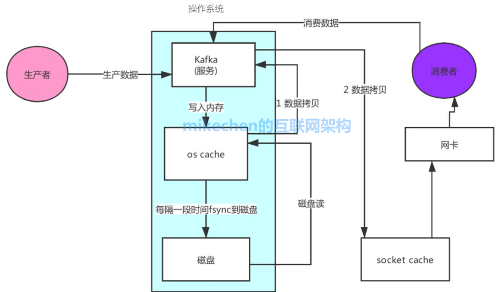
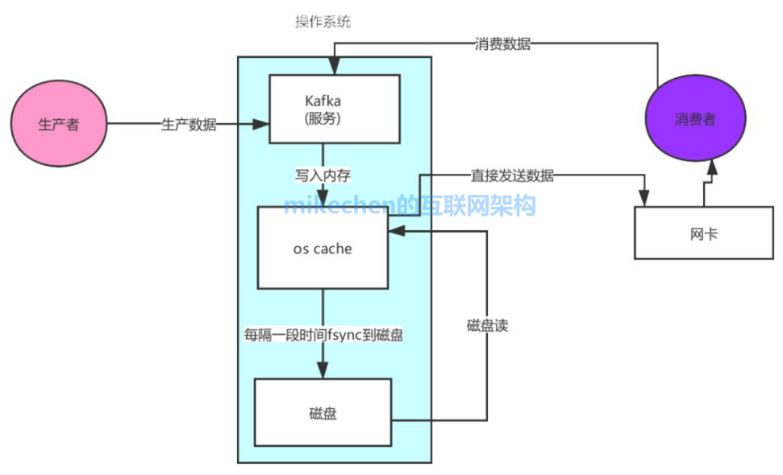
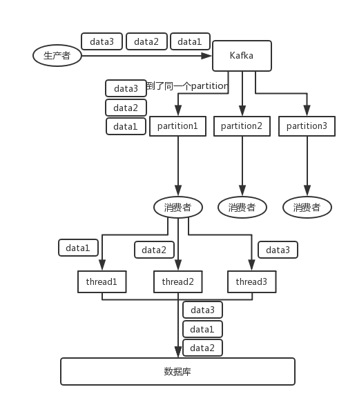
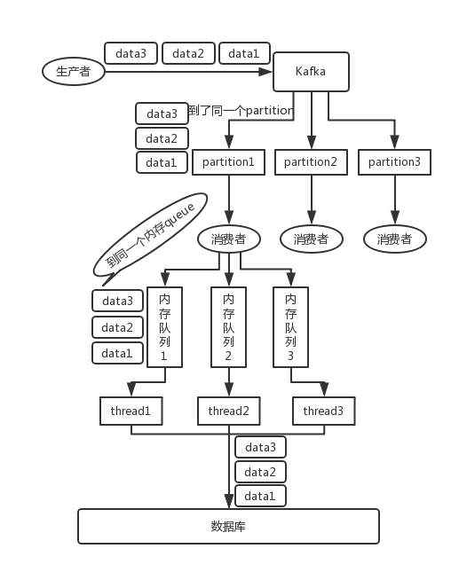

# Kafka

### 面试题

**1.Kafka为什么快？**

[Kafka 实现了零拷贝原理来快速移动数据，避免了内核之间的切换。Kafka 可以将数据记录分批发送，从生产者到文件系统（Kafka 主题日志）到消费者，可以端到端的查看这些批次的数据。]

批处理能够进行更有效的数据压缩并减少 I/O 延迟

页缓存技术:

总结一下其实就是四个要点

- 顺序读写 :完成一次磁盘 IO，需要经过寻道、旋转和数据传输三个步骤，采取顺序写入磁盘的方式，避免了随机磁盘寻址的浪费。 

- 零拷贝 ：通过 零拷贝技术，就不需要把 os cache 里的数据拷贝到应用缓存，再从应用缓存拷贝到 Socket 缓存了，两次拷贝都省略了，所以叫做零拷贝。

  

  

- 页缓存技术: Kafka 是基于操作系统 的页缓存(page cache)来实现文件写入的，我们也可以称之为 os cache，意思就是操作系统自己管理的缓存。

  Kafka 在写入磁盘文件的时候，可以直接写入这个 os cache 里，也就是仅仅写入内存中，接下来由操作系统自己决定什么时候把 os cache 里的数据真的刷入磁盘文件中

- 分区分段+索引 : Kafka 的 message 是按 topic分 类存储的，topic 中的数据又是按照一个一个的 partition 即分区存储到不同 broker 节点。每个 partition 对应了操作系统上的一个文件夹，partition 实际上又是按照segment分段存储的。

  通过这种分区分段的设计，Kafka 的 message 消息实际上是分布式存储在一个一个小的 segment 中的，每次文件操作也是直接操作的 segment。为了进一步的查询优化，Kafka 又默认为分段后的数据文件建立了索引文件，就是文件系统上的.index文件。这种分区分段+索引的设计，不仅提升了数据读取的效率，同时也提高了数据操作的并行度。

- 分批发送

- 消息压缩

  

**2.Kafka 的ACK 机制，0，1，-1 分别代表着什么意思?**

- **ACK + 重试机制**：生产者生产数据写入Kafka，等待Kafka返回ack确认，收到ack，生产者发送下一条
   **ACK机制**：acks = 0/1/all/-1
   *0*：不等待ack，直接发送下一条
   优点：快；
   缺点：数据易丢失
   *1*：生产者将数据写入Kafka，Kafka 等待这个分区的 Leader 副本返回ack，发送下一条
   优点：性能和安全做了中和的选项；
   缺点：依旧存在一定概率的数据丢失的情况
   *all/-1*：生产者将数据写入Kafka，Kafka 等待这个分区所有ISR 【可用】副本同步成功才返回ack，发送下一条
   优点：安全
   缺点：性能比较差
   问题：如果ISR中只有leader一个，leader写入成功，直接返回，leader故障数据丢失怎么办？
   解决：搭配min.insync.replicas来使用，并且 >= 2
   min.insync.replicas：表示最少要有几个ISR的副本

**2.1 什么是AR、ISR、OSR**

**AR** : All-Replicas 所有副本，指的是一个分区在所有节点上的副本

**ISR**：In - Sync- Replicas可用副本，所有正在与Leader 同步的 Follower 副本；

**OSR**: Out-Sync-Replicas 不可用副本

**3.Kafka 架构分哪几个部分：**

- Producer ：消息生产者，就是向 kafka broker 发消息的客户端。
- Consumer ：消息消费者，向 kafka broker 取消息的客户端。
- Topic ：可以理解为一个队列，一个 Topic 又分为一个或多个分区，
- Consumer Group：这是 kafka 用来实现一个 topic 消息的广播（发给所有的 consumer）和单播（发给任意一个 consumer）的手段。一个 topic 可以有多个 Consumer Group。
- Broker ：一台 kafka 服务器就是一个 broker。一个集群由多个 broker 组成。一个 broker 可以容纳多个 topic。
- Partition：为了实现扩展性，一个非常大的 topic 可以分布到多个 broker上，每个 partition 是一个有序的队列。partition 中的每条消息都会被分配一个有序的id（offset）。将消息发给 consumer，kafka 只保证按一个 partition 中的消息的顺序，不保证一个 topic 的整体（多个 partition 间）的顺序。
- Offset：kafka 的存储文件都是按照 offset.kafka 来命名，用 offset 做名字的好处是方便查找。例如你想找位于 2049 的位置，只要找到 2048.kafka 的文件即可。当然 the first offset 就是 00000000000.kafka。

**4.你知道 Kafka 是如何做到消息的有序性？**

kafka 中的每个 partition 中的消息在写入时都是有序的，而且单独一个 partition 只能由一个消费者去消费，可以在里面保证消息的顺序性。但是分区之间的消息是不保证有序的。

在Kafka中，**只保证Partition(分区)内有序，不保证Topic所有分区都是有序的**

**解决方案1：**

一个 topic，一个 partition，一个 consumer，**内部单线程消费，单线程吞吐量太低，不建议使用**
生产者在发送消息的时候指定要发送到特定Partition(分区)
将 producer 发送的数据封装成一个 ProducerRecord 对象。
（1）指明 partition 的情况下，直接将指明的值直接作为 partiton 值；
（2）没有指明 partition 值但有 key 的情况下，在Producer往Kafka插入数据时，控制同一Key分发到同一Partition，并且设置参数max.in.flight.requests.per.connection=1，也即同一个链接只能发送一条消息，如此便可严格保证Kafka消息的顺序
**解决方案2:**

**场景:**建了一个 topic，有三个 partition。生产者在写的时候，指定一个 key，比如说指定了某个订单 id 作为 key，那么这个订单相关的数据，一定会被分发到同一个 partition 中去，而且这个 partition 中的数据一定是有顺序的。
消费者从 partition 中取出来数据的时候，也一定是有顺序的。到这里，顺序还是 ok 的，没有错乱。但是，如果在消费者里可能会搞多个线程来并发处理消息。因为如果消费者是单线程消费处理，而处理比较耗时的话，比如处理一条消息耗时几十 ms，那么 1 秒钟只能处理几十条消息，这吞吐量太低了。而多线程并发跑的话，顺序可能就会乱掉。

**解决：**消费者可以 N 个内存队列，具有相同 key 的数据都到同一个内存队列；然后对于 N 个线程，每个线程分别消费一个内存队列 即可，这样就能保证顺序性。

由下图 图一 改为 图二：

**5.什么是 CAP 理论，Kafka 满足哪两个？**
 C : 一致性，任何一台机器写入数据，其他节点也可以读取到；
 A ：可用性，如果一个节点故障，其他节点可以正常提供数据服务；
 P ：分区容错性，如果某个分区故障，这个分区的数据照样可用
 Kafka 满足CA，Kafka 不能保证一个分区故障，这个分区的数据照样可用。
