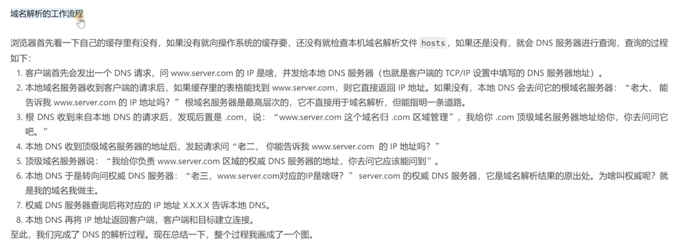

# 网络基础

## 1.网络分层

传输层 因为 TCP会携带源端口与目标端口 所以是 **进程与进程之间的通信** （寻找对应目标进程）

网络层 是**主机与主机之间的通信** （通过IP寻找对应目标主机）

## 

[具体可以参考](https://blog.csdn.net/weixin_46591962/article/details/109636249)

### 2.应用层

#### **应用层使用http协议 也就是超文本传输协议**

超文本 表示传输并不限制与文本 还有图片 视频 音频等

协议是指互联网的一种规定，使用计算机能够理解的语言确立了一种计算机之间交流通信的规范，以及相关的控制和错误处理方式

#### **HTTPS和HTTP的主要区别**        

1、https协议需要到CA申请证书，一般免费证书较少，因而需要一定费用。

2、http是超文本传输协议，信息是**明文传输**，https则是**具有安全性的ssl/tls加密传输协议**。

3、http和https使用的是完全不同的连接方式，用的端口也不一样，前者是80，后者是443。

4、http的连接很简单，是无状态的；HTTPS协议是由SSL/TLS+HTTP协议构建的可进行加密传输、身份认证的网络协议，比http协议安全。

TCP

### 3.传输层

**传输层协议 ：TCP和UDP**

#### TCP3次握手 

SYN，ACK是标志位。

SYN =1  seq：包的初始序列号

ACK标志位 1是确认  ack or ack_num : 应答序列号 值为对方的SEQ+1

大写的ACK(Acknowledgement)是标识位， 可以通过它标识包的性质， [ACK]  or [FIN] .

#### TCP4次挥手 断开连接

### 4.网络层

#### **IP**

#### **DNS域名解析**

#### **NAT**（虚拟机有用到）

### 5.数据链路层

MAC地址

### 6.物理层

将byte字节流转换成信号